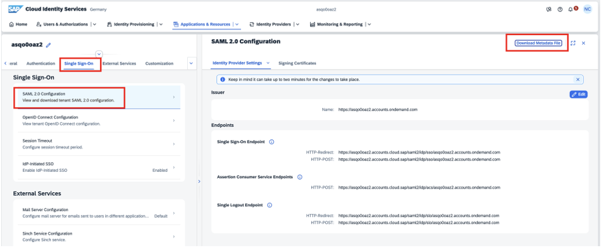
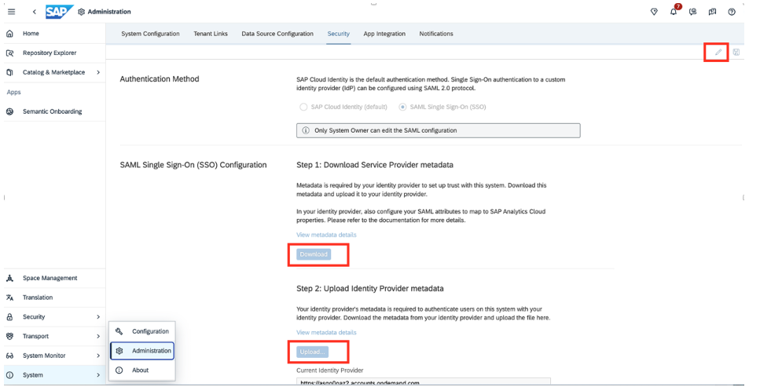
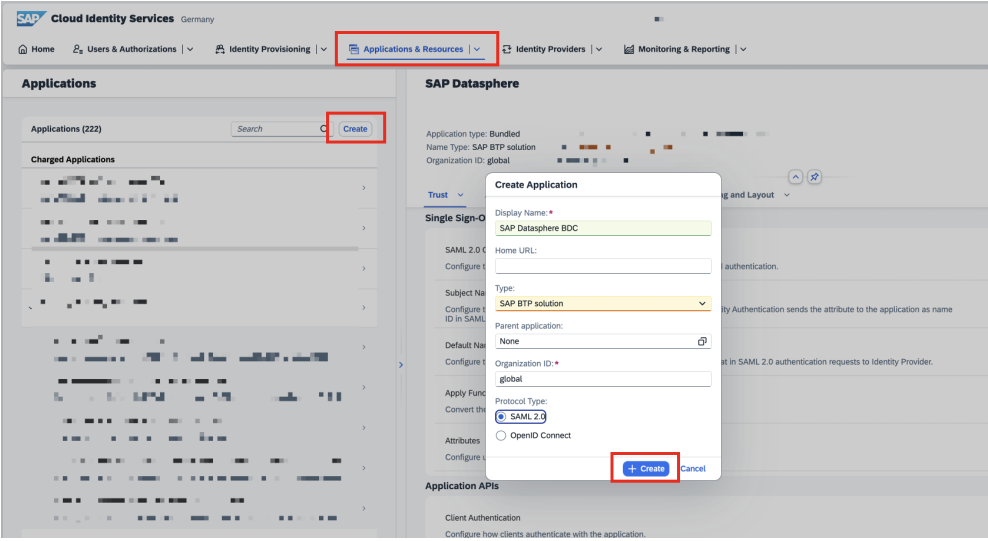
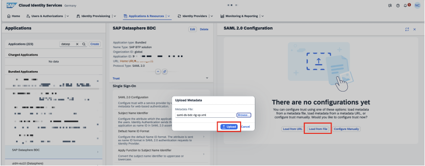
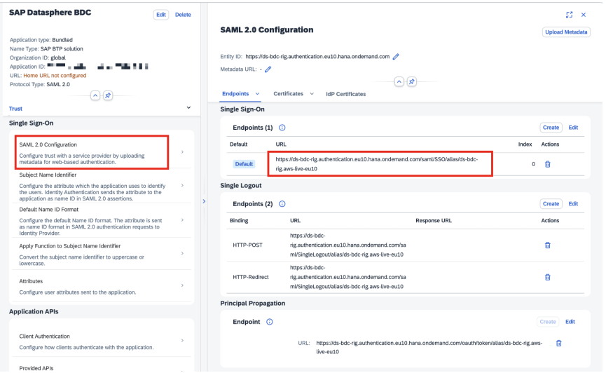
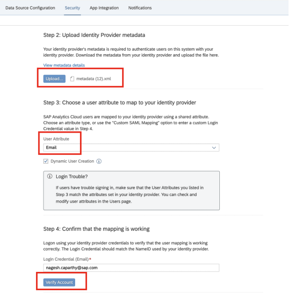
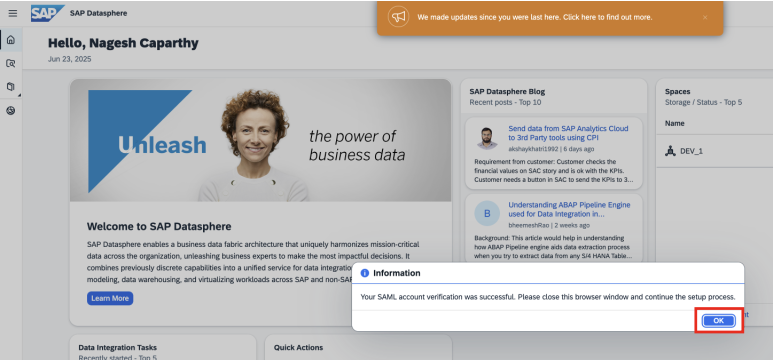

Create an IAS tenant with a CRM ID attached to the global account (or SAP internally on the same cost center as the global account). An existing IAS tenant used with SAP Datasphere can be used with Joule.
Login as the IAS admin to the IAS tenant and follow the below steps.
  
<h1 style="fot-size:4;"><b>Setup Single Sign On between IAS and Datasphere</b></h1>

Click on <b>Application & Resources > Tenant Settings > Single Sign-On > SAML 2.0 Configuration</b> and download <b>Metadata</b> File.
Keep this file handy as you will need to upload it in Datasphere later

   

 
 

 

Login to SAP Datasphere. Click on <b></b>System > Administration > Security</b> and click on <b>Edit</b>. Download the <b>SSO Configuration files</b>.
  
<b>Tip: You need to be a tenant owner in SAP Datasphere.</b>
   

 
 

 

Go back to IAS and under <b>Application & Resources > Application</b>. Click <b>Create</b> to create a new application. 
<li>Display Name: SAP Datasphere ( as required by customer)</li>
<li>Home URL:</li>
<li>Type: SAP BTP Solution</li>
<li>Parent application: None</li>
<li>Organization id: global</li>
<li>Protocol Type: SAML 2.0</li>

   

 
 

 

Once the application is created, we will need to upload the metadata downloaded from Datasphere. For this, select the application that was created above and select <b></b>Single Sign On > SAML 2.0 Configuration</b>. Upload the metadata that was downloaded before from Datasphere
   

 
 

 

Once uploaded, the SAML 2.0 Configuration will display the certificate status

   

 
 

 

Select <b>Subject Name identifier</b> and select <b>Email</b> as the <b>Primary Attribute</b>
   

 
 

 

Go to <b>Attributes</b> and under <b>Self Defined Attributes</b>, enter <b>Email</b> as the value for <b>email</b> and <b>Groups</b> as <b>sac</b>. Please select the source as <b>Expression</b> for groups
   

 
 

 

  
<h1 style="fot-size:4;"><b>Upload IAS metadata to Datasphere</b></h1>

Go to Datasphere and click on System> Administration > Security.
Upload the <b>metadata.xml</b> which was downloaded at the very beginning under 

<b>Step 2:</b> Upload Identity Provider metadata

<b>Step 3:</b> Select user attribute as Email 

<b>Step 4:</b> Enter the email id to verify the mapping
   

 
 

 

Follow the steps to verify the account
   

 
 

 

  
You will be redirected to enter the credentials. The URL should show SAML
   

 
 

 

   

 
 

 

Click <b>OK</b>. You should receive an Account Verified message
   

 
 

 

Once the Cloud Identity Service is integrated with DataSphere, please follow the below steps to activate Joule

<li>Go to <a href="https://discovery-center.cloud.sap/missiondetail/4538/4826/"</href>Establish a Unified Joule Instance Mission</a></li> 
<li>Login to the SAP Discovery Centre mission and click on Project Board. </li>
<li>Under <b>Setup</b> tab, follow the steps under the below tiles and return to the mission</li>  

<pre><li><b>Configure Subaccount in SAP BTP for Joule</b></li></pre>
<pre><li><b>Establish Trust between Subaccount and SAP Cloud Identity Authentication Service</b></li></pre>
<pre><li><b>Create SAP Build Work Zone Instance</b></li></pre>
<pre><li><b>Run Booster in SAP BTP for Joule</b></li> </pre>
