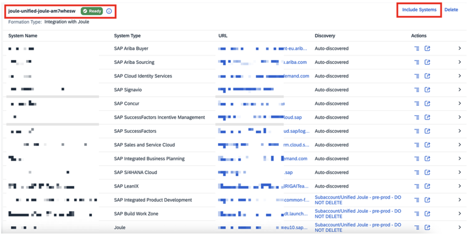
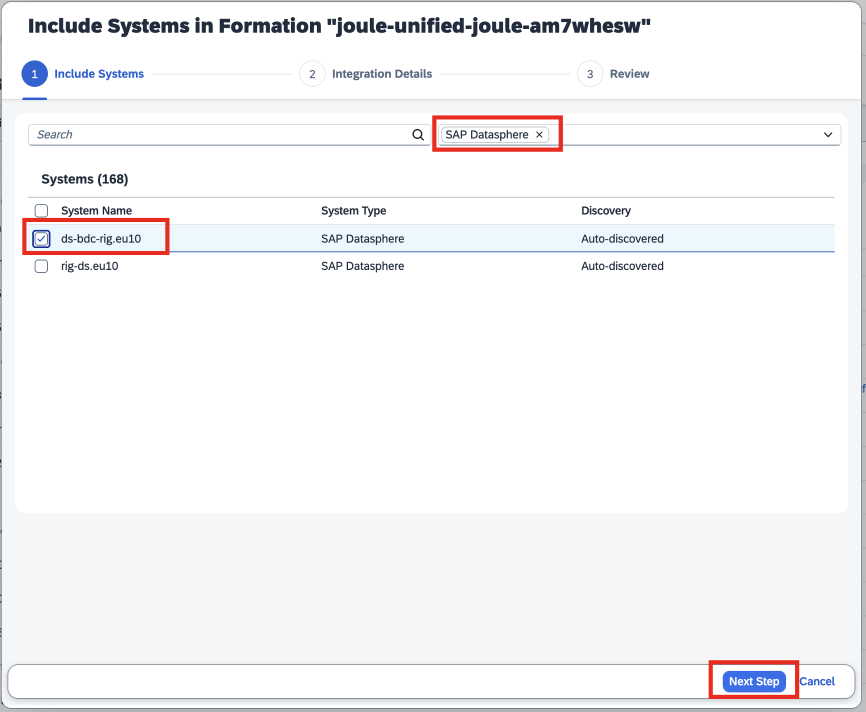
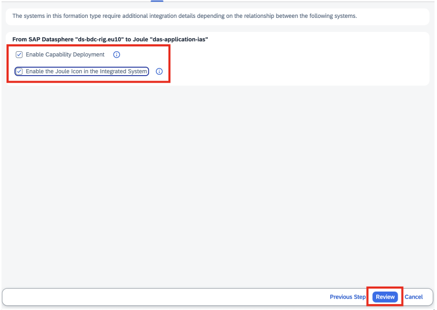
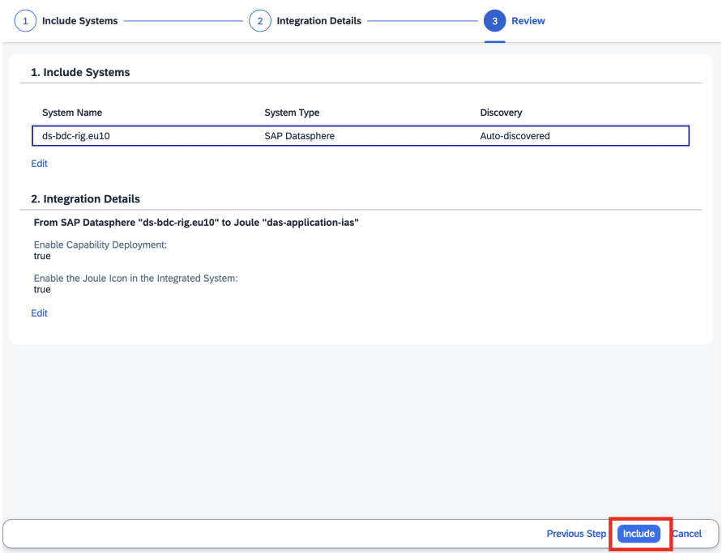
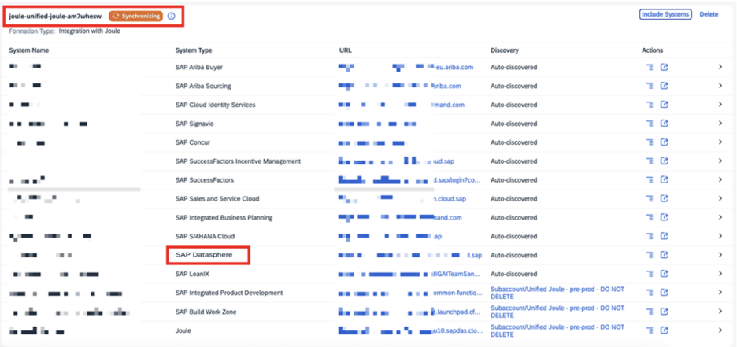
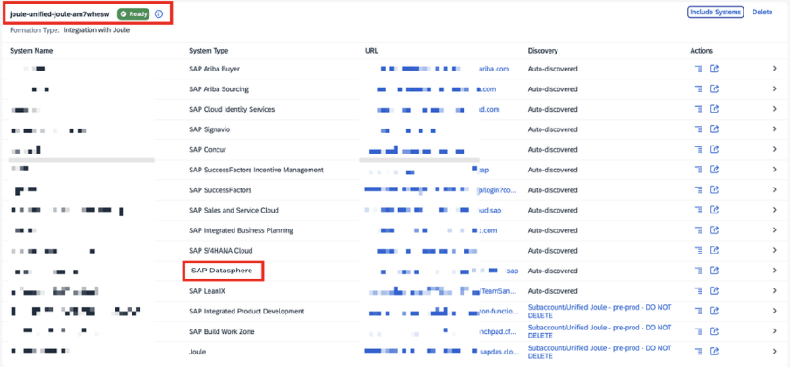

In this section, we will show you how to activate Joule for DataSphere in the context of an existing Joule formation.
Within your SAP BTP Global Account, navigate to <b>System Landscapes</b>, click on <b>Formations</b>, and search for the Joule formation you have already set up. In my case, I am using one of the existing formations, which has multiple SAP products connected to one Joule instance, as shown below. You can click on Include System

  

 
 

 

In the new window, you may filter it only for SAP Datasphere for Joule integration and click on Next.

  

 
 

 

Select the option “Enable Capability Deployment” and click on Review
  

 
 

 

Review the details, and if all is good, you may click on Include.
  

 
 

 

The process may take 5 to 8 minutes to complete, and you should be able to see the synchronizing option, as shown below. 
  

 
 

 

Once the status turns green and Ready, we are good to use Joule with SAP Datasphere
  

 
 

 

  

This completes the Joule activation for Datasphere.
