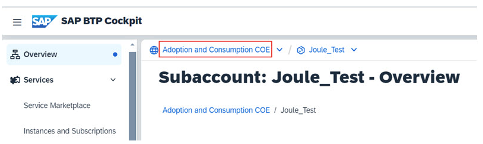
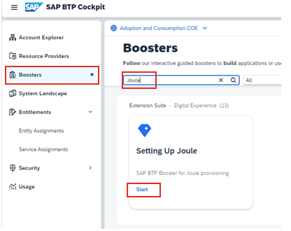
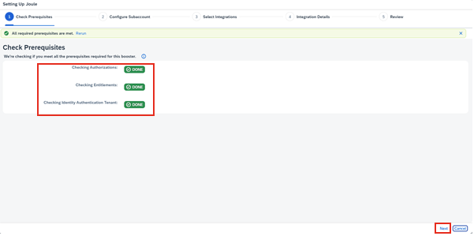
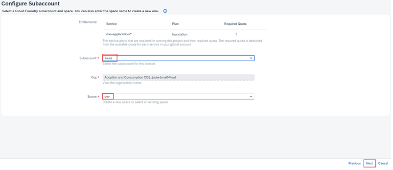
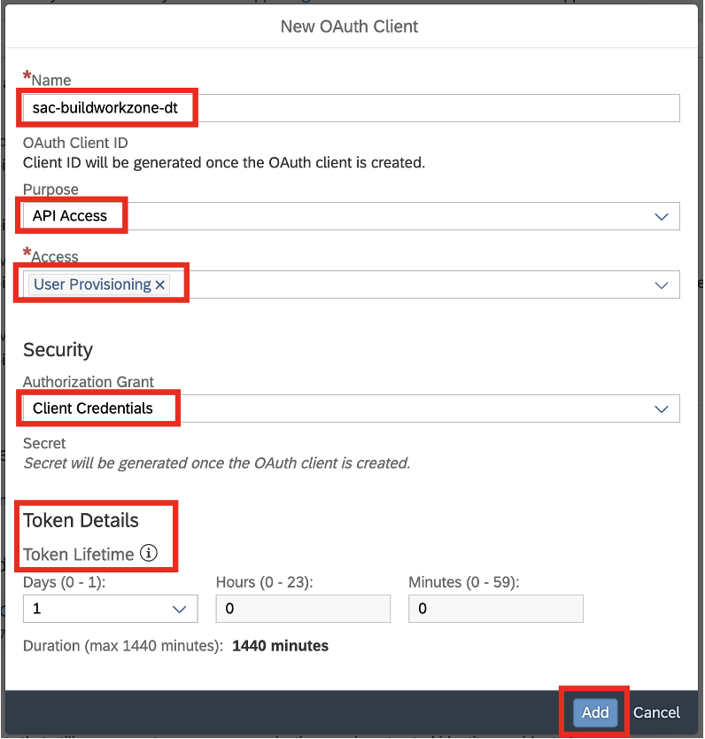
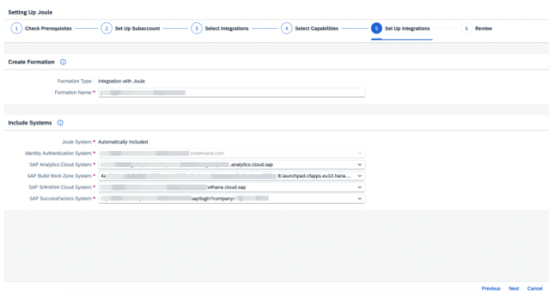
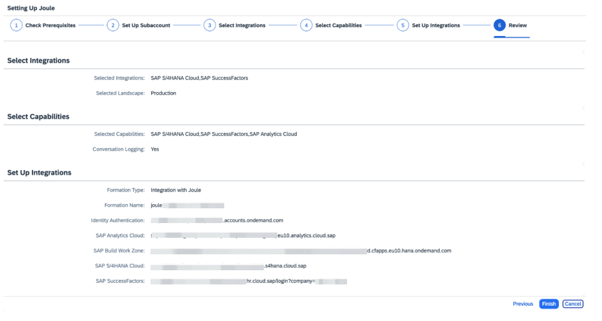
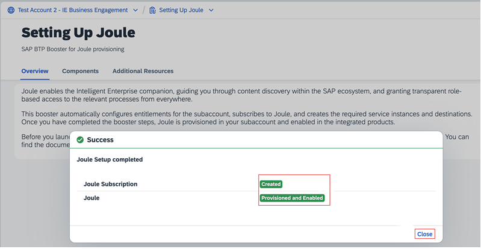

To run Booster in SAP BTP for Joule

1.	Navigate to your BTP Global Account.
    

 
 

 

Image 1</b> 

 
2.	From the Navigation Pane on the left, click <b>Boosters</b> >> search for <b>Joule</b> >> click <b>Start</b> on Setting up Joule tile.
    

 
 

 

Image 1</b> 

 
3.	Confirm the pre-requisites check is successful and click <b>Next</b>.
       

 
 

 

Image 1</b> 

 
4.	From the Subaccount dropdown select the Joule subaccount created earlier and click <b>Next</b>.
    

 
 

 

Image 1</b> 

 
5.	From the Products dropdown select all SAP applications which will be setup with Joule. For ex ample, SAP S/4HANA Cloud Public Edition and SAP SuccessFactors in my setup. Choose whether the integration is for <b>Testing or Production</b> and click <b>Next</b>.
    

 
 

 

Image 1</b> 

 

6. Select <b>SAP Analytic Cloud</b> in the <b>Capabilities Packages</b> along with the other SAP solutions selected in the previous step. Click <b>Next</b>
    

 
 

 

Image 1</b> 

 
7.	Leave the default Formation Name. Under the Include System area choose the following and click Next.
SAP Build WorkZone System: SAP Cloud Identity Services System: Additional systems based on your specific scenario.In this example we are setting up Analytical Insights for SAP SuccessFactors and SAP S/4HANA Cloud Public Edition so choose the appropriate system that is registered in the System Landscape for those respective solutions.
    

 
 

 

Image 1</b> 

  

8.	Review the configuration settings and click <b>Finish</b>.
    

 
 

 

Image 1</b> 

 
9.	Confirm the booster execution is successful and click <b>Close</b>.
        

 
 

 

Image 1</b> 

 

