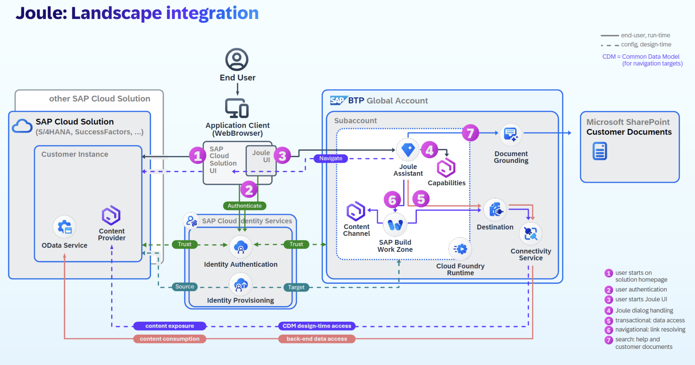

We are happy to introduce you to the Joule capabilities with SAP Datasphere.  

Joule will support users in SAP Datasphere to interact in new ways. Joule provides not only a natural language interface to SAP Datasphere, but also allows users to perform tasks across sites instead of navigating through the user interface in multiple clicks.  

With Joule, SAP Datasphere will provide use cases along three main usage patterns:  

<li><b>Informational:</b>users can ask about specific pieces of information pertaining to their tenant, such as how many spaces are locked at a specific moment or what users have been assigned to a certain role.Joule can also answer product questions by searching through SAP product documentation on behalf of the user and retrieve the answer tailored to the question raised.</li>
<li><b>Navigational:</b> Joule also allows users to navigate through SAP Datasphere by directly providing buttons in chat instead of clicking on the user interface to navigate to the desired location</li>
<li><b>Transactional:</b> extending the navigational usage patterns mentioned above, Joule can also perform transactions based on user queries, such as adding users to a space or creating models</li>

The scope covered is focused on admin target personas, space managers, as well as all users who from time to time use the SAP product documentation. Going forward, SAP Datasphere will increase the coverage also to data modelling tasks and further capabilities offered today.  

<b>Joule</b> is a BTP service that can be hosted in multiple environments and data centers: Refer to <a href="https://help.sap.com/docs/joule/serviceguide/data-centers-supported-by-joule">Data Centers Supported for Joule</a>.

Additional Resources:
<a href="https://help.sap.com/docs/joule/integrating-joule-with-sap/introduction">Joule Help Guide</a>,
<a href="https://www.sap.com/canada/products/artificial-intelligence/ai-assistant.html">Joule and additional AI Innovations from SAP</a>

The setup process for Joule with SAP applications requires integration across multiple SAP components as depicted in the picture below. This purpose of this guide is to provide step-by-step instructions on how to enable <b>Joule on SAP Datasphere</b>. In this mission I will primarily focus on Joule configuration in the SAP BTP environment while other solution-specific-configuration is covered in separate missions. Support for additional SAP solutions is being added on a regular basis so make sure to check the links above for updates.
   

 
 

 

Image 1</b> 

