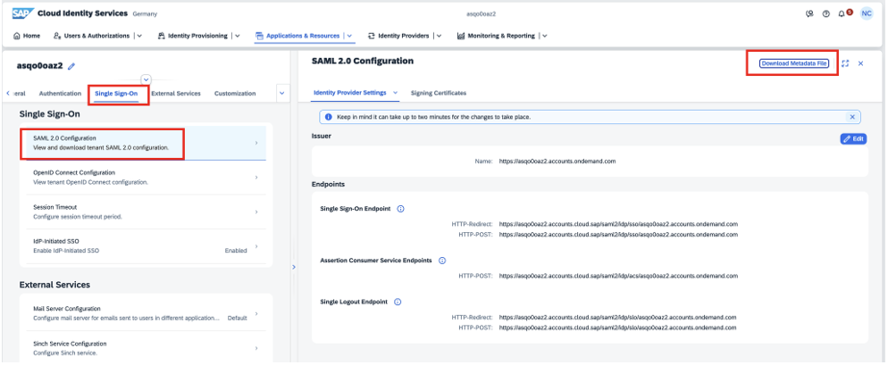
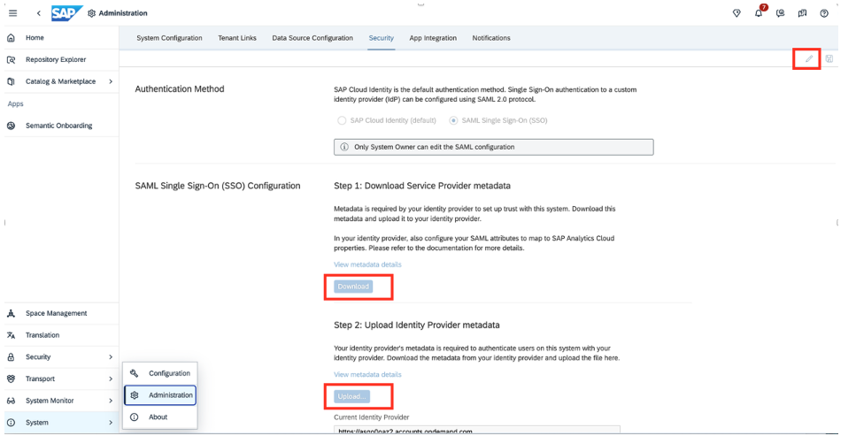
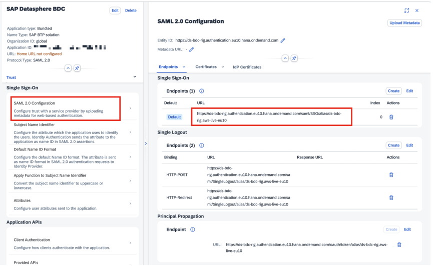
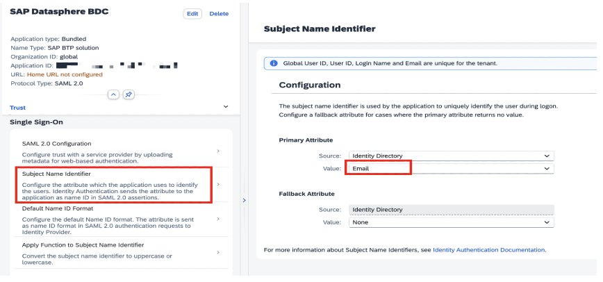
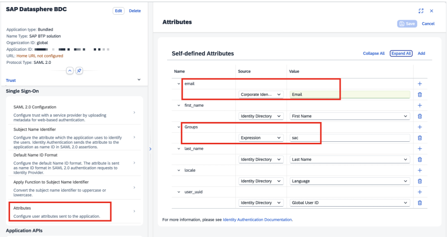
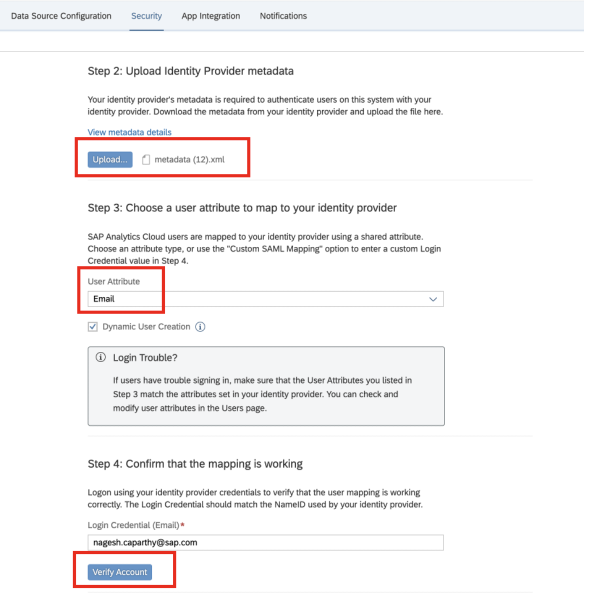
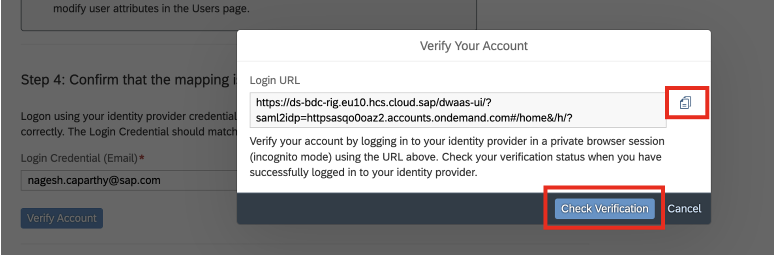
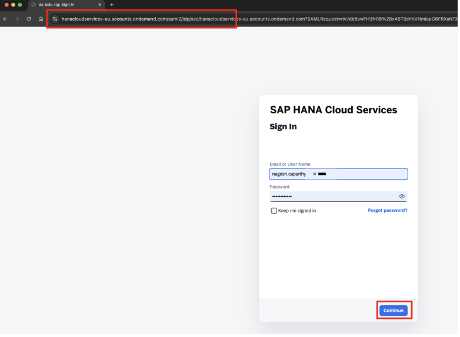
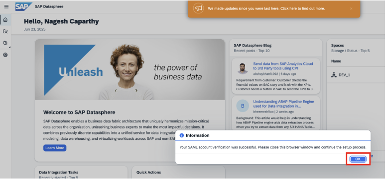
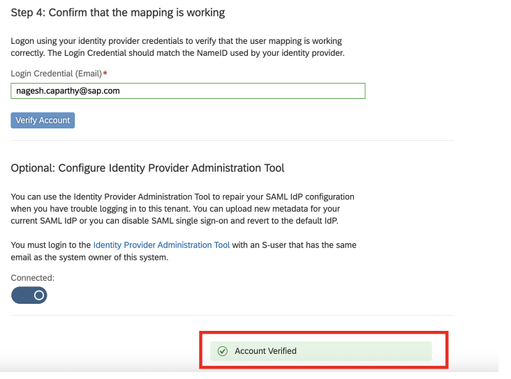

Before you can activate Joule, there are certain number of prerequisites that must be met. This section describes those prerequisites and outlines some details that need to be captured prior to running through the activation steps. 

<h1 style="fot-size:4;"><b>1. User Personas Required for Joule activation</b></h1>

Activation of Joule requires configuration in multiple systems. It's important to have the right stakeholders involved when setting up the configuration. To set up Joule, the following user personas are required: 

<li>You must have the SAP Datasphere application tenant administrator role</li>
<li>Have the role of DW Joule Consumer or a global role that has the Joule privilege (not a scoped role) to use Joule features (this will show up in your SAP Datasphere once Joule is integrated)</li> 
<li>SAP Cloud Identity Services access as an administrator</li>
<li>SAP Business Technology Platform administrator</li> 

  
<b>Hint:</b> Always refer to the SAP Help Page, as they are updated regularly, and you can find the links here for :- <a href="https://help.sap.com/docs/joule/integrating-joule/integration-with-sap-datasphere?locale=en-US&state=DRAFT&version=DEV">Integration with SAP Datasphere </a>

<h1 style="fot-size:4;"><b>2. Integrate Cloud Identity Services and Datasphere</b></h1>
Create an Cloud Identity Service tenant with a CRM ID attached to the global account (or SAP internally on the same cost center as the global account). An existing Cloud Identity Service tenant used with SAP Datasphere can be used with Joule.

Login as the Cloud Identity Service admin to the Cloud Identity Service tenant and follow the below steps.
  

Click on <b>Application & Resources > Tenant Settings > Single Sign-On > SAML 2.0 Configuration</b> and download <b>Metadata</b> File.
Keep this file handy as you will need to upload it in Datasphere later

   

 
 

 

Login to SAP Datasphere. Click on <b></b>System > Administration > Security</b> and click on <b>Edit</b>. Download the <b>SSO Configuration files</b>.
  
<b>Tip: You need to be a tenant owner in SAP Datasphere.</b>
   

 
 

 

Go back to Cloud Identity Service and under <b>Application & Resources > Application</b>. Click <b>Create</b> to create a new application. 
<li>Display Name: SAP Datasphere ( as required by customer)</li>
<li>Home URL:</li>
<li>Type: SAP BTP Solution</li>
<li>Parent application: None</li>
<li>Organization id: global</li>
<li>Protocol Type: SAML 2.0</li>

   

 
 

 

Once the application is created, we will need to upload the metadata downloaded from Datasphere. For this, select the application that was created above and select <b></b>Single Sign On > SAML 2.0 Configuration</b>. Upload the metadata that was downloaded before from Datasphere
   

 
 

 

Once uploaded, the SAML 2.0 Configuration will display the certificate status

   

 
 

 

Select <b>Subject Name identifier</b> and select <b>Email</b> as the <b>Primary Attribute</b>
   

 
 

 

Go to <b>Attributes</b> and under <b>Self Defined Attributes</b>, enter <b>Email</b> as the value for <b>email</b> and <b>Groups</b> as <b>sac</b>. Please select the source as <b>Expression</b> for groups
   

 
 

 

  
<h1 style="fot-size:4;"><b>Upload Cloud Identity Service metadata to Datasphere</b></h1>

Go to Datasphere and click on System> Administration > Security.
Upload the <b>metadata.xml</b> which was downloaded at the very beginning under 

<b>Step 2:</b> Upload Identity Provider metadata

<b>Step 3:</b> Select user attribute as Email 

<b>Step 4:</b> Enter the email id to verify the mapping
   

 
 

 

Follow the steps to verify the account
   

 
 

 

  
You will be redirected to enter the credentials. The URL should show SAML
   

 
 

 

   

 
 

 

Click <b>OK</b>. You should receive an Account Verified message
   

 
 

 

