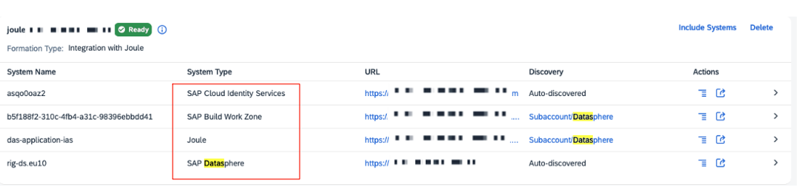
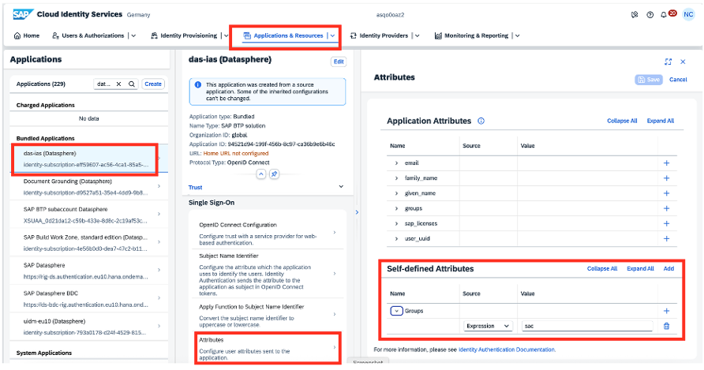
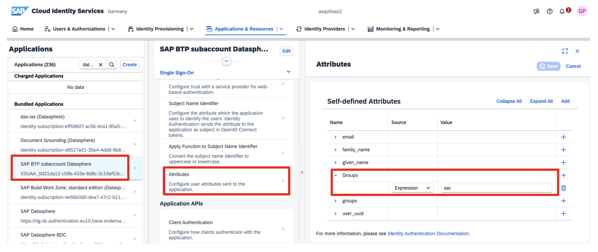
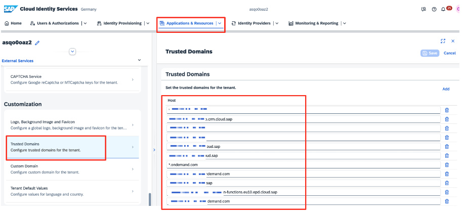
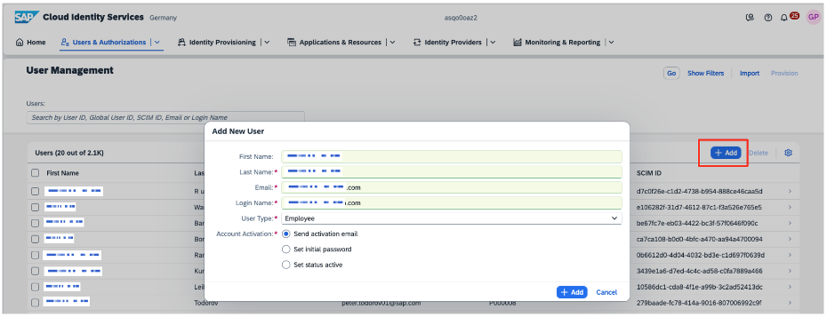
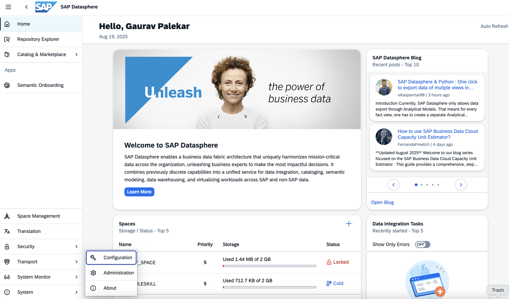
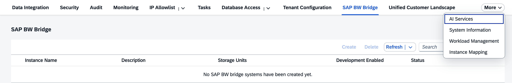
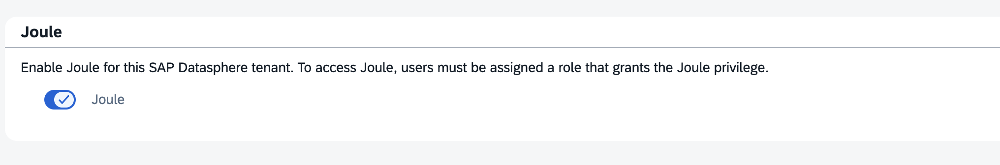
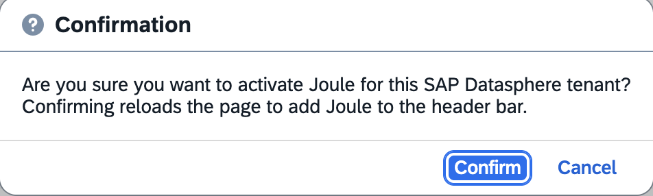
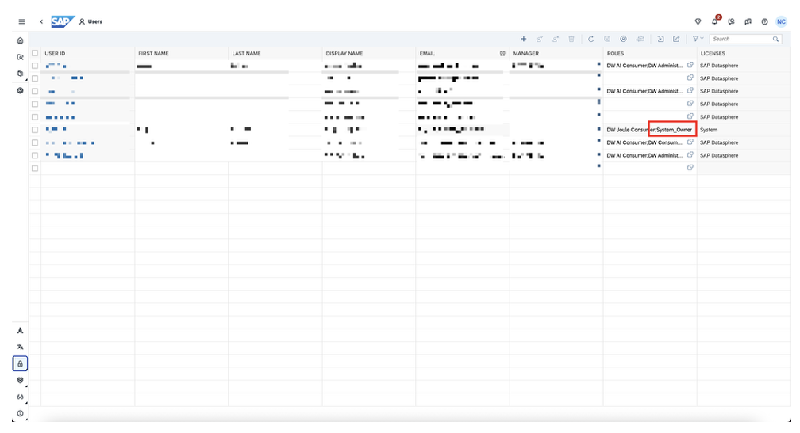

If you have a new Joule Setup, please validate the below step else proceed to the next step.

1.	Once you have the Success message from the Joule Booster, we will need to validate the Formations that the booster has created. To validate this, you can navigate to your SAP BTP Global Account, click on <b>System Landscape -> click on Formations</b>, and look for the formation ID that you have created with the booster.  You should be able to see the status “Ready” as shown below.

  

 
 

 

2.	Login to <b>Cloud Identity Service</b>. Click on <b>Application& Resources > Application > das-ias (Datasphere) > Attributes</b>

Under Self-defined Attributes > Add Groups(Name) – Expression (Source) > sac (Value)
  

 
 

 

Under the same screen, Click on <b>SAP BTP subaccount Datasphere</b>. Under <b>Single Sign On</b>, select <b>Attributes</b>

Under <b>Self-defined Attributes</b>, ensure <b>Groups</b> is set to <b>sac</b>
  

 
 

 

3.  Add the following SAP Datasphere trusted domains to the Cloud Identity Service:
    *.cfapps.orca.dev.sap
    
    *.hcs.cloud.sap
    
    *.ondemand.com
    
    *.projectorca.cloud
    
    *.datawarehouse.cloud.sap
    
    *.hanacloudservices.cloud.sap

Go to <b>Application & Resources > Tenant Settings > Customization > Trusted Domains and click Add</b>
  

 
 

 

Click <b>Save</b> once all the domains have been entered

  Follow a similar process and add the SAP Datasphere Domains in your SAP BTP Subaccount where Joule is activated.
  

 
 

 

4.	Create users in Cloud Identity Service. Go to <b>User & Administrations > User Management</b>. Click on <b>Add</b>

<b>Tip: Ensure that Login Name is set to the Email id of the user.</b>
  

 
 

 

<h1 style="fot-size:4;"><b>Enable Joule in DataSphere</b></h1>

In the side navigation area, click <b>System > Configuration</b>
  

 
 

 

Click the <b>AI Services</b> tab.
  

 
 

 

In the <b>Joule</b> section, click <b>Activate Joule</b>
   

 
 

 

On the Confirmation screen, click <b>Confirm</b>
   

 
 

 

Grant the <b>DW Joule Consumer</b> global privilege to users whom you want to access Joule features.To do so, navigate to <b>Security</b>, click on <b>Roles</b>, click on <b>DW Joule Consumer</b>, and assign the required users.
   

 
 

 

You can also do the same via the Users option and assign the role above.

<b>Important:</b> Joule will not work for the user who is assigned the <b>“System_Owner”</b> role. If you are the system owner, you may be able to see the Icon, but you may not get the responses from Joule that you are looking for. Please ensure that you validate the setup with other users once the configurations are activated.
   

 
 

 

Joule is now active on DataSphere

