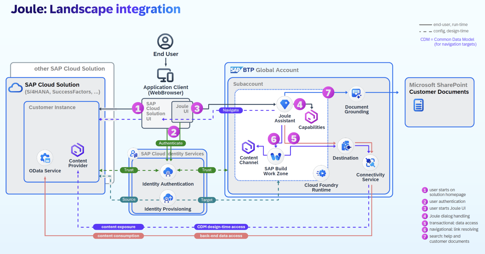

Joule is the AI copilot that truly understands your business. It revolutionizes the way you interact with SAP systems, making every touchpoint smarter, more insightful, and every task easier. Joule is not just a digital assistant—it’s the companion of the Intelligent Enterprise, seamlessly guiding users through content discovery within the SAP ecosystem with transparent, role-based access to relevant processes from anywhere.

What makes Joule even more powerful is its integration with <b>SAP Analytics Cloud (SAC)</b>. 
<li>By combining conversational AI with advanced analytics, Joule doesn’t just answer your questions—it empowers decision-making with  analytic insights</li> 
<li>Users can ask business questions in natural language and get intelligent, visualized responses powered by SAC, such as charts, comparisons etc, all embedded directly in the conversation. This enables faster, more informed decisions across departments</li>.

Joule is a BTP service that can be hosted in multiple environments and data centers: Refer to <a href="https://help.sap.com/docs/joule/serviceguide/data-centers-supported-by-joule">Data Centers Supported for Joule</a>.
Additional Resources:
<a href="https://help.sap.com/docs/joule/integrating-joule-with-sap/introduction">Joule Help Guide</a>
<a href="https://www.sap.com/canada/products/artificial-intelligence/ai-assistant.html">Joule and additional AI Innovations from SAP</a>
The setup process for Joule with SAP applications requires integration across multiple SAP components as depicted in the picture below. This purpose of this guide is to provide step-by-step instructions on how to enable Analytic Insights that can work across multiple SAP solutions. In this mission I will primarily focus on Joule configuration in the SAP BTP environment while other solution-specific-configuration is covered in separate missions. Support for additional SAP solutions is being added on a regular basis so make sure to check the links above for updates.
   

 
 

 

Image 1</b> 

