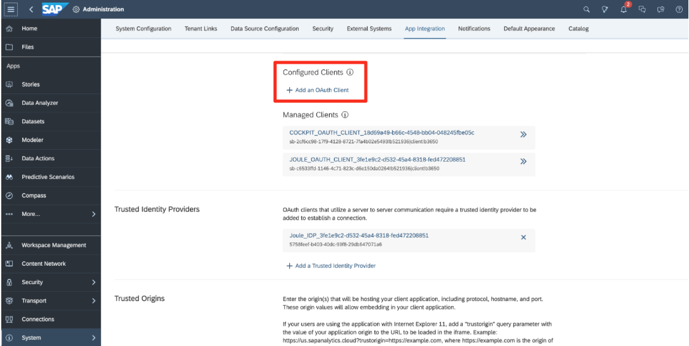
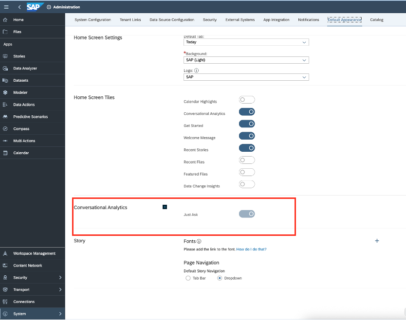

Before you can activate Joule, there are certain number of prerequisites that must be met. This section describes those prerequisites and outlines some details that need to be captured prior to running through the activation steps. 

## User Personas Required for Joule activation in SAC
Activation of Joule requires configuration in multiple systems. It's important to have the right stakeholders involved when setting up the configuration. To set up Joule, the following user personas are required in SAP Analytics Cloud: 

<ul>
  <li>Admins of the system for which Joule will be set up. In this mission, you need admin access to your SAP Analytics Cloud (SAC) tenant.</li>
  <li>SAP BTP Global Account Admin</li>
  <li>SAP Cloud Identity Services Admin</li>
</ul>

Pre requisites for SAC
<li>
  You need to have SAP Analytics Cloud integrated with SAP Cloud Identity Service, and the user login mechanism should be with <b>email ID</b>. 
  
    <b>Tip:</b> SAP product team is currently working on enabling other options. Please stay tuned for more information.
  
</li>
   
<li>Your SAP Analytic Cloud tenant must have at least two free OAuth client slots available. You can find the information in your SAC by going to <b>System -> Administration -> App Integration</b> and checking the <b>Configured Clients </b> section. If you see the “<b>+ Add a New OAuth Client</b>” button, then the prerequisites are fulfilled </li>

    

 
 

 

Image 1</b> 

<li>Your SAP Analytics Cloud user accounts must have Read permission for the Joule privilege to use analytical insights. </li>

<li>The <b>"Just Ask"</b> feature in your SAP Analytics Cloud tenant must be enabled. You can check this in <b>System > Administration > Default Appearance</b> and ensure that the <b>Just Ask</b> toggle under the Conversational Analytics section is enabled.</li>

     

 
 

 

Image 2</b> 

Hint: Always refer to the SAP Help Page, as they are updated regularly, and you can find the links here for :- <a href="https://help.sap.com/docs/joule/integrating-joule-with-sap/integration-with-sap-analytics-cloud">Integration with SAP Analytics Cloud </a> 

