1. If you have a new setup for Analytic Insights and Joule, please follow this step.

Once you have the Success message from the Joule Booster, we will need to validate the Formations that the booster has created. To validate this, you can navigate to your <b>SAP BTP Global Account</b>, click on <b>System Landscape</b> -> click on <b>Formations</b>, and look for the <b>formation ID</b> that you have created with the booster.  You should be able to see the status “<b>Ready</b>” as shown below.

   

 
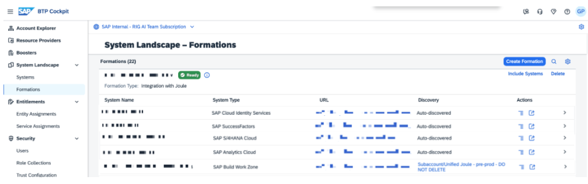 

 

Image 3</b>

2.   Once you follow the steps above, you can validate if the BTP Destination is created in your SAP BTP Subaccount. To check this, navigate to your SAP BTP     Subaccount and click on <b>Connectivity</b> -> click on <b>Destinations</b>.
You should be able to see a Destination named – “<b>DYN_SAC_SSO</b>” with some of the details as shown below.
 Note: No edits/changes are required; it’s a check if the setup is completed.
   

 
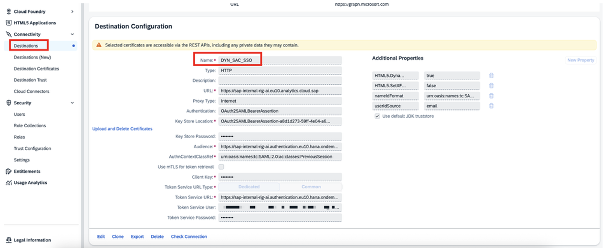 

 

Image 4</b>

 
Second, also check if the OAuth Client is created in your SAP Analytics Cloud system as shown below.
   

 
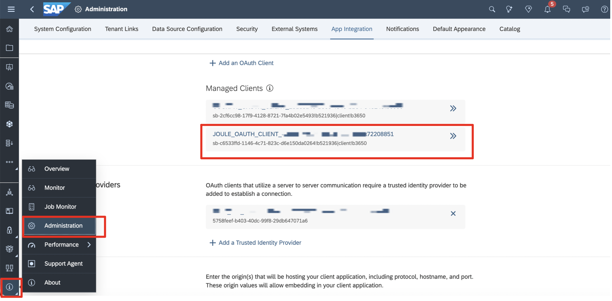 

 

Image 5</b>

<h1 style="fot-size:4;">3.	<b>Consume Role Definition Content from SAP Analytics Cloud.</b></h1>

For the users to use analytical insights in Joule, their SAP Analytics Cloud user accounts, roles, and permissions need to be synced to SAP Build Work Zone via the Identity Provisioning Service (IPS). Let us take a look at the process to activate the required services and the setup. 

3.1	<b>Create an OAuth Client for the Design Time in SAP SAC</b>

Log in to your SAP Analytics Cloud system with Administrator authorization, and navigate to <b>System -> and then click on Administration</b>. Navigate to <b>App Integration tab -> click on Add an OAuth Client</b> under <b>Configured Clients</b>.  

   

 
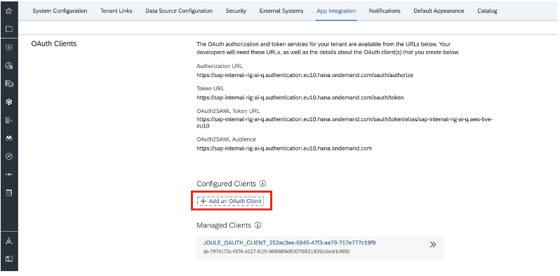 

 

Image 6</b>

Enter the following details as shown below and click on Add: 
<b>
-	Name, for example (recommended to be): “sac-buildworkzone-dt”
-	Purpose: API Access
-	Access: User Provisioning 
-	Authorization Grant: Client Credentials
-	Token Lifetime: I have selected 1 day, please select based on your requirements </b>

When the access token expires, clients must use a valid refresh token to obtain a new access token. An administrator can set both the value and the unit. Available time units include days, hours, and minutes.
The lifetime value must be a positive integer. If this value is not provided, it will be infinite by default.
   

 
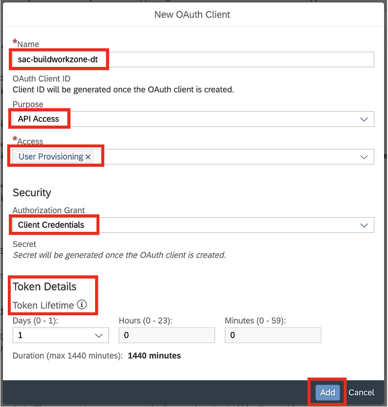 

 

Image 7</b>

Once you add the OAuth client, you will be able to generate a new Secret value. Please copy the Secret value as it will be used in the next step. 
Note that the Secret value will not be able to visible later, please ensure to store it.  
   

 
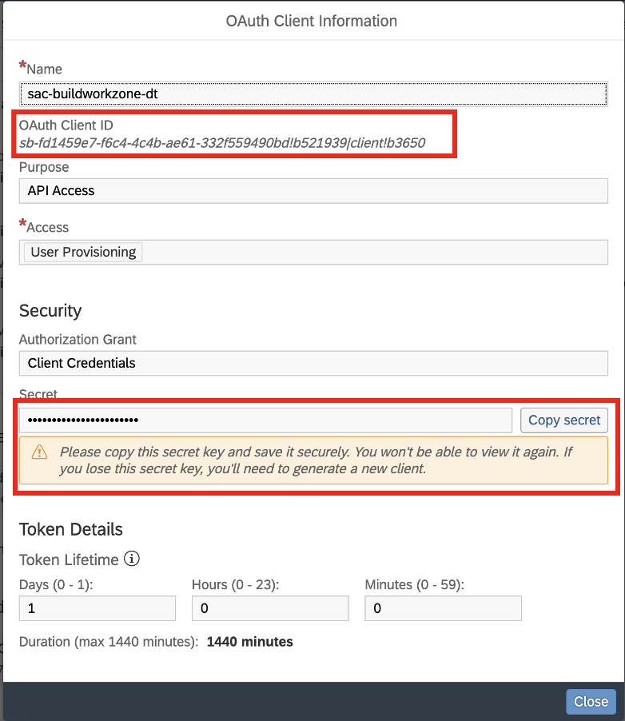 

 

Image 8</b>

With this, you should be able to the Configured Client  “dt” which we created manually.
   

 
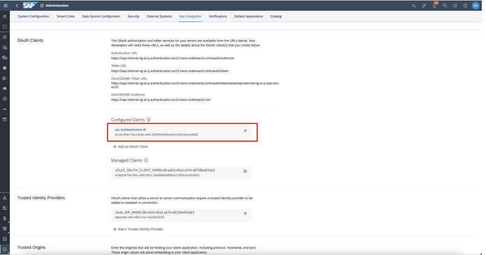 

 

Image 9</b>

For the next step, we will need the Token URL value from the OAuth Clients, please ensure to save this value. 

<b>3.2	Create a Design Time Destination in your SAP BTP Subaccount</b>

In this step, we will create a design-time destination in the SAP BTP subaccount where you activated Joule. 
To do this, navigate to your <b>SAP BTP Subaccount -> click on Connectivity -> click on Destinations -> click on Create Destination</b> -> enter the details below and click on <b>Save</b>. 
<b>Tip: Always look for the latest details from the SAP Help Page. </b>

   

 
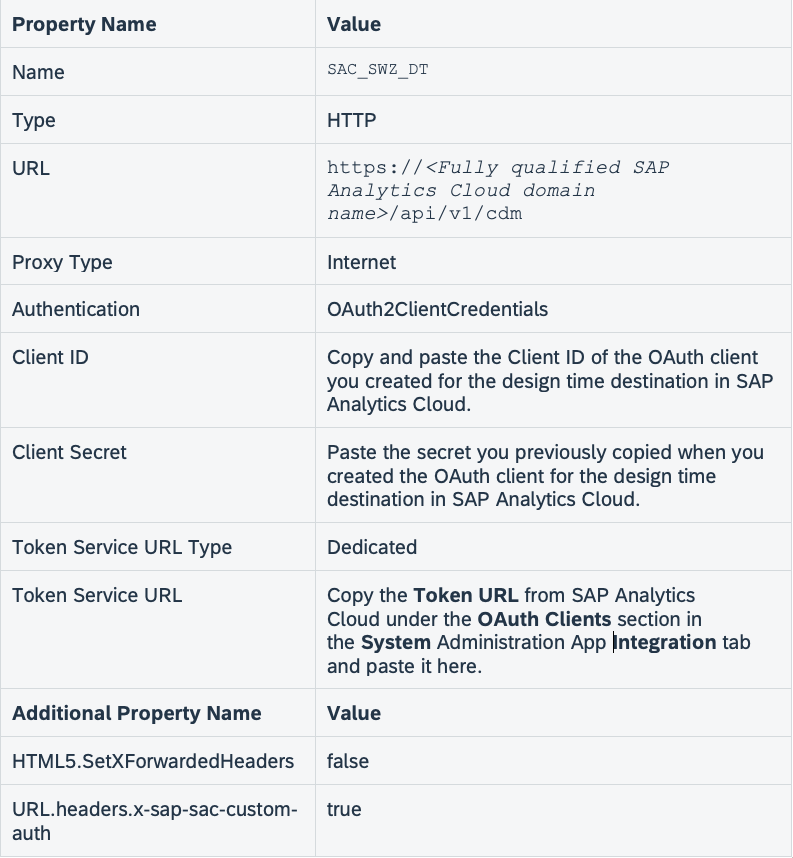 

 

Image 10</b>

   

 
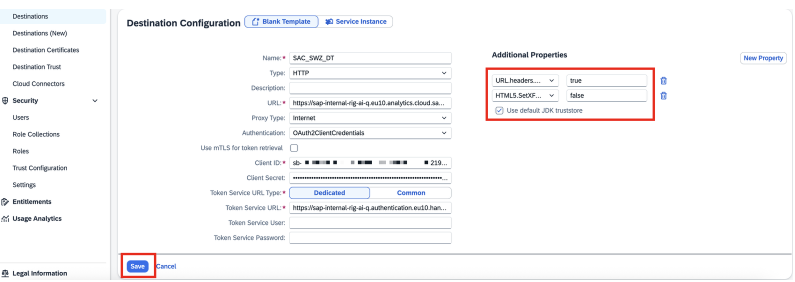 

 

Image 11</b>

<b>Tip: Ensure to have the values accurately from the table above. </b>

<b>3.3	Create a Runtime Destination by Cloning in Your SAP BTP Subaccount</b>

We will be creating a new destination that is used for runtime activities. We can clone the existing destination <b>“DYN_SAC_SSO”</b> and edit the values that are required. 

   

 
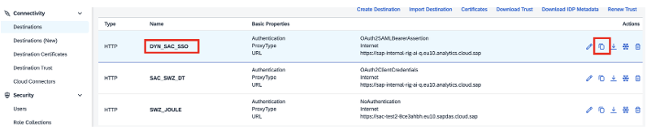 

 

Image 12</b>

The cloning mechanism will allow us to copy the required parameters for our runtime destination. 
Once you close the destination, please edit the following values:
Destination Configuration Name: <b>SAC_SWZ_RT</b>

Click on <b>New Property</b> and add the following properties:
   

 
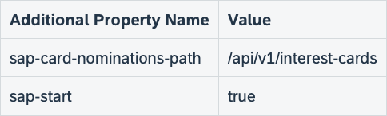 

 

Image 13</b>

Your <b>SAC_SWZ_RT</b> should be as shown below, and click on <b>Save</b>. 

   

 
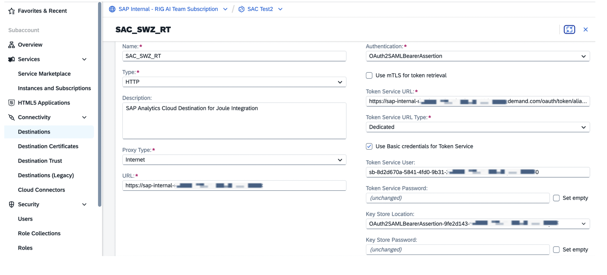 

 

Image 14</b>

In total, you should have the following destinations for your setup. 

   

 
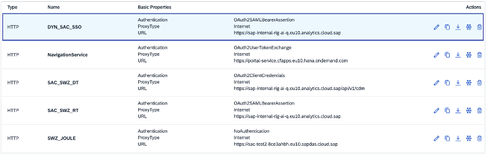 

 

Image 15</b>

<b>Tip:</b> To create NavigationService Destination, <li>Go to <a href="https://discovery-center.cloud.sap/missiondetail/4538/4826/">Establish a Unified Joule Instance Mission</a></li> 
<li>Login to the SAP Discovery Centre mission and click on Project Board. </li>
<li>Under <b>Setup</b> tab, follow the steps under "<b>Create NavigationService Destination</b>" in the below tile and return to the mission</li>  
<pre><li><b>Post Booster Configuration</b></li></pre>

<b>3.4	Create a Content Provider in SAP Build Work Zone</b>

To create a content provider in the SAP Build Work Zone, please ensure you have the role <b>“Lauchpad_Admin”</b> assigned. You can verify or add this role collection in the subaccount, Users section. 

   

 
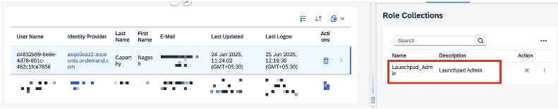 

 

Image 16</b>

To launch the SAP Build Work Zone, go to Services -> Instances and Subscription and click on SAP Build Work Zone, standard edition to launch it.

<b>Tip: I am using the SAP Build Work Zone standard plan for the demo; the screen may differ for the foundation plan, but the settings are the same. </b>

Now, click on <b>Channel Manager and create a New -> Content Provider</b> as shown below.
   

 
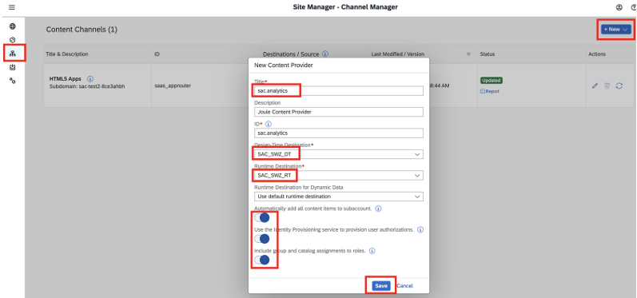 

 

Image 17</b>

   

 
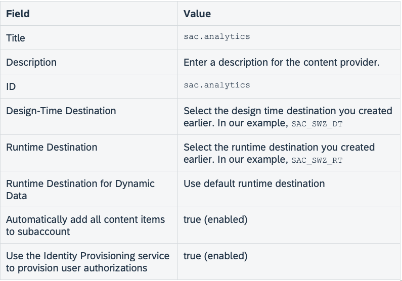 

 

Image 18</b>

Save the settings. This completes the setup process for Joule and <b>Role definitions</b> from <b>SAP Analytics Cloud</b> are now available in <b>SAP Build Work Zone</b>

<b>Important:</b> 
If changes are made to the <b>roles</b> and <b>permissions</b> in <b>SAP Analytics Cloud</b> after this initial import, these changes <b>won't</b> be automatically reflected in <b>SAP Build Work Zone</b>. You must <b>manually sync</b> the <b>roles and permissions</b> again by navigating to the <b>Channel Manager</b> page and using the <b>refresh button</b> associated with the <b>sac.analytics</b> provider.

<h1 style ="font-size:4;"<b>4.	Provision Users from SAP SAC to SAP Build Work Zone using IPS</b></h1>

In the following steps, we are going to provision users from SAP SAC to SAP Build Work Zone. We will be working on SAP Cloud Identity Services, and you will need access as an Administrator. 

<b>4.1	Setup SAP SAC as a Source System</b>

Before we get started, please note the below:
There are two versions of the SAP Analytics Cloud SCIM API. They are handled by the sac.api.version property as follows:
-	When the value is set to 1 or the property is not defined (typical for systems created before versioning was introduced on April 10, 2023), SAP Analytics Cloud SCIM API version 1 is used. This is the default value.
-	When the value is set to 2, SAP Analytics Cloud SCIM API version 2 is used. This version is released with enhancements, such as: reading groups are not ignored in the default read transformation.
More information can be found <a href="https://help.sap.com/docs/cloud-identity-services/cloud-identity-services/sap-analytics-cloud?version=Cloud">here</a>.
If you have the required information, we can proceed. To do so, navigate to <b>SAP Cloud Identity Services, click on Identity Provisioning, and click on Source System.</b>

Here we give you two options,

-	<b>Option 1: Create the Source System Manually </b>
-	<b>Option 2: Use the Template to Create the Source System </b>

<b>Option 1: Create the Source System Manually </b>
Click on <b>Add</b> -> select the <b>Type</b> as <b>SAP Cloud Analytics</b>, and enter the details as required.

   

 
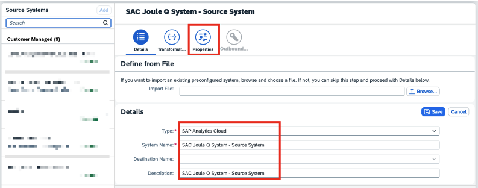 

 

Image 19</b>

Once you enter the details, you can click on the <b>Properties</b> tab -> click on <b>Edit</b> -> click <b>Add</b> and select <b>Standard</b> and enter the following details 
<b>Name: “sac.api.version” 
Value: “2” </b>

and <b>Save</b> the settings. Once you save it, you will be able to see the following settings.  

   

 
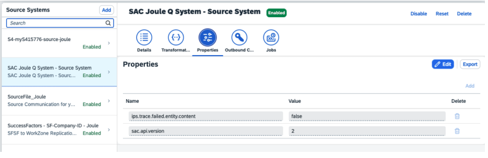 

 

Image 20</b>

This will allow you to generate the sac.api.version – <b>version 2</b> transformations, which will generate the Transformation automatically. You can validate it by navigating to the <b>Transformation</b> tab. 

Now let’s go back to the properties tab and add the following values:

   

 
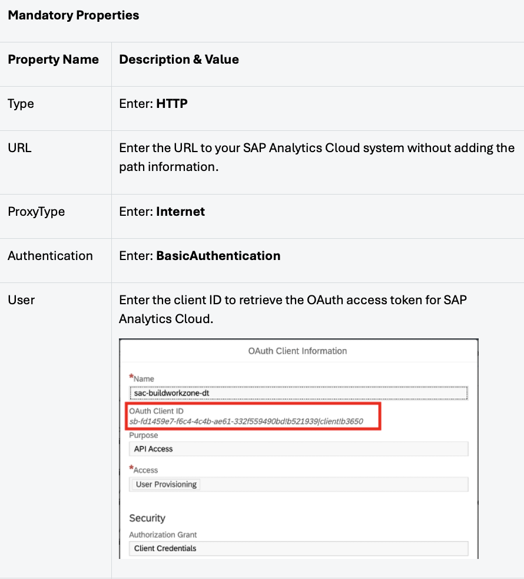 

 

Image 21</b>

   

 
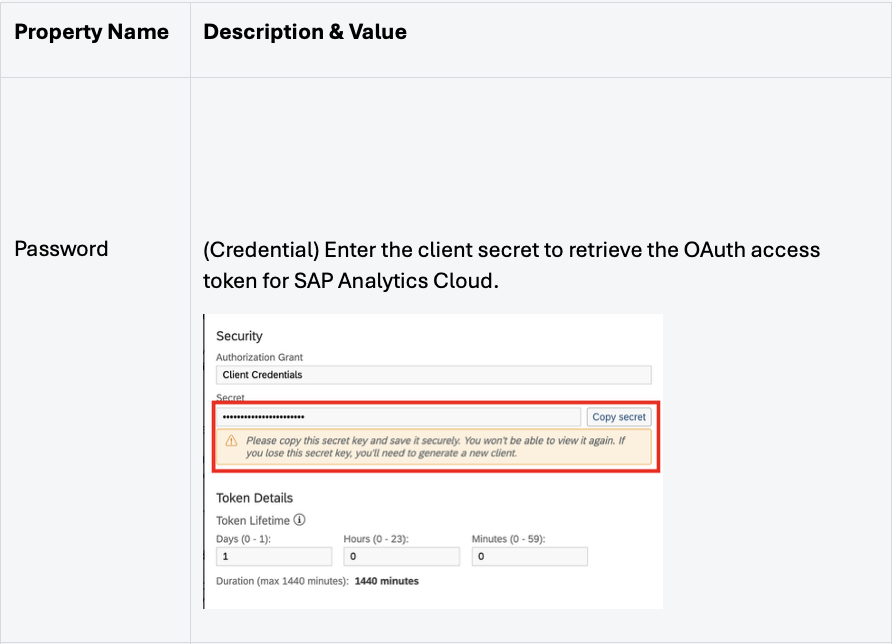 

 

Image 22</b>

   

 
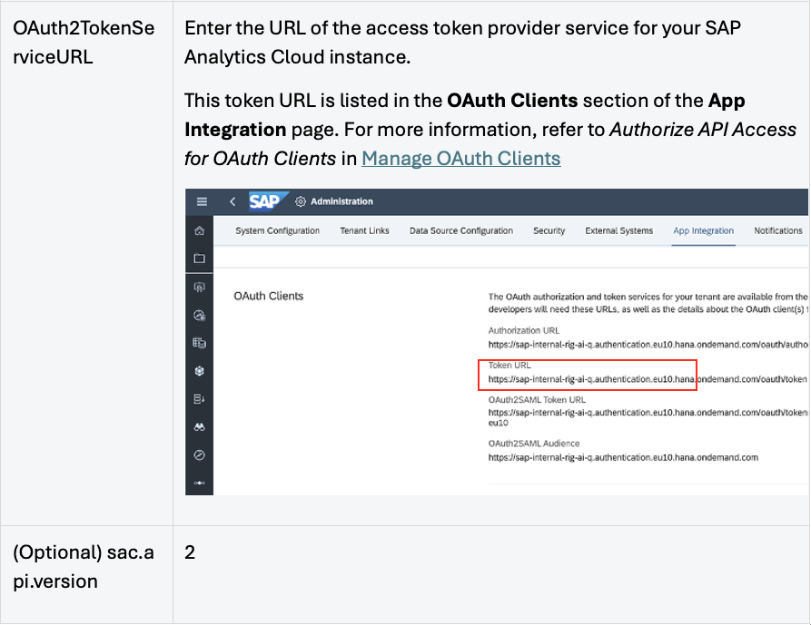 

 

Image 23</b>

Once you enter the details as above, you can click Save. 

<b>-	Option 2: Use the Template to Create the Source System</b>

Download the <a href="https://github.com/SAP-samples/btp-onboarding/blob/main/docs/Joule with Analytics Capablities/SAC Joule System - Source System - Template.json">SAC Joule – Source System.json</a> file and import it as shown below, and edit the Name and Description as required.

   

 
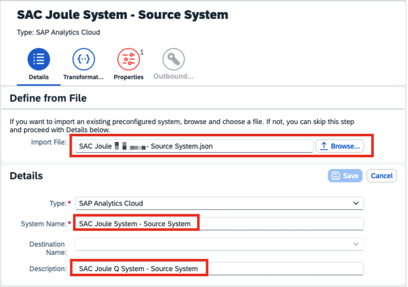 

 

Image 24</b>

Now, click on the Properties tab and edit the values as per the table above. 

   

 
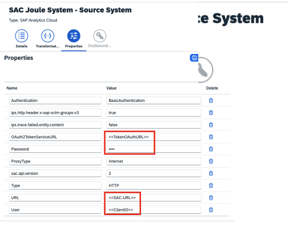 

 

Image 25</b>

Once you edit the values, you should be able to see them as below. 

   

 
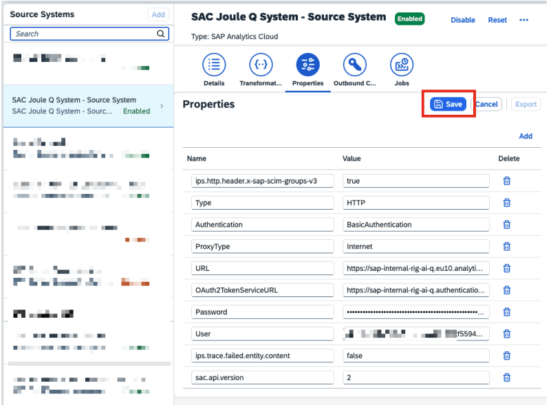 

 

Image 26</b>

<b>4.2	Setup SAP Build Work Zone as a Target System</b>

Similar to the option above, we will now create a Target System. Before we start, you should have completed the setup of <b>SAP Build Work Zone</b> along with the <b>Service Key</b> steps . Please refer <a href="https://discovery-center.cloud.sap/missiondetail/4538/4826/">Establish a Unified Joule Instance Mission</a></li> 
<li>Login to the SAP Discovery Centre mission and click on Project Board. </li>
<li>Under <b>Setup</b> tab, follow the steps under the below tiles and return to the mission</li>  
<pre><li><b>Create SAP Build Work Zone Instance</b></li></pre>
We will need the specific file where you created the Service Key.

We have two options:
<b>
-	Option 1: Create the Target System Manually 
-	Option 2: Use the Template to Create the Target System </b>

<b>Option 1: Create the Target System Manually</b>
Navigate to <b>SAP Cloud Identity Services -> click on Identity Providers -> click on Target System, and click on Add</b>. In the new target system, select the following:

•	<b>Type:</b> SAP Build Work Zone, standard edition

•	<b>System Name:</b> Enter a Name

•	<b>Description:</b> as required

•	<b>Source Systems:</b>  Select the <b>Joule Source that was created in the previous step</b>

Your setup should look like this, and you can click on <b>Save</b>.

   

 
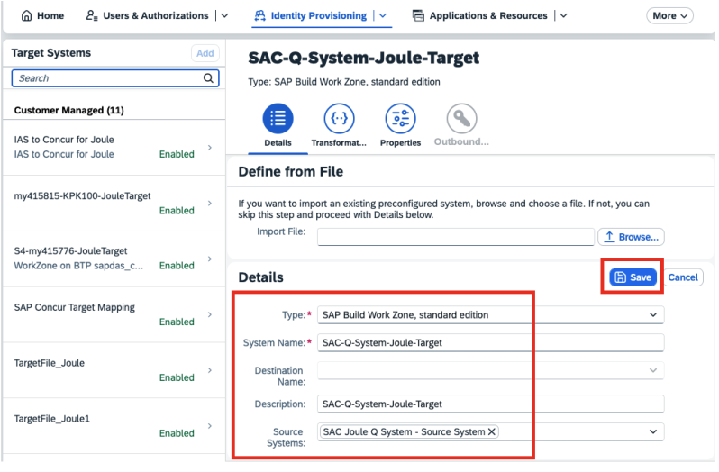 

 

Image 27</b>

Once the Target System is saved, you should be able to see that the Transformation and Properties will be auto added with default values

   

 
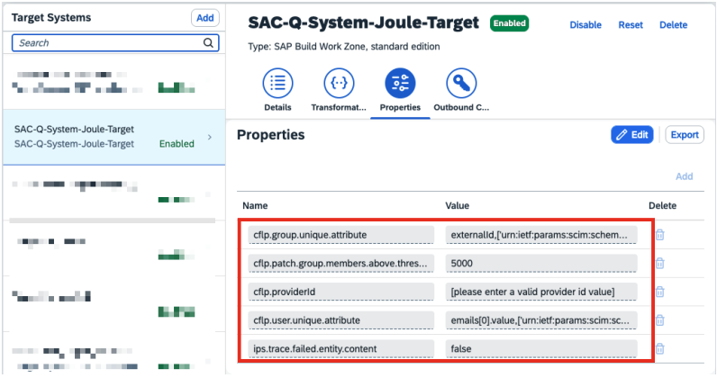 

 

Image 28</b>

You can click on Edit and add the following values:

<b>Tip: Open the Service Key file, as most of the values are required from the file.</b> I have attached the Service Key file example below. 

   

 
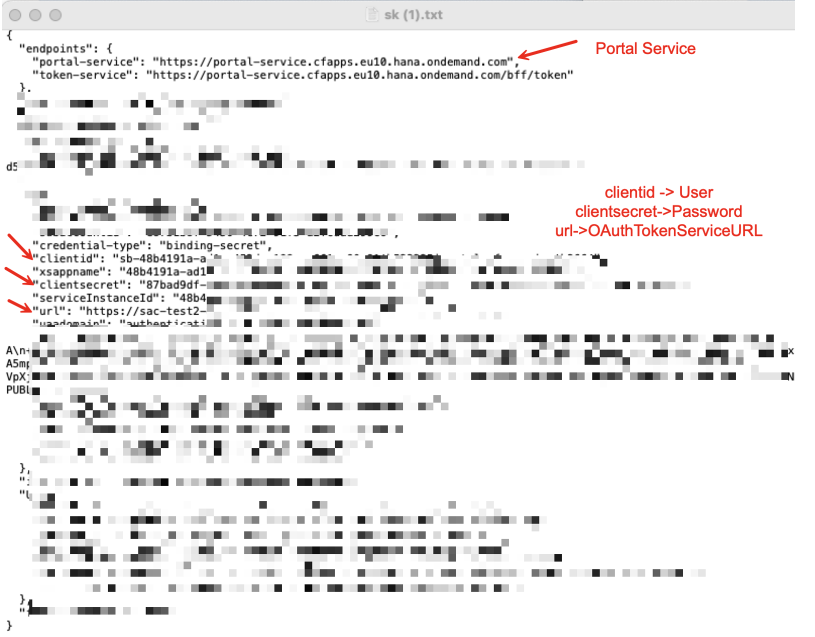 

 

Image 29</b>

   

 
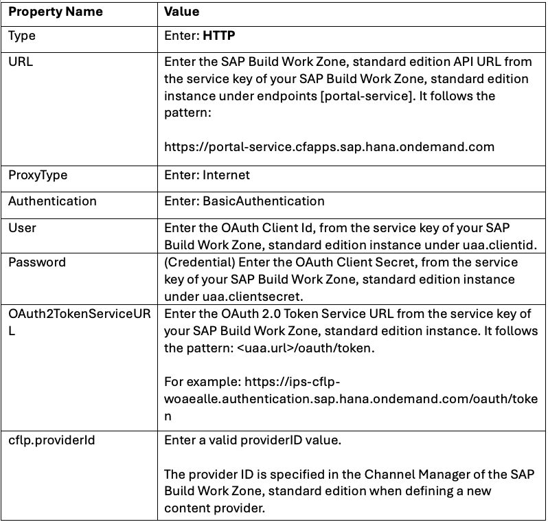 

 

Image 30</b>

Once you enter the details, click on <b>Save</b>.

<b>-	Option 2: Use the Template to Create the Target System</b>

When you create a <b>new Target System</b> -> click on <b>Browse</b> and select the file <a href="https://github.com/SAP-samples/btp-onboarding/blob/main/docs/Joule with Analytics Capablities/SAC-Joule-Target Template.json">SAC-Joule-Target Template.json</a>, and ensure you select the Source Systems as per the previous setup. 

   

 
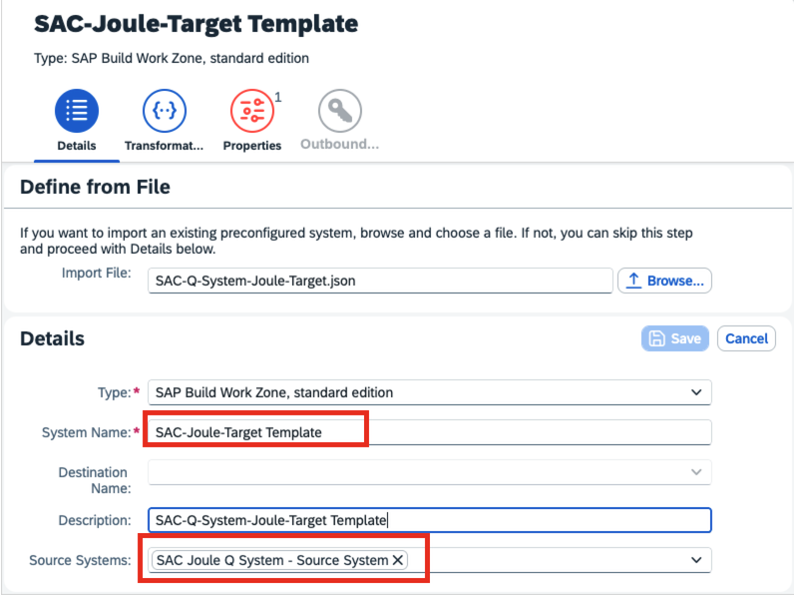 

 

Image 31</b>

Click on Properties and edit the following values as per the table above

   

 
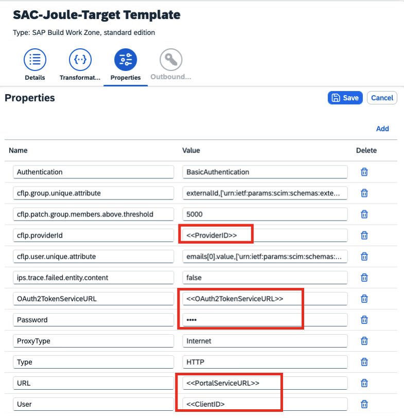 

 

Image 32</b>

The values should be as shown below. Validate the details and click on <b>Save</b>. 
   

 
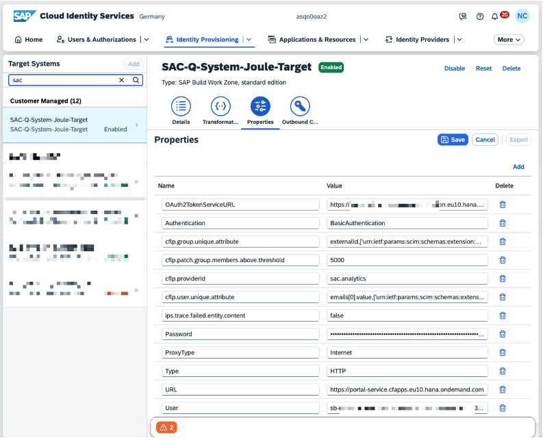 

 

Image 33</b>

<b>4.3	Run User and Group Provisioning</b>

Now we are good to go ahead and do a user sync from <b>SAP Analytics Cloud</b> to <b>SAP Build Work Zone</b>. In your SAP Cloud Identity Services click on <b>Identity Provisioning -> click on Source System</b> and look for the SAC Joule Source that we created above. 

Click on Jobs, and in the <b>Read Job</b> section, click on <b>Run Now</b>.

   

 
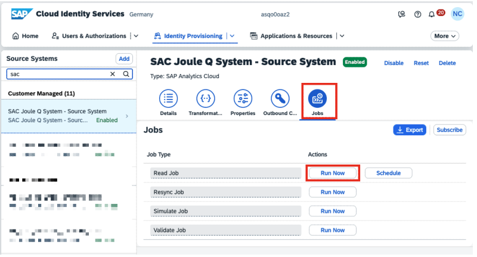 

 

Image 34</b>

Once the Job is triggered, you can click on <b>Identity Provisioning</b> and <b>Provisioning Logs</b> to see the status sync in progress. Important to look at the Job process with two users and a group with the source system and two users and a group for the target system. 

   

 
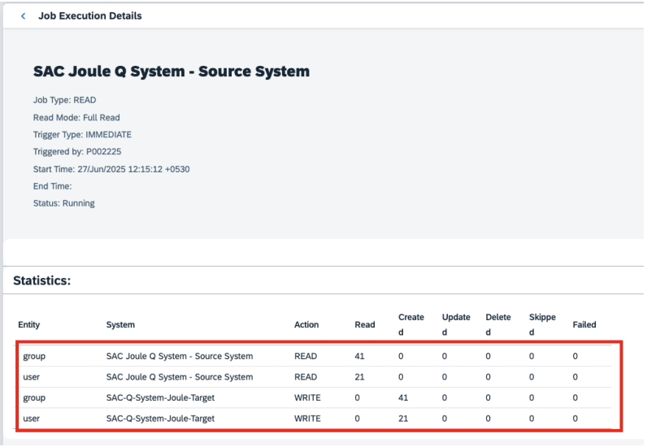 

 

Image 35</b>

Depending on the number of users in the system, the IPS job may take a few minutes to hours. Once completed, you should be able to see the Job Finished Successfully, as shown below. 

   

 
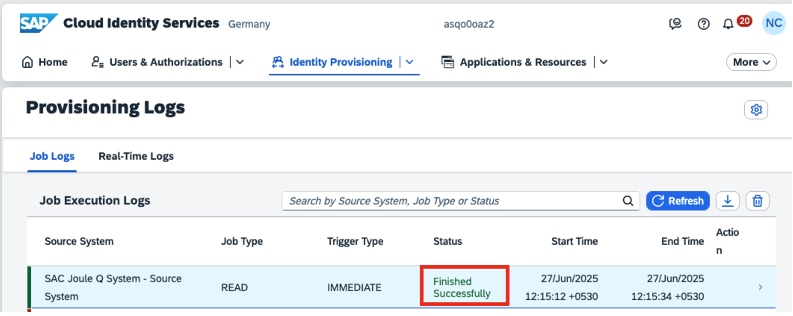 

 

Image 36</b>

<b>4.4	Validate Provisioning</b>

You can validate the user provisioning in the SAP Build Work Zone. You will need a role “<b>Launchpad_Admin</b>” assigned. You can go to your <b>SAP BTP Subaccount -> click on Instance and Subscriptions -> click on SAP Build Work Zone, standard edition</b>. This will open a new page -> click on <b>Channel Manager</b> to refresh the “<b>sac.analytics</b>” Provider ID that you have created, once its updated you can click on <b>Reports</b> to see the new numbers as shown below. 

   

 
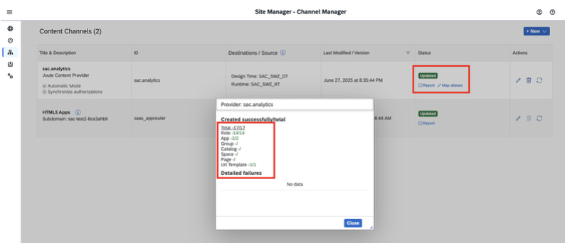 

 

Image 37</b>

 
Alternatively, you can go to <b>Settings -> Identity Provisioning</b>, enter a user <b>email address</b>, and click on <b>View Assigned Roles.</b>
   

 
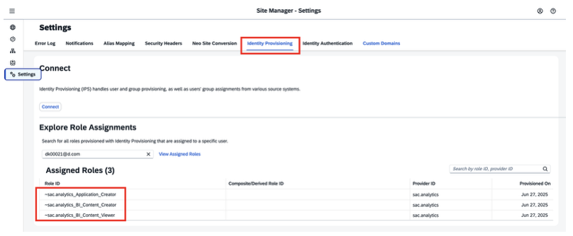 

 

Image 38</b>

This completes the setup process. 

<b>4.5	Schedule User and Group Provisioning (optional)</b>

To schedule a sync from SAP Analytics Cloud to SAP Build Work Zone, perform the following steps:
1.	Sign in to SAP Cloud Identity Services.
2.	Go to the <b>Identity Provisioning</b> tab and choose <b>Source Systems.</b>
3.	Select your SAP Analytics Cloud source system.
4.	Go to the <b>Jobs</b> tab.
5.	Choose the <b>Schedule</b> button on the <b>Read Job</b> row and configure your recurrence details.

