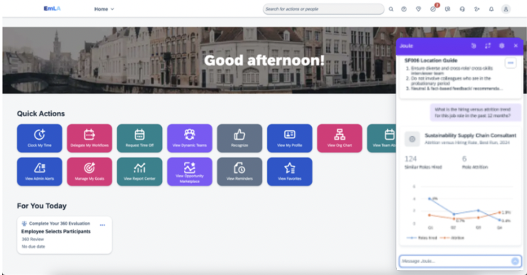

We are now ready to set up the test models in the SAP Analytics Cloud and prepare Joule to pick the required responses. To prepare your data models, please refer to the section <a href="https://help.sap.com/docs/joule/integrating-joule-with-sap/index-your-data-using-just-ask-and-test-your-integration?locale=en-US">“Index Your Data Using Just Ask for Analytical Insights”.</a>
Once you have indexed your models, you should be able to see the Joule response as below – please adjust according to your data.

Since we have added analytical capability to both SuccessFactors and S/4 HANA public cloud, we can ask analytical questions to Joule from SuccessFactors.

Example: Show me an analytical chart for sales based on the month

   

 
 

 

Image 1</b> 

