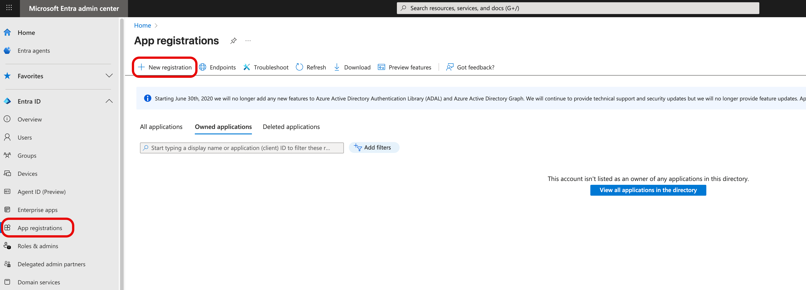
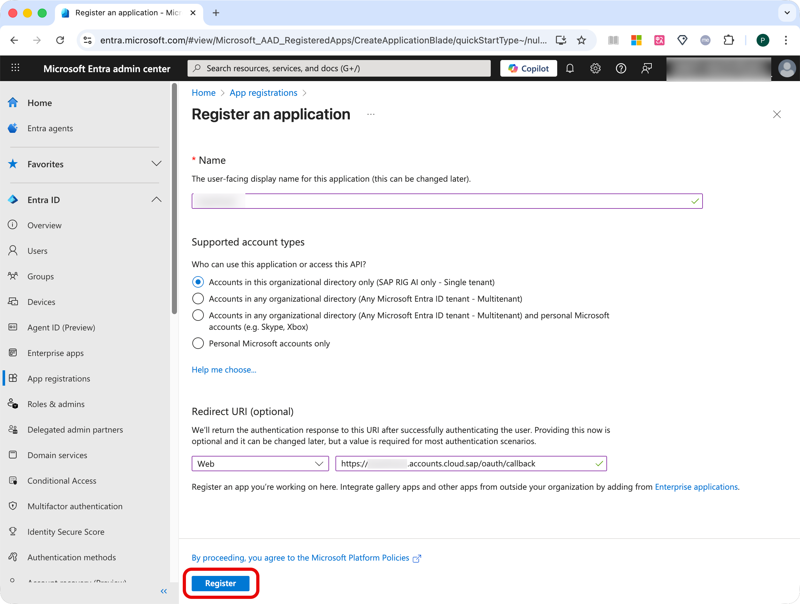
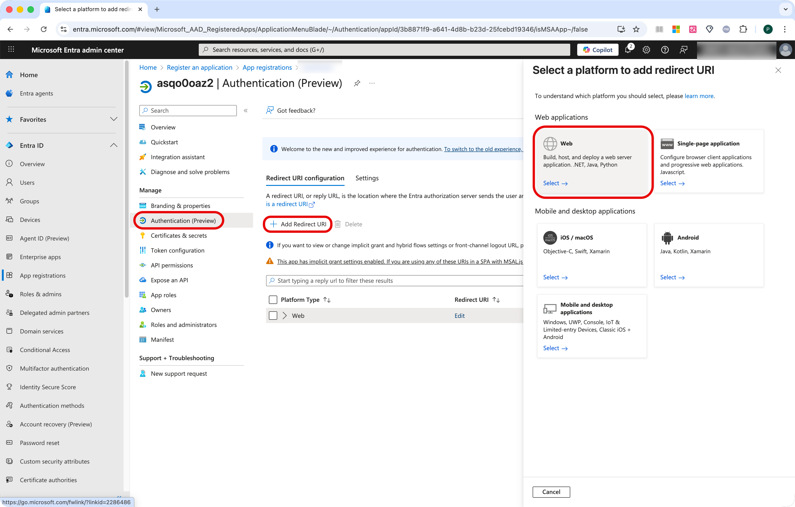
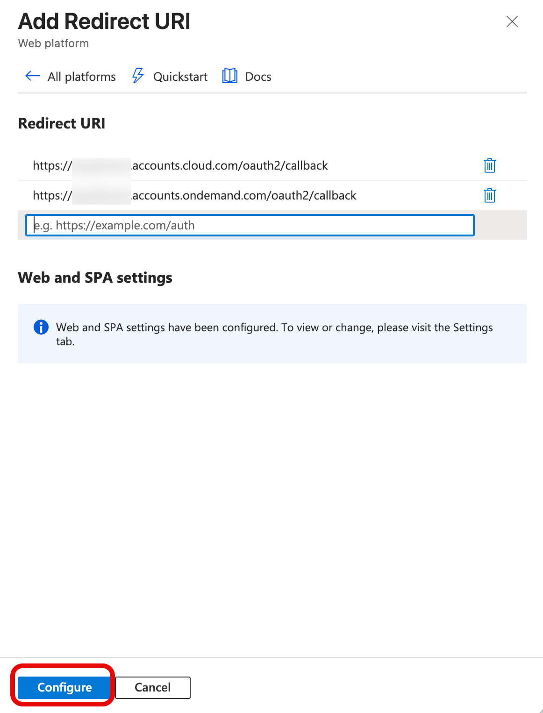

## Configure Microsoft Entra ID

Go to the Entra ID Admin Center with the admin user role.

## Register the Federation App

1. Go to **Home > App registrations** .
2. Choose **New registration** .

   
3. Enter a meaningful name such as **Federation with *{cloud_identity_issuer}*** .
4. Under **Redirect URI (optional)** , choose **Web** .
5. Enter the following redirect URI: ***{cloud_identity_issuer}* /oauth2/callback** .
   Replace the placeholder with the proper value.
6. Choose **Register**.

   
7. Note down the **Application (client) ID** and the **Directory (tenant) ID** .
   You need the application ID later in this blog and the follow up blog. The directory ID is needed only in the follow up blog.

## Configure Redirect URIs

In case the Entitlements are not found in your SAP BTP Global Account, and if the order is processed, it could be that you have Multiple SAP BTP Global Accounts, and the license could have been assigned to the other account. Please reach the SAP BTP CSM or AE for support.

Add all remaining redirect URIs that are supported by your SAP Cloud Identity Services tenant to the application registration. See the previous section **Issuer and Subdomain of Your SAP Cloud Identity Services Tenant** .

1. Go to **Authentication (Preview)** .
2. Choose **Add Redirect URI**  **>** **Web**.

   
3. Add the additional redirect URIs.

   * For SAP public cloud, enter:
     * https://***{cloud_identity_tenant_subdomain}*** .accounts.ondemand.com/oauth2/callback
     * https://***{cloud_identity_tenant_subdomain}*** .accounts.cloud.sap/oauth2/callback
   * When using a custom domain, enter: https://***{custom-domain}*** /oauth2/callback
4. Save your entries by clicking the **Configure**

   
