## 1. SAP Signavio with SAP Cloud Identity Services

To activate Joule in SAP Signavio, we first need to ensure we have the prerequisites. Let's look at the details of configuring SAP Cloud Identity Services for your system.

**Note: In case you already have SAP Cloud Identity configured with SAP Signavio, you may skip this section.**

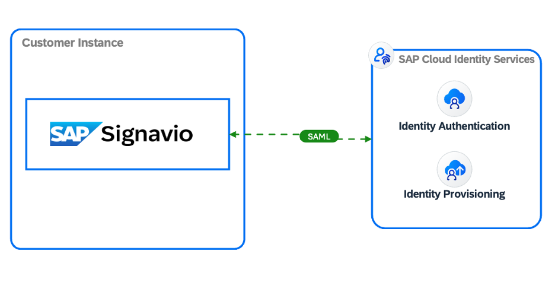

To achieve the above setup, you will need access as an Administrator to your SAP Cloud Identity Services and your SAP Signavio system.

We highly recommend checking the [Single Sign-on Using SAML](https://help.sap.com/docs/signavio-process-manager/workspace-admin-guide/enable-sso?q=Metadata) help page and the following sections.

- [Set Up SSO Using SAML](https://help.sap.com/docs/signavio-process-manager/workspace-admin-guide/enable-sso?q=Metadata#set-up-sso-using-saml)

- [Configure Your IdP](https://help.sap.com/docs/signavio-process-manager/workspace-admin-guide/enable-sso?q=Metadata#configure-your-idp)

- [Enabling SSO Using SAML](https://help.sap.com/docs/signavio-process-manager/workspace-admin-guide/enable-sso?q=Metadata#enable-sso-using-saml)

- [Invite New Users by Email](https://help.sap.com/docs/signavio-process-manager/workspace-admin-guide/enable-sso?q=Metadata#invite-new-users-by-email)

- [Enforce SSO to Disable Login with Credentials](https://help.sap.com/docs/signavio-process-manager/workspace-admin-guide/enable-sso?q=Metadata#enforce-sso-to-disable-login-with-credentials)

The details below can guide one of the processes to Setup SSO with SAP Cloud Identity Services.

### 1.1 Download the Metadata file from SAP Cloud Identity Services

This file is required to exchange the SAML 2.0 files and establish trust between the systems. More information is available [here](https://help.sap.com/docs/cloud-identity-services/cloud-identity-services/tenant-saml-2-0-configuration?version=Cloud&q=download+metadata). 

Ensure you have selected the same SAP Cloud Identity used across the landscape for SSO. This is essential for the best user experience with Joule. Ensure you use the same Domain Name as in your SAP Cloud Identity Services. Note that the Cloud Identity Service tenant cannot vary in case you want to connect multiple solutions to Joule.

Log in to your **SAP Cloud Identity Services** tenant, click on **Applications and Resources**, select **Tenant Settings** -> select **Single Sign-On** -> click on **SAML 2.0 Configurations**, and click on **Download Metadata File**.

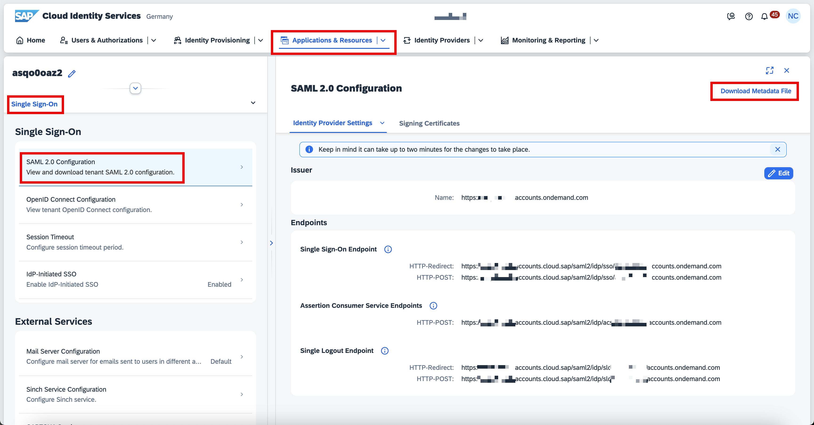

We shall go ahead and import this metadata file into you SAP Signavio System.

### 1.2 Establish Trust and Download the Metadata file from SAP Signavio

Log in to your SAP Signavio system, click on the App Menu icon, and click on Process Manager.

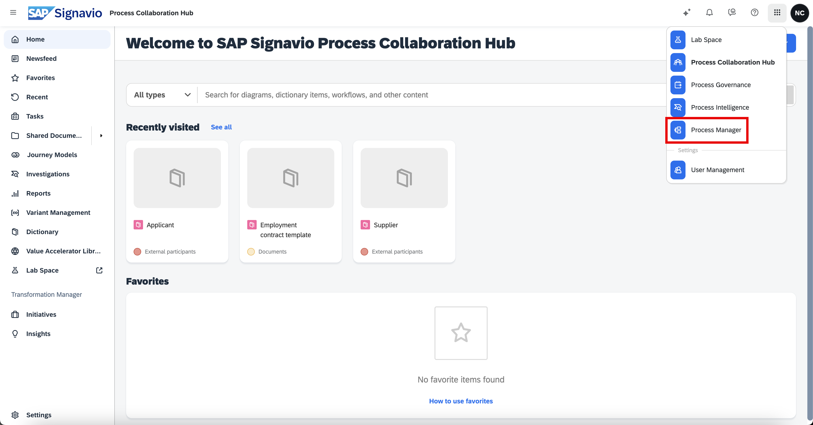

In the Process Manager page, click on Setup and click on Manage SAP Signavio Process Collaboration Hub authentication as shown below.

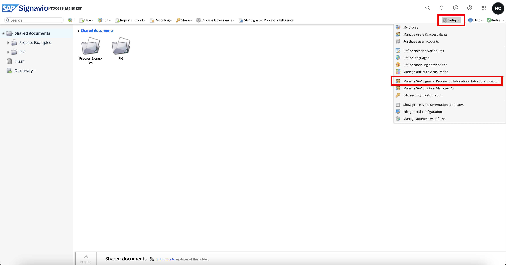

In the new window, you will have a few options to activate Single Sign-on Using SAML. You may refer to the section [Enable SSO Using SAML](https://help.sap.com/docs/signavio-process-manager/workspace-admin-guide/enable-sso?q=Metadata#enable-sso-using-saml). You will need to select the following options:

- Enable SAML 2.0 authentication
- Allow service provider-initiated authentication
- Sign authentication request
- Create new user accounts automatically (**this will be an optional parameter, please validate before you select it**)
- Copy the code from your SAP Cloud Identity Services metadata file and paste it into the Metadata section, as shown below

Click on Download the SAML service provider metadata, now this Metadata will be added to the SAP Cloud Identity Services.

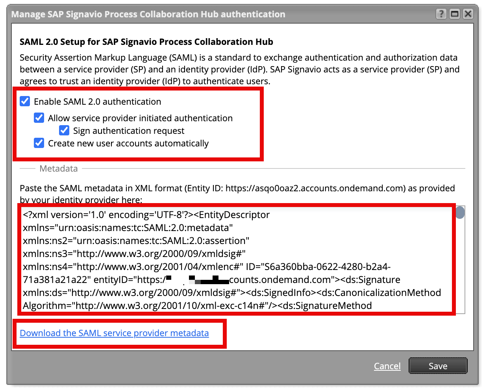

Once you have validated the details, Save it.

### 1.3 Create an Application for Signavio in SAP Cloud Identity Services

We will be creating a new [Application](https://help.sap.com/docs/cloud-identity-services/cloud-identity-services/applications?version=Cloud&q=application) in your SAP Cloud Identity Services to setup a SAML trust between the systems. You may also refer to the official [SAP Note - 3461963](https://me.sap.com/notes/0003461963) for more details.

In your SAP Cloud Identity Services, click on Application & Resources -> click on Applications -> then click on Create.

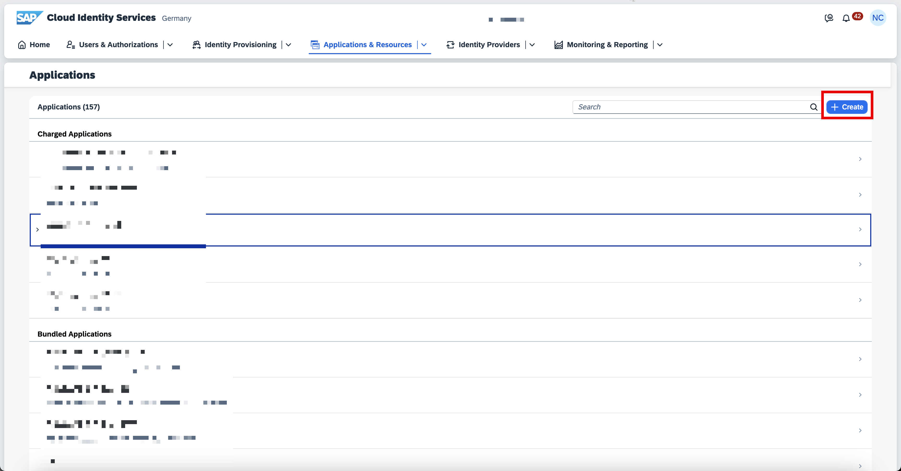

In the Create Application, please enter the details to recognize your system. You may follow the details as shown below and Save the settings.

- Display Name – Signavio System
- Type: SAP Signavio Solution
- Protocol Type: SAML 2.0

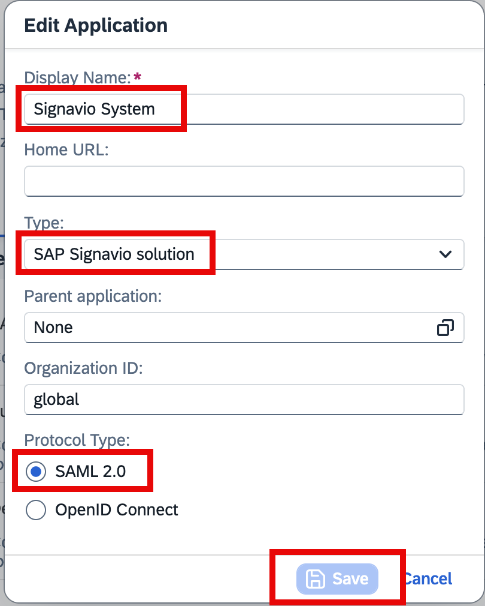

A new application will be created. Please click on the new application you created for Signavio System, click on SAML 2.0 Configuration, click on Define from Metadata, click on Browse in the new window, and upload it.

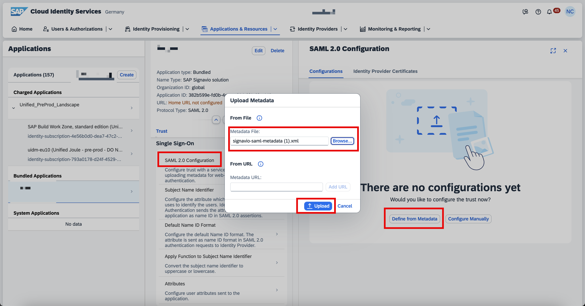

You should be able to see the Metadata file information once it’s uploaded as shown below.

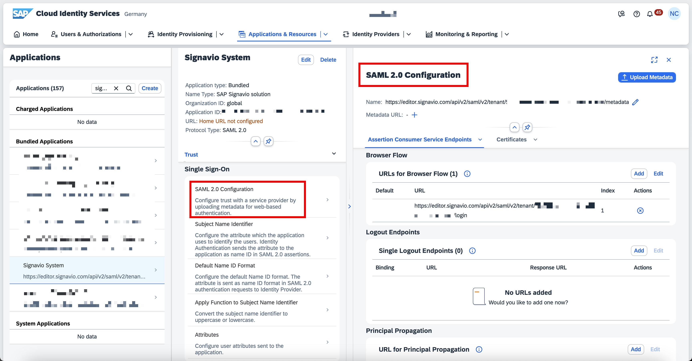

In the same section of your application Signavio System, click on Subject Name Identifier change the Identity Directory - Value to Global User ID, and Save the settings.

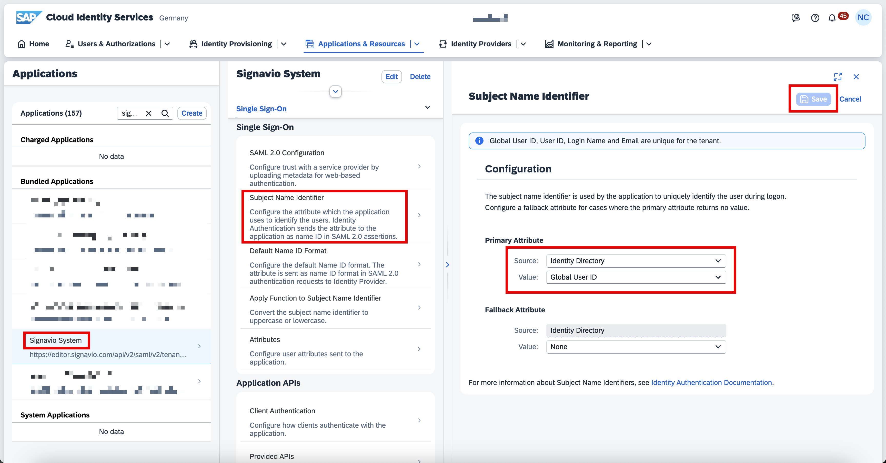

Next, we will need to add a value in the Attributes section. Please click on Attributes and click on Add and ensure you add the attribute Name as “signavio_licenses_v1” and the Value in my case I have “Enterprise Plus Edition”  (You can choose your license type - The name of the license that you want to assign to a user, for example "Enterprise Plus Edition", "Enterprise Edition", "Classic Edition", "Collaboration Hub", or "Workflow". If required you can also refer to the note3461963 - Configuring SSO with SAP IAS for SAP Signavio).

Before you save the details, please validate the other details such as email, first_name, last_name, and user_uuid as per the screen, and Save it. 

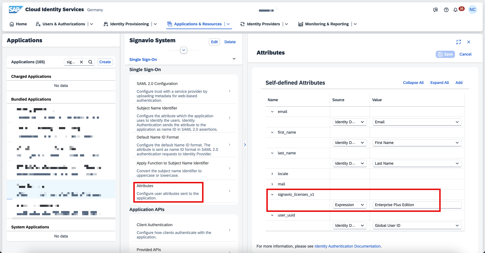

In case you want to add more values please look at [Configure your IdP](https://help.sap.com/docs/signavio-process-manager/workspace-admin-guide/enable-sso?q=Metadata#configure-your-idp) section on the help page.

This completes the bidirectional trust between the SAP Signavio system and the SAP Cloud Identity Services.

### 1.4 Test your SAP Signavio SSO with SAP Cloud Identity Services

To access your SAP Signavio system with SSO you can use the following URL syntax:

https://<<ServerRegion>>.signavio.com/p/hub?t=<WORKSPACE_ID> 

In case you do not know your WORKSPACE_ID, within your SAP Signavio system click on the question icon and you can find the Workspace ID as shown below.

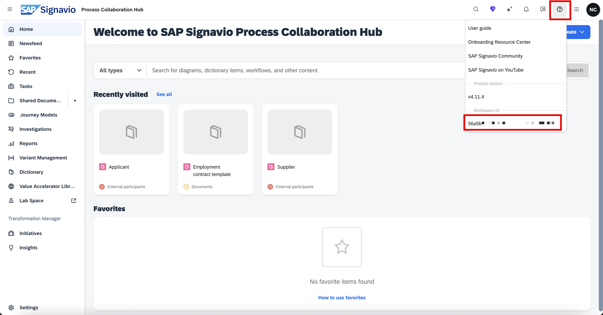

So, in my case, my SAP Signavio SSO URL is:

https://editor.signavio.com/p/hub?t=5xxxxxxxxxxxxxxxxxxxxxxxxxxxc

Once I launch this URL, SAP Signavio auto-redirects to the SAP Cloud Identity Services page for Authentication, and users should be able to log in successfully.

Further, you can check the roles and authorization management here - [Manage Users and Access Rights](https://help.sap.com/docs/signavio-process-manager/workspace-admin-guide/manage-users-and-access-rights?q=Metadata).

### 1.5 SAP Cloud Identity Services Additional Configurations

This is an additional process that will allow you to differentiate the access for Base and Premium users. To achieve this setup, we will create 3 different groups.

- grp_joule_skills_personal_data_restricted used for Personally Identifiable Information (PII)
- sap.sig.base
- sap.sig.premium

<b>

Note:
- I recommend reading the help page “SAP Cloud Identity Services Additional Configurations” for more information on each role.
- A base role is required for all users. If users need Premium and/or PII skills, please create the groups and maintain the users, respectively.
</b>

I am showing Base user group creations; you can follow the same for the others. You can navigate to SAP Cloud Identity Services, click on Users and Authentication, click on Groups, click on Create, enter the following details, and click on Next Step.

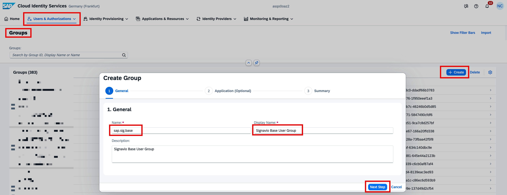

Once you enter the details, click on Next Step (Optional: Search for the Joule integration; you can skip this application selection as it’s not mandatory).

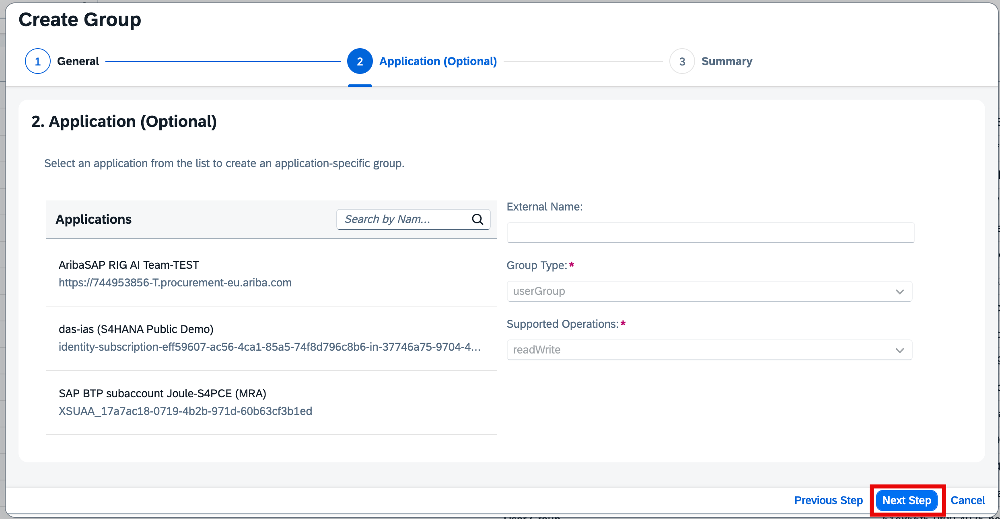
