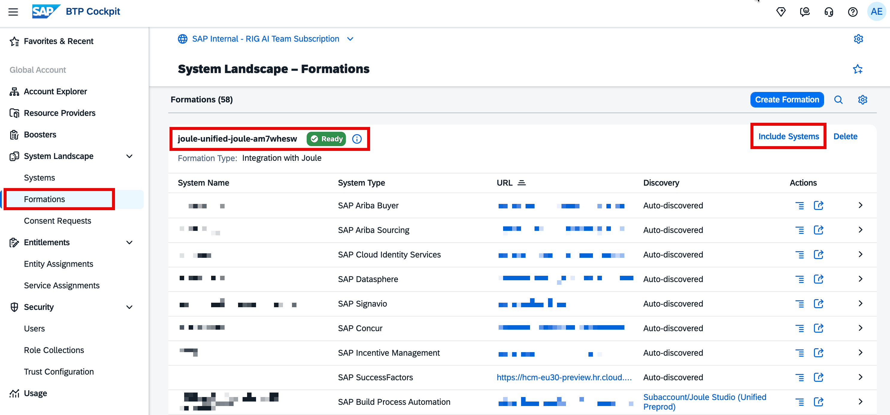
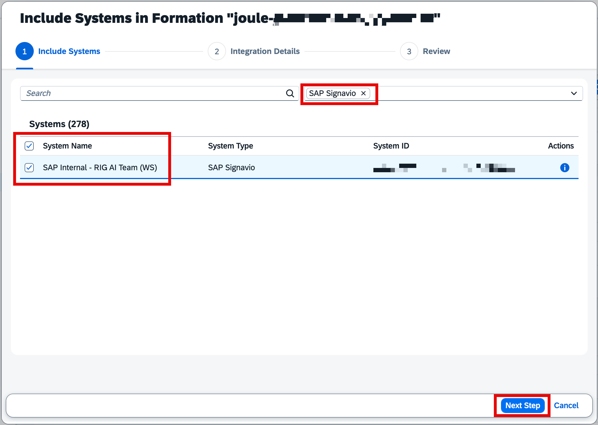
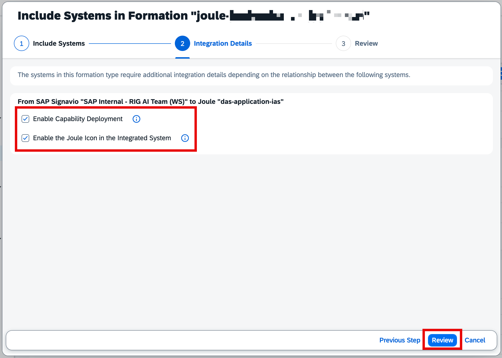
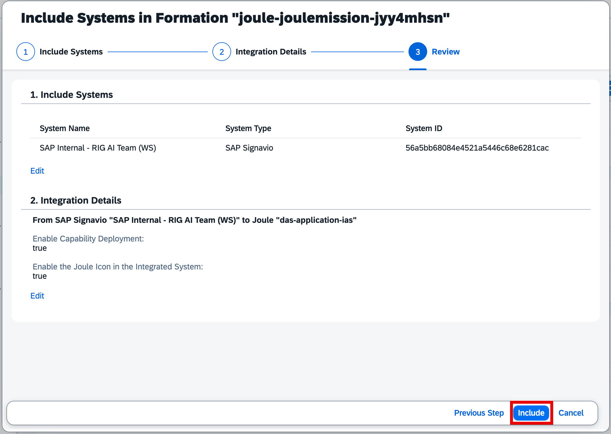
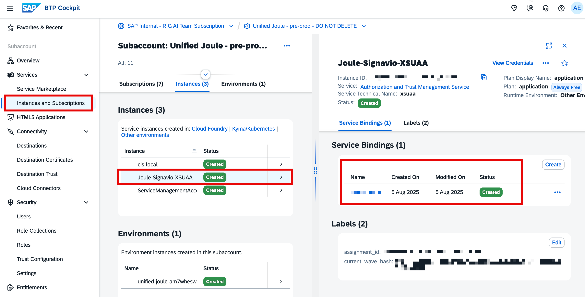
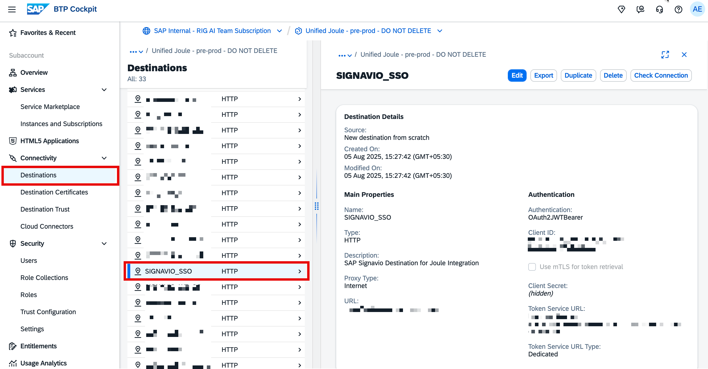

## 3. Adding SAP Signavio to an existing Joule formation

Formation is a logical grouping of SAP systems together. In Joule case, if the booster has been executed previously, we can use the same formation to integrate the SAP Signavio system.

Note: Please check if the existing formation is connected to Test or Production systems and plan to use them or create a new SAP BTP Subaccount.

To use the existing SAP BTP formations, navigate to SAP BTP GA, click on System Landscape, click on Formations, and search for the existing formation to which you want to add the SAP Signavio system.

In the formation below, you can see that we have a formation in a Ready state, and SAP Signavio is not part of it. Click on Include System.

If you have too many systems, filter it out by SAP Signavio or else select the SAP Signavio system and click on Next.

Select both options, as we want Joule to support SAP Signavio scenarios and enable the Joule icon in the SAP Signavio system, click on Review.

Once you verify the details, click on Include.

Once you click on Include, the formation status changes to Synchronizing, and it might take 5-10 minutes at times to become Ready.

### 3.1 Post checks in your SAP BTP Subaccount

Once your SAP Signavio is set with Joule either via Booster or the Include System in Formation, you should be able to see the settings in your Subaccount.

- An instance is created, which can be found in Instances and Subscriptions

- A **SIGNAVIO_SSO** Destination is created as shown below.

If these things show up, we can continue to set up the additional destinations required.

