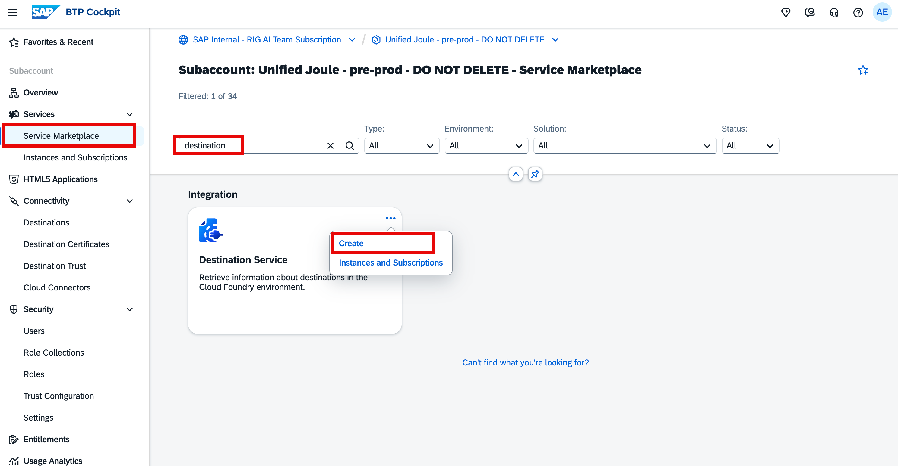
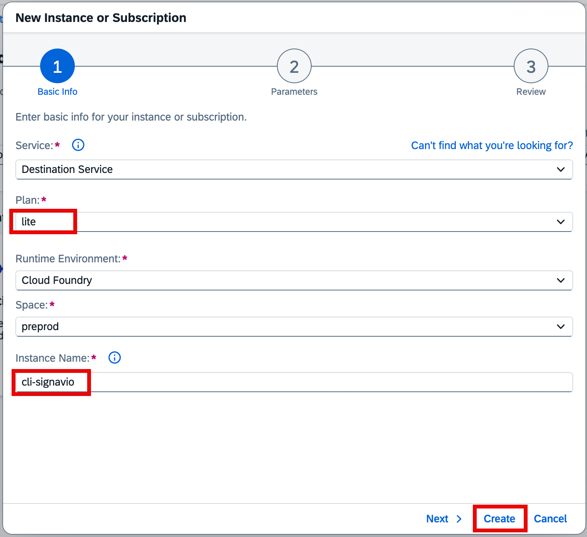
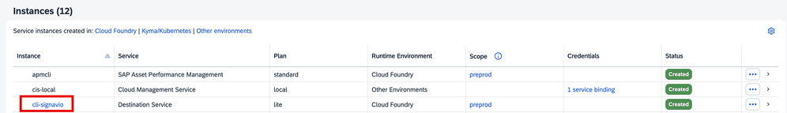
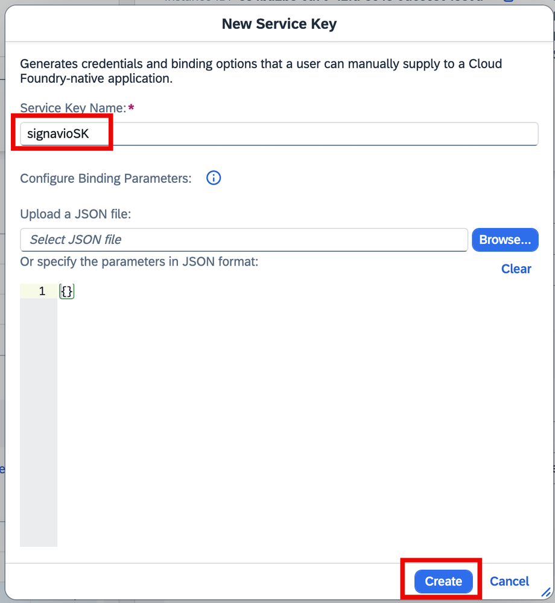
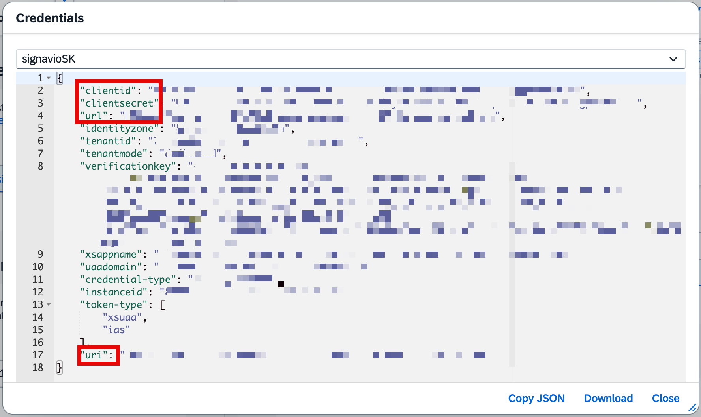
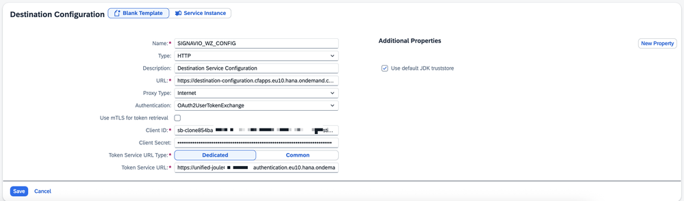
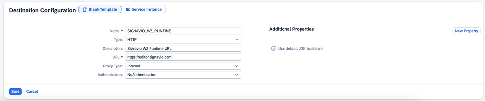

## 4. Creating SAP Signavio Destination in the SAP BTP Subaccount

To complete the setup, we need to set up two more destinations - **SIGNAVIO_WZ_CONFIG** and **SIGNAVIO_WZ_RUNTIME** to use the navigation service. 

<b>
Note: SAP Build Work Zone integration will be released soon and will be automated soon; however, it is a manual setup with this release and we use the destination names to sync with next releases. 
</b>

### 4.1 Activate Destination Service and Create a Service Key

To create the destination service, we will need to activate services called Destination Service in your SAP BTP Subaccount. Navigate to our Joule subaccount, click on Services -> click on Service Marketplace - > look for a service called Destination Service -> and click dots and click Create.

In the new pop-up screen, you will be able to see the default values that will be picked up based on your setup. In my case, it’s using Cloud Foundry and the Space from the previous setup and you have to give the Instance Name and click on Create.

Once the instance is created you should be able to see the details in the Instance and Subscription section under Instances.

Click on the three-dots icon for your cli-signavio instance, select Create Service Key, enter the details as shown below, and click on Create.

Once the Service Key is created download this file. You can click either view or download the file as we need the values to create the destinations. We will need the ClientID, Client Secret, URL, and the URI from this file.

### 4.2 Create Destinations

To create the SIGNAVIO_WZ_CONFIG and SIGNAVIO_WZ_RUNTIME, click on Connectivity  -> click on Destinations ->, and click on Create Destination.

- We will set the SIGNAVIO_WZ_CONFIG destination as table below

| Parameter | Value |
| --- | --- |
| Name | SIGNAVIO_WZ_CONFIG |
| Type | HTTP |
| Description | Portal-service URI Value from the service key created for the service instance of SAP Signavio (paste here the address you copied step in 7, then add the suffix /destination-configuration/v1/destinations/). |
| Proxy Type | Internet |
| Authentication | OAuth2UserTokenExchange |
| Client ID | ClientID from the service key created for the service instance of SAP Signavio |
| Client Secret | Client Secret from the service key created for the service instance of SAP Signavio
| Token Service URL | Dedicated |
| Token Service URL | Enter the URL to the OAuth2 token service in the following format: https://<my-subdomain>.authentication.<region>.hana.ondemand.com/oauth/token |
| Additional Properties | Verify that the checkbox Use default JDK trust store is selected |

The destination should be like this.

Save the Destination if all is good.

- Create the second destination for SIGNAVIO_WZ_RUNTIME

| Parameter | Value |
| --- | --- |
| Name | SIGNAVIO_WZ_RUNTIME |
| Type | HTTP |
| Description | Signavio WZ Runtime URL |
| URL | Base URL of your Signavio client from your Signavio workspace, example: https://editor.signavio.com or https://app-us.signavio.com validate your Signavio URL |
| Proxy Type | Internet |
| Authentication | NoAuthentication |
| Additional Properties | Verify that the checkbox Use default JDK trust store is selected |

The destination should look like below.

This completes the setup of Joule in SAP Signavio.

