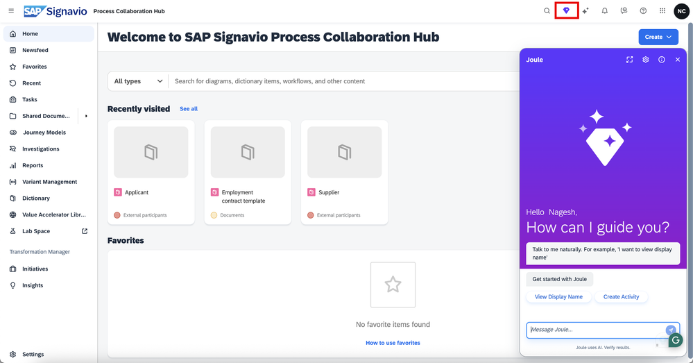

## 4.1. Test SAP Signavio with Joule

Now let’s log in to the SAP Signavio system and launch the Joule icon to test the functionalities.

For more information on the Joule capabilities and how it works with SAP Signavio please check our official SAP help page - [Joule in SAP Signavio Solutions](https://help.sap.com/docs/joule/capabilities-guide/joule-in-sap-signavio-process-transformation-suite?version=CLOUD).

