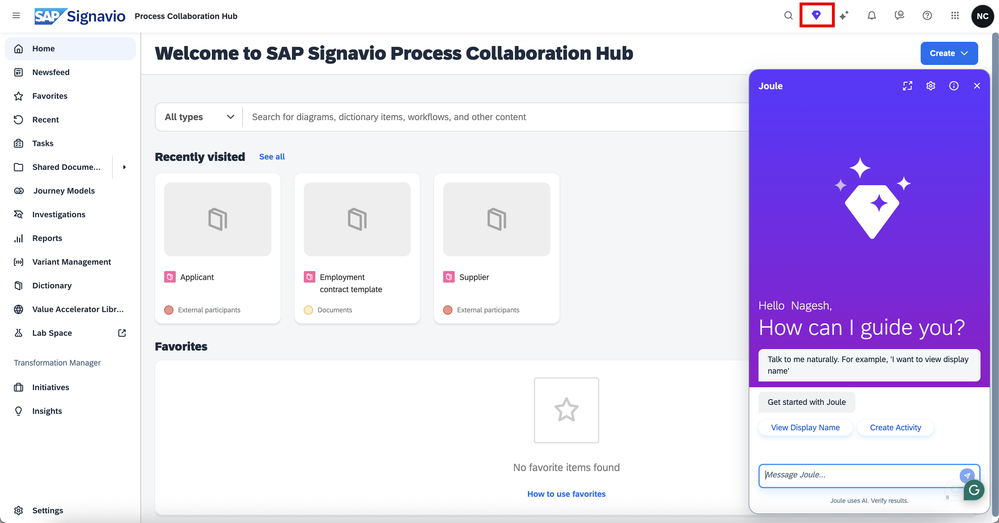

## 4.1. Test SAP Signavio with Joule

Now let’s log in to the SAP Signavio system and launch the Joule icon to test the functionalities.

### 4.1.1 Joule Capabilities

Joule in SAP Signavio solutions offers three types of capabilities: transactional, navigational, and informational.

Following examples list different types of Joule capabilities available in SAP Signavio.

#### Process Descriptor or Process to Text

It is an informational Joule capability that allows users to obtain clear, human-readable, and easy to understand description of a given process that's open in SAP Signavio Process Collaboration Hub. It provides description of a process model by reading the process model ID from the context. This scenario supports requests like "Describe process model" to explain the process model's key details. 

#### Process Comparison Summary

Process Comparison Summary is an informational skill that enables users to quickly understand the key differences between process models by providing an auto-generated, human-readable summary of meaningful changes. It is designed to reduce reliance on manual side-by-side visual inspections and helps process modelers efficiently assess revisions via comparing process models between the latest published revision and an earlier revision of the same process model.

### Variant Manager

Variant Manager is both a navigational and a transactional Joule capabilitiy which navigates to the Variant Management overview page where users can create, read, update and delete variants and templates of processes. Users can attach a variant to a template, copy a template to create a variant, promote a variant to a template, detach a variant from its variant group, and make any process a template.

### Hub Assistant

Hub Assistant finds and navigates to diagrams, dictionary entries, files, folders and Journey models.

For more information on the Joule capabilities and how it works with SAP Signavio please check our official SAP help page - [Joule in SAP Signavio Solutions](https://help.sap.com/docs/joule/capabilities-guide/joule-in-sap-signavio-process-transformation-suite?version=CLOUD).

