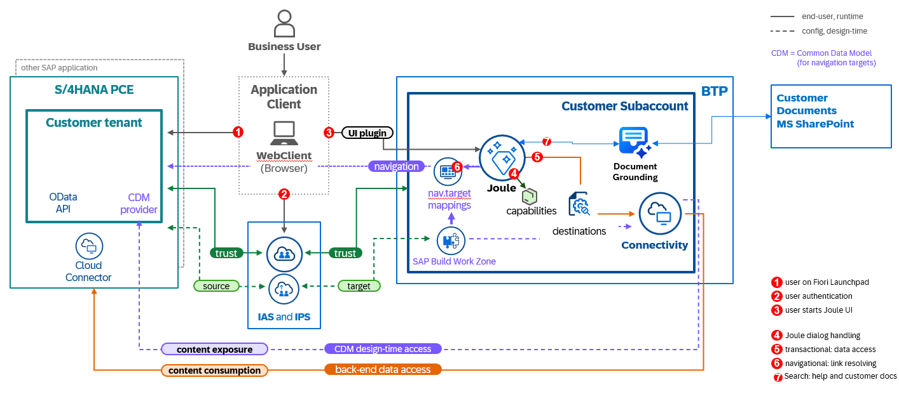

Joule is an AI-powered copilot now available with SAP S/4HANA Cloud Private Edition, designed to simplify your daily work through natural language interactions. With capabilities such as Conversational Information, Transactional, and Navigational support, Joule helps you quickly access information, perform actions like creating or updating data, and navigate directly to the right SAP Fiori apps to complete tasks in their full web UI. By combining these capabilities, Joule streamlines how you interact with the system, enabling you to work smarter and boost productivity. Joule is Generally Available (GA) with SAP S/4HANA Cloud Private Edition.  For more information on Joule and other AI powered initiatives, have a look the following resources:

* [Latest Updates in Joule](https://www.sap.com/canada/products/artificial-intelligence/ai-assistant.html)
* [Use Cases supported with Joule](https://help.sap.com/docs/joule/capabilities-guide/joule-in-sap-s-4hana-cloud-private-edition)

The setup process for Joule with SAP S/4HANA Cloud Private Edition requires integration across multiple SAP components as depicted in the picture below. 

This purpose of this guide is to provide step by step instructions on how to set up Joule with SAP SAP S/4HANA Cloud Private Edition.