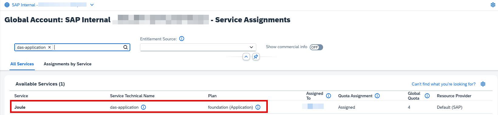
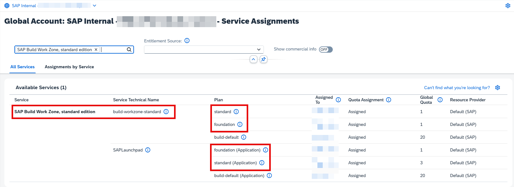
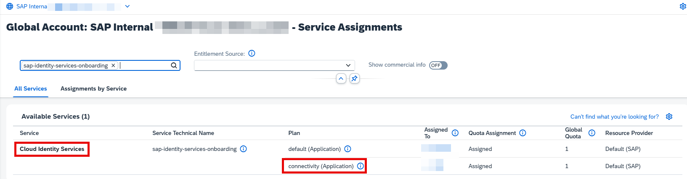
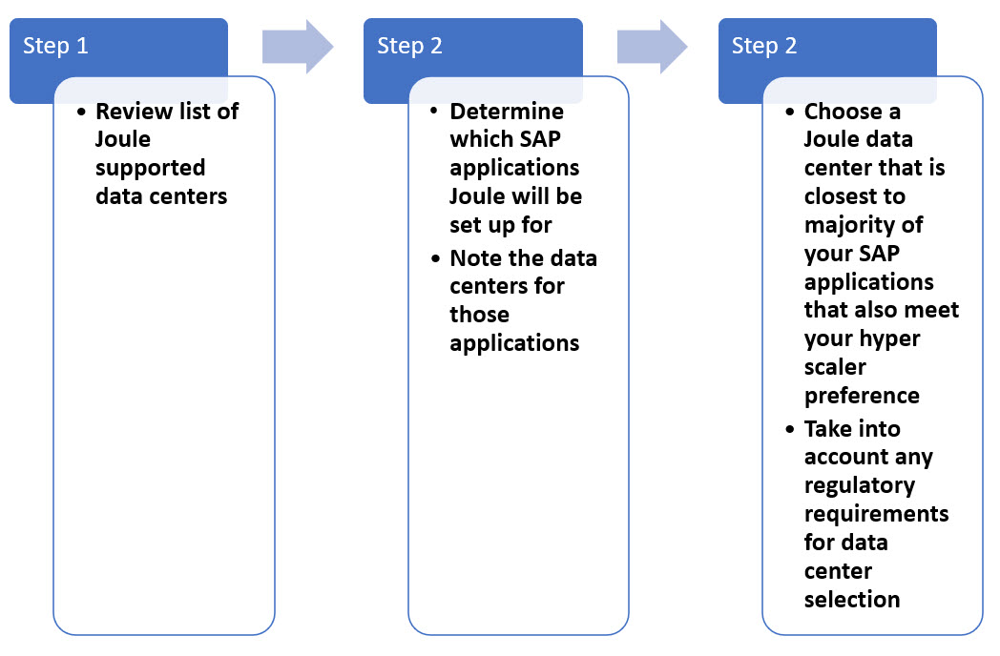
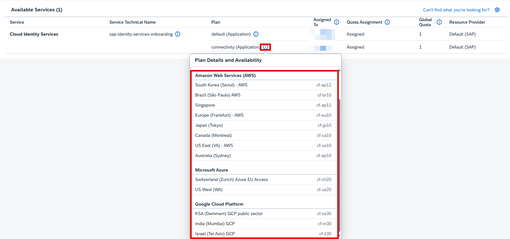
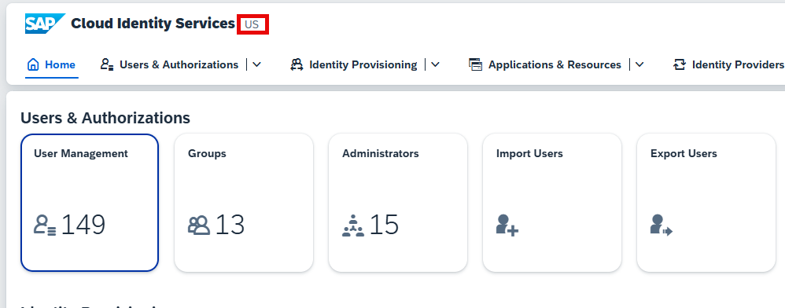
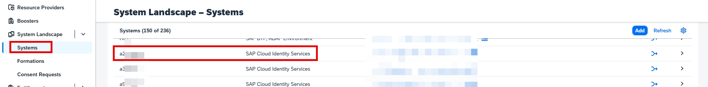
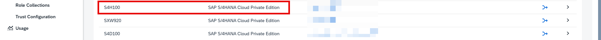

Before you can activate Joule, there are certain number of prerequisites that must be met.  This section describes those prerequisites and outlines some details that need to be captured prior to running through the activation steps.

## 1. User Personas Required for Joule activation

Activation of Joule requires configuration in multiple systems.  It's important to have the right stakeholders involved when setting up the configuration.  In order to set up Joule, the following user personas are required:
* SAP BTP Global Account Admin
* SAP Cloud Identity Services Admin
* SAP Cloud Connector Admin
* SAP S/4HANA Cloud Private Edition Admin
  
## 2. Verify Global Account Entitlements

1. Access [BTP Cockpit URL](https://cockpit.btp.cloud.sap).
2. Select the BTP Global Account and click Continue. 
   
3. From the Navigation Panel, expand **Entitlements** and click **Service Assignments**.
4. Search for **Joule** and validate that the following plan is available.
   
    | Application     | Technical Name | Plan        | Required Quota | Remaining Quota |
    | ----------- | ----------- | ----------- | -------------- | --------------- |
    | Joule      | das-application      | foundation       |     1            |          limited       |
  
    

5. Clear the existing search text and search for **SAP Build Work Zone, standard edition**.  Validate that the following 2 plans are available for SAP Build Work Zone:

    | Application     | Technical Name | Plan        | Required Quota | Remaining Quota |
    | ----------- | ----------- | ----------- | -------------- | --------------- |
    | SAP Build Work Zone, standard edition   | SAPLaunchpad       | foundation or standard       |      1           |       limited          |
    | SAP Build Work Zone, standard edition      | build-workzone-standard      | foundation or standard      |     1            |          limited       |
  
     

6. Clear the existing search text and search for **Cloud Identity Services**.  Validate that the following plan is available:

    | Application     | Technical Name | Plan        | Required Quota | Remaining Quota |
    | ----------- | ----------- | ----------- | -------------- | --------------- |
    | Cloud Identity Services   | sap-identity-services-onboarding       | connectivity       |      1           |       limited          |
  
      

If the entitlements are not visible, it could be due to one of these reasons:
  * You don't have licenses for Joule.
  * Joule entitlements were added to a different BTP Global Account to which you don't have Global Account Admin access.
  * The start date for the Joule contract is at a future date hence the entitlements won't be visible in BTP until that date.

  In the scenarios above, please work with your Account Executive, BTP Customer Success Partner to resolve the entitlements issue prior to proceeding further with this mission.  It is also possibile to acquire the Joule base entitlement from [SAP Store](https://www.sap.com/store.html).  Make sure to select the correct BTP Global Account when acquiring the Joule base entitlement thorugh SAP Store.

## 3. Choose Data Center for Joule Setup

Joule is BTP Service that works with multiple SAP solutions.  The number of SAP solutions supported with Joule is growing on a regular basis so it's important to choose a data center for Joule setup that can work for various SAP systems that you may have in your landscape - even if those systems are not in scope for Joule setup now.  There are several factors that determine which data center to choose for Joule setup.  Some factors to consider: 
1) What are the currently supported datacenters for Joule? 
1) What are the currently supported datacenters for Cloud Identity Service (Plan - Connectivity)? 
2) What is Cloud Identity Service tenant region? 
2) Which SAP solutions will Joule be set up for and what are datacenters of those solutions? 
3) Are there any legal requirements to choose a datacenter in a particular region? 
4) Do you have a preference for particular hyperscaler such AWS, Azure, Google etc.? 

The picture below depicts the process to follow to determine data center selection. 
 

For Step 1, review the list of Joule supported data centers from the help page: [Data Centers Supported for Joule](https://help.sap.com/docs/JOULE/3fdd7b321eb24d1b9d40605dce822e84/8b4d8708f6d646a995fdc50f8c508f1f.html?version=CLOUD) 
Step 2, review the list of Joule supported data centers from the your SAP BTP Global Account 
  
Step 3, review the Cloud Identity Service tenant region, by logging into the system 
  
Step 3, requires finding the data centers for the respective SAP systems for which Joule will be set up.  This will be different for each system so refer to solution specific documentation to find the respective data centers. 

## 4. SAP Cloud Identity Provisioning Service running on Neo or SAP Cloud Identity Services Landscape

Joule setup for different LOB solutions like S/4HANA Cloud Private Edition leverage SAP Cloud Identity Provisioning Service to read users from S/4HANA Cloud Private Edition and provision them to SAP Build Work Zone.  This requires that SAP Build Work Zone, standard edition is available as a connector under target systems in SAP Cloud Identity Provisioning Service (IPS).  This connector may not be available on IPS tenants running on NEO landscapes.  It's recommended customers migrate IPS from NEO to IPS running on SAP Cloud Identity Provisioning Service (SCI) landscape.  In most cases this migration can be done in a matter of minutes.  For more information on how to perform this migration, refer to the following links:
* [Help Documenation: Migrate Identity Provisioning Bundle Tenant](https://help.sap.com/docs/identity-provisioning/identity-provisioning/migrate-identity-provisioning-bundle-tenant)

## 5. Register Systems in SAP BTP

To set up Joule for SAP systems, it's important that those systems are available in the BTP **System Landscape**.

> ℹ️ **Important (SAP S/4HANA Cloud, private edition):**  
> SAP S/4HANA Cloud, private edition systems **cannot be registered manually** in the System Landscape.  
> Instead, verify whether your tenant is already available and, if it is missing, request SAP to add it.

**Check if your system is available**
1. In SAP BTP, navigate to **Global Account** → **System Landscape** → **Systems**.
2. Search for your **SAP S/4HANA Cloud, private edition** tenant/system.

**If your tenant/system is missing**
- Open an SAP ticket to component **BC-CP-MP-FOR** and request that your SAP S/4HANA Cloud, private edition tenant be added to the BTP System Landscape.

**Additional notes**
- Register a new system only if it's not already there.
- The system type for **SAP Cloud Identity Services** is typically available by default. Ensure that the SAP Cloud Identity Services tenant used to authenticate users when opening the **SAP S/4HANA Fiori launchpad** is listed.
- Not all systems have to be available up front. For example, if you are only going to run the booster for SAP S/4HANA Cloud, private edition, there is no need to ensure that other systems (such as SAP SuccessFactors) are also available in the System Landscape. 

For the purpose of this mission I am using SAP SuccessFactors and SAP S/4HANA Cloud Public Edition to showcase the setup process

