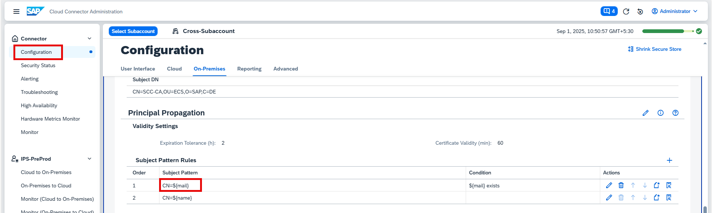
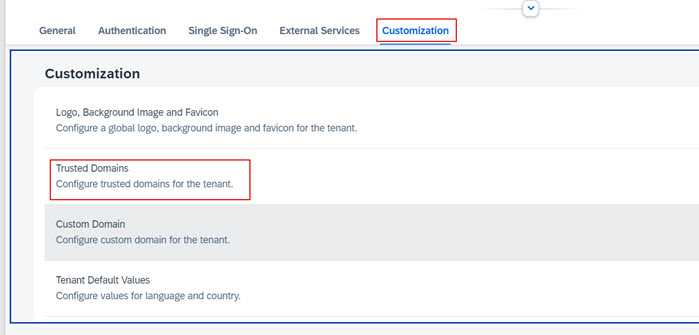
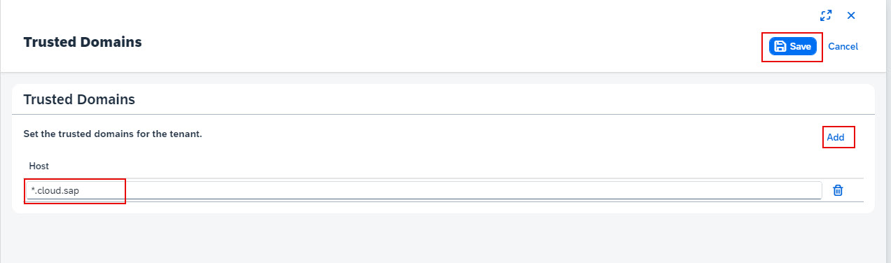

Before you can activate Joule for S/4HANA Cloud Private Edition, there are certain number of pre-requisites that must be met.  This section describes those pre-requisites and outlines some details that need to be captured prior to running through the activation steps.

## 1. Create Technical User for Content Exposer

You need to create a technical user in your SAP S/4HANA Cloud, private edition system with the role SAP_FLP_EXP_USER for Content Exposer.

## 2. Create Technical User for Identity Provisioning

You need to create a technical user in your SAP S/4HANA Cloud, private edition system with the role SAP_BC_JSF_COMMUNICATION_RO  for Identity Provisioning.

## 3. Activate Content Exposer Service

Content Exposure is available in two versions: Version 1 and Version 2. 
For Version 1, you need to activate the CDM3 service using transaction SICF. 
For Version 2, you need to activate the /UI2/FLP_CONTENT_EXPOSURE service using transaction UCON_HTTP_SERVICES. 
  
## 4. Set Principle Propogation in Cloud Connector

You need to set up Principal Propagation in the Cloud Connector with your SAP S/4HANA Cloud, private edition system. 
You can follow the relevant SAP Help page to configure [Principal Propagation](https://help.sap.com/docs/connectivity/sap-btp-connectivity-cf/configuring-principal-propagation?q=cloud%20connector). 

## 5. Activate OData Services

For transactional capability, you need to activate specific OData services in your SAP S/4HANA Cloud, private edition system. You can refer to this [SAP Note](https://me.sap.com/notes/3523238) attachment section for details on which OData services need to be activated for each scenario.
Please refer to the documentation [Activate and Maintain Services](https://help.sap.com/docs/SAP_NETWEAVER_740/68bf513362174d54b58cddec28794093/bb2bfe50645c741ae10000000a423f68.html) for guidance on activating the required OData services.

## 6. SAP Cloud Identity Services tenant(s) and S/4HANA Cloud Private Edition Details

To setup Joule, the S/4HANA Cloud Private Edition tenant should already be integrated to use SAP Cloud Identity Service.  It's important that the BTP subaccount trust is setup with the same SAP Cloud Identity Authentication Service (IAS) tenant that is also used by SAP S/4HANA Cloud Private Edition. In addition, the date of when the activatation was done will be important to confirm the domain to use for BTP Subaccount trust to SAP Cloud Identity Authentication Service (IAS). 

## 7. S/4HANA Cloud Private Edition Domain trust with SAP Cloud Identity Services

You need to add the SAP S/4HANA Cloud, private edition Fiori launchpad domain to the SAP Cloud Identity Services (IAS) tenant. To do this, sign in to the Administration Console and navigate to Applications and Resources > Tenant Settings. At the top of the page, you can view administrative and license-relevant information of the tenant. Under Customization, select Trusted Domains, then press + Add and enter the URL of the trusted host, either as the full hostname or using the wildcard * function. Exercise caution when using wildcards and ensure the domain is fully trusted. For example, you can add mycompany.ondemand.com or *.example.com. After saving your changes, the system will confirm with the message Trusted Domains updated.

