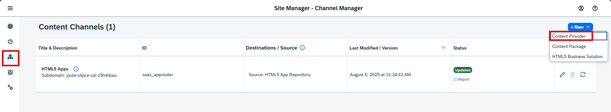
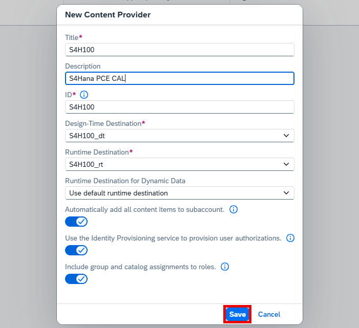
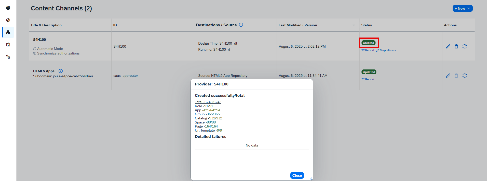

## Define Content Provider in SAP Build Work Zone, Standard Edition

In **SAP Build Work Zone, standard edition**, define the **SAP S/4HANA Cloud Private Edition** system as a content provider via the **Channel Manager**.  

---

### Step-by-Step Instructions

1. In the **SAP BTP cockpit**, log on to your subaccount as an administrator.
2. Navigate to:  
   **Instances and Subscriptions > SAP Build Work Zone, standard edition**
3. Launch **SAP Build Work Zone, standard edition**. Ensure you have the **LaunchpadAdmin** role assigned in your BTP subaccount.
4. Go to **Channel Manager**.
5. Click **+ New** to add a new content provider.

6. Fill in the fields as follows:

| Field                                | Value / Description |
|-------------------------------------|---------------------|
| **Title**                           | `SAP S/4HANA Cloud Private Edition` or any other meaningful name |
| **ID**                              | `<A unique ID>` |
| **Design-Time Destination**         | Select the design-time destination |
| **Runtime Destination**             | Select the runtime destination |
| **Runtime Destination for Dynamic Data** | The runtime destination used to retrieve data for dynamic tiles.  By default, the runtime destination is reused here. |
| **Automatically add all content items to subaccount** | `true` |
| **Use the Identity Provisioning service to provision user authorizations** | `true` |
| **Include group and catalog assignments to roles** | Toggle based on how your provider is modeled:  • Disable to include **all groups and catalogs** in the site, regardless of role assignment.  • Enable to include **only groups and catalogs assigned to roles**.  |

---

### What Happens Next

- A new row is added to the **Content Channels** table with status: **Creating…**
- Once ready, the status changes to **Created**.
- Click the **Report** link to view the number of:
  - Roles
  - Apps
  - Groups
  - Catalogs
  - Spaces
  - Pages
  - URL templates

✅ The content provider is now also visible in the **Content Explorer**.

---

