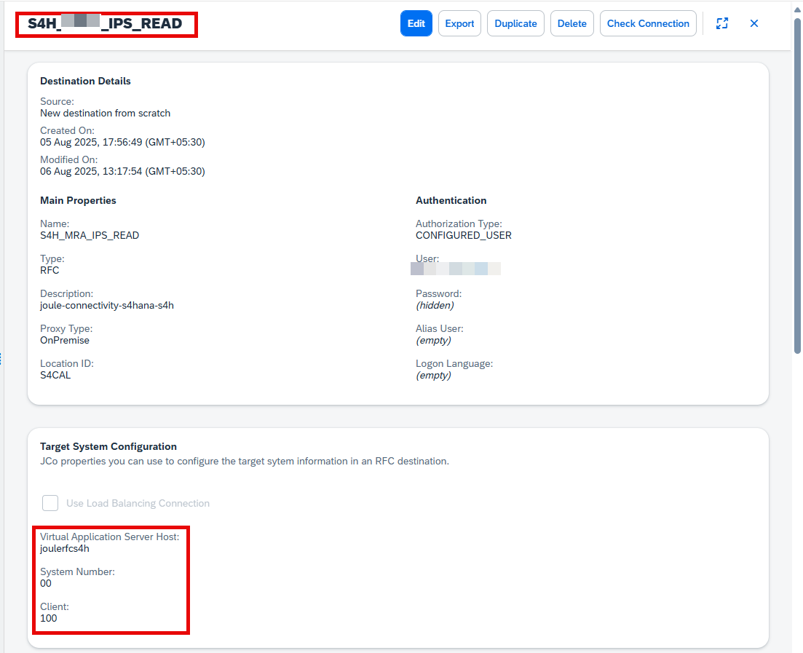

## Configure Identity Provisioning Destination in SAP BTP Cockpit

Navigate to:  
**Connectivity > Destinations**

Create a new destination with the following example values for a connection with load balancing:

| Field                | Value / Description |
|----------------------|---------------------|
| **Name**             | Name of the destination |
| **Type**             | `RFC` |
| **Description**      | Enter a description |
| **ProxyType**        | `OnPremise` |
| **User**             | `<Username of your SAP S/4HANA Cloud Private Edition technical service user>` |
| **Password**         | `<Password of your SAP S/4HANA Cloud Private Edition technical service user>` |
| **Authorization Type** | `CONFIGURED_USER` |
| **Location ID**      | `<ID of the SAP Cloud Connector, if configured>`, example: `DLM_MAIL` |

---

### Additional Properties (case sensitive)

| Property              | Value / Description |
|-----------------------|---------------------|
| **jco.client.client**  | `<Client of your SAP S/4HANA Cloud Private Edition system>`, example: `950` |
| **jco.client.ashost**  | `<Virtual host of your SAP Cloud Connector configuration for Identity Provisioning service integration>`, example: `joulerfcS4H` (value up to colon) |
| **jco.client.sysnr**   | `<Virtual System Number of your SAP Cloud Connector configuration>`, example: `00` |

---

✅ Save the destination after entering all details.

