## Configure Identity Provisioning: Source and Target Systems

### 1. Set Up the Source System

1. Open your **Identity Authentication Service** administrator console at:  
   `<IAS domain>/admin`

2. Navigate to the **Identity Provisioning** section and open the **Source Systems** tab.

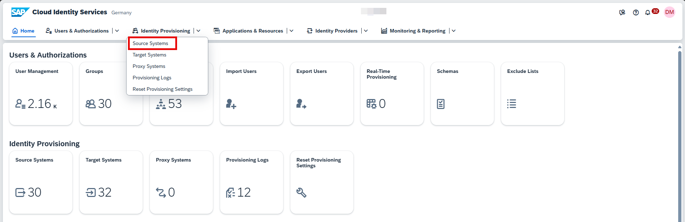

3. Click **+ Add** to add a new source system.

4. Select **SAP Application Server ABAP** as the type.

5. Enter a meaningful name for the source system.

6. Select the RFC Destination created in your sub account.

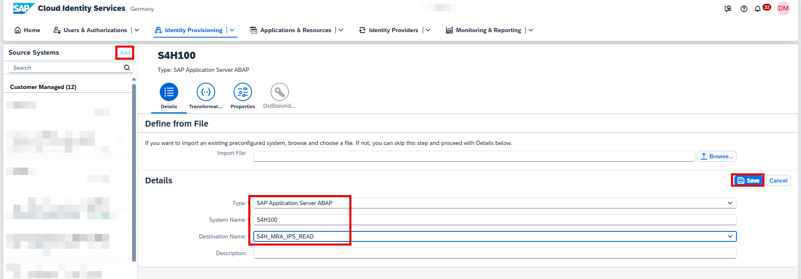

7. In the **Transformations** tab:
   - Click **Edit**.
   - Switch to **JSON mode** using the `{..}` button.
   - Paste the standard transformation JSON ([Copy JSON configuration from point 6.C](https://help.sap.com/docs/joule/integrating-joule-with-sap/configure-identity-provisioning-service-a6cf317ecede4fa78c57be07219cee1a?version=CLOUD)).

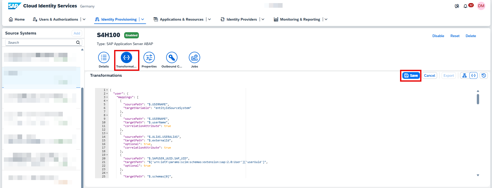

---

### 2. Set Up the Target System

1. Navigate to the **Identity Provisioning** section and open the **Target Systems** tab.

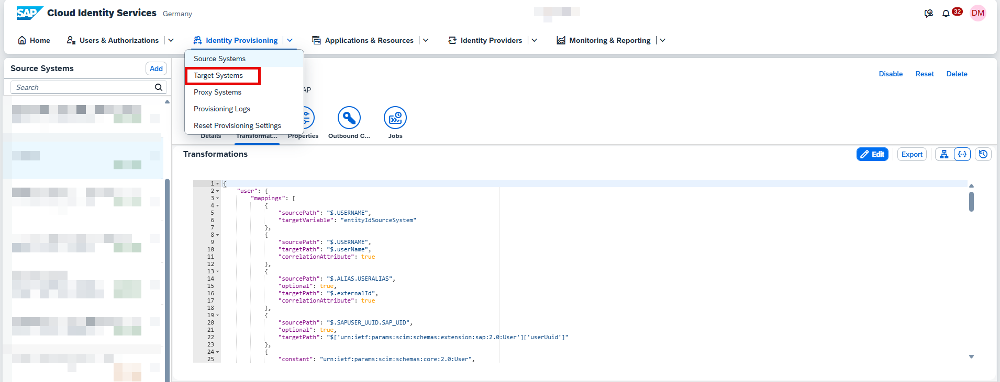

2. Click **+ Add** to add a new target system.

3. Select **SAP Build Work Zone, standard edition** as the type.

4. Enter a meaningful name for the target system.

5. Select the source system you created earlier.

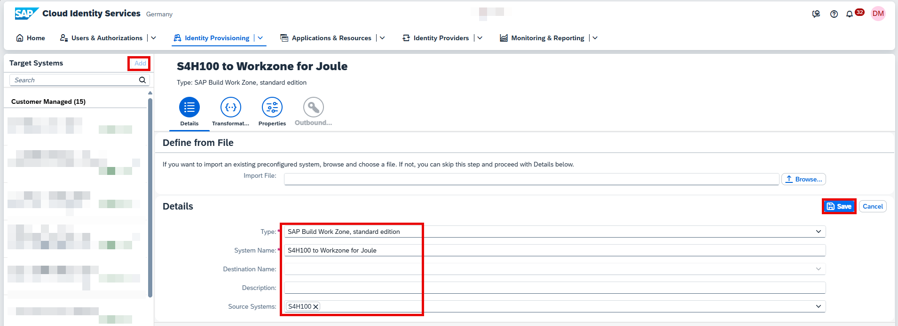

6. In the **Transformations** tab:
   - Click **Edit**.
   - Switch to **JSON mode** using the `{..}` button.
   - Paste the standard transformation JSON ([Copy JSON configuration from point 8.D](https://help.sap.com/docs/joule/integrating-joule-with-sap/configure-identity-provisioning-service-a6cf317ecede4fa78c57be07219cee1a?version=CLOUD)).

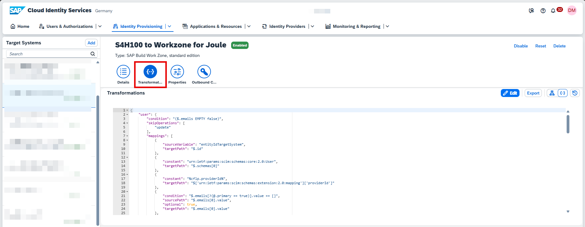

---

### 3. Configure Target System Properties

In the **Properties** tab, add the following fields and values:

| Field | Value |
|-------|-------|
| Authentication | `BasicAuthentication` |
| cflp.group.unique.attribute | `externalId,['urn:ietf:params:scim:schemas:extension:2.0:mapping']['providerId']` |
| cflp.patch.group.members.above.threshold | `5000` |
| cflp.providerId | `<ID of the content provider, e.g. S4_PC_UCT950>` |
| cflp.user.unique.attribute | `emails[0].value,['urn:ietf:params:scim:schemas:extension:2.0:mapping']['providerId'],externalId` |
| ips.trace.failed.entity.content | `false` |
| OAuth2TokenServiceURL | `<uaa url from SAP Build Work Zone, standard edition service key+ /oauth/token>` |
| Password | `<clientsecret from SAP Build Work Zone, standard edition service key>` |
| ProxyType | `Internet` |
| Type | `HTTP` |
| URL | `<portal-service from SAP Build Work Zone, standard edition service key>` |
| User | `<clientid from SAP Build Work Zone, standard edition service key>` |

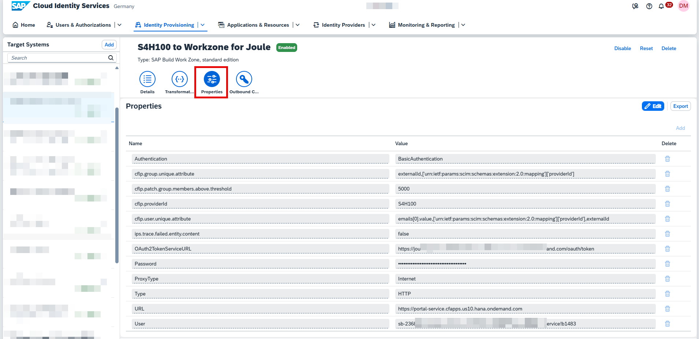

---

### 4. Run Synchronization Job

1. Navigate back to the **Identity Provisioning** > **Source Systems**.

2. Select the **source system** created for your **SAP S/4HANA Cloud Private Edition** tenant.

3. Open the **Jobs** tab.

4. Click **Run Now** for the **Read Job** to start the synchronization of your SAP S/4HANA Cloud Private Edition users and roles with your SAP Build Work Zone, standard edition tenant.

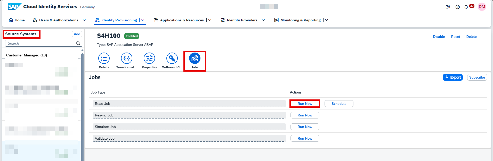

---

### 5. Monitor Job Status

1. Go to the **Provisioning Logs** section under **Identity Provisioning**.

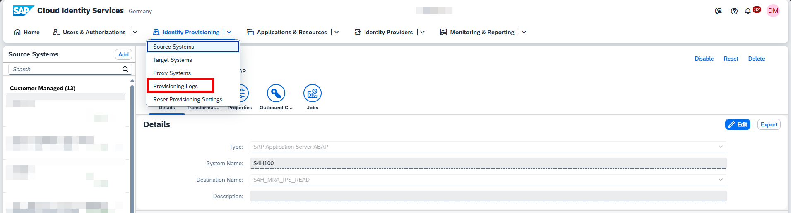

2. Review logs and check the status of your synchronization jobs.

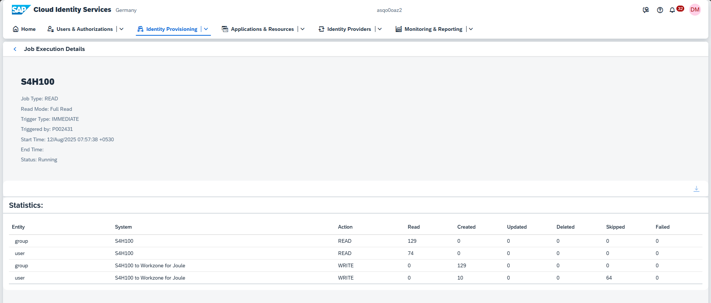

---

### 🎉 Completion

You have now completed the setup of the **Identity Provisioning service**.

Users who have configured **cards** as visible in the **Insights** section of *My Home* in **SAP S/4HANA Cloud** should now be able to see them in the **Insights** section of **SAP Build Work Zone, standard edition**.

## Validate Role Assignment After IPS Sync

After the IPS sync job completes, validate that role assignments were provisioned correctly:

1. Go to **SAP Build Work Zone** → **Settings** → **Identity Provisioning**.
2. Search for a **specific user**.
3. Verify that the user has the expected **roles assigned**.

> ℹ️ **Note**: If the user has no roles assigned, re-check your IPS configuration and re-run the sync job.

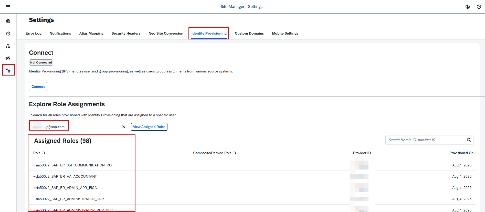