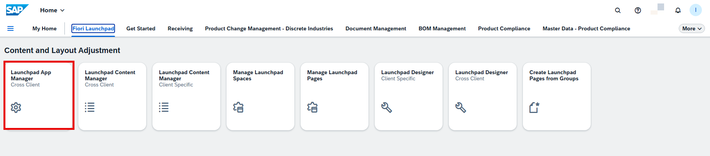
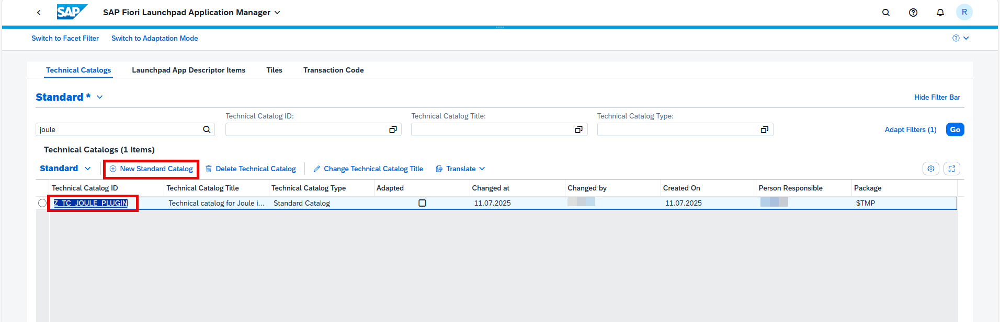
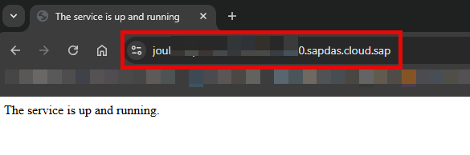
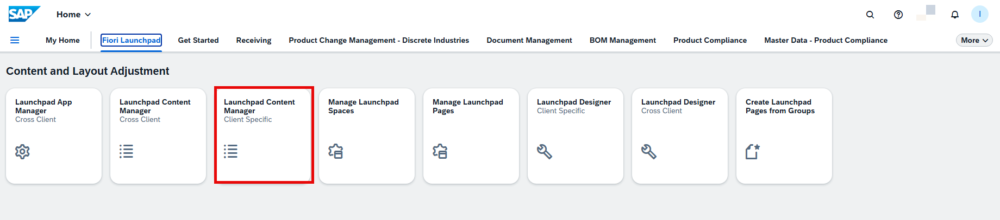
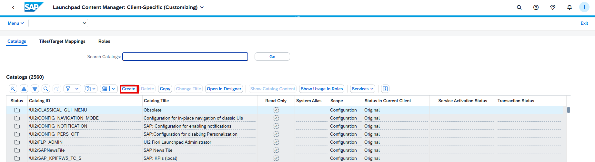
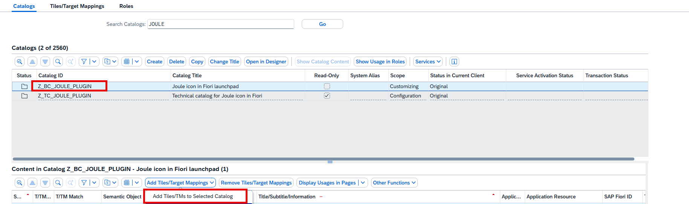
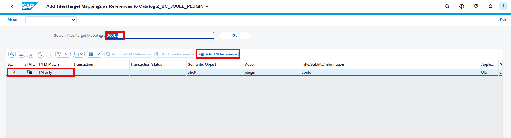
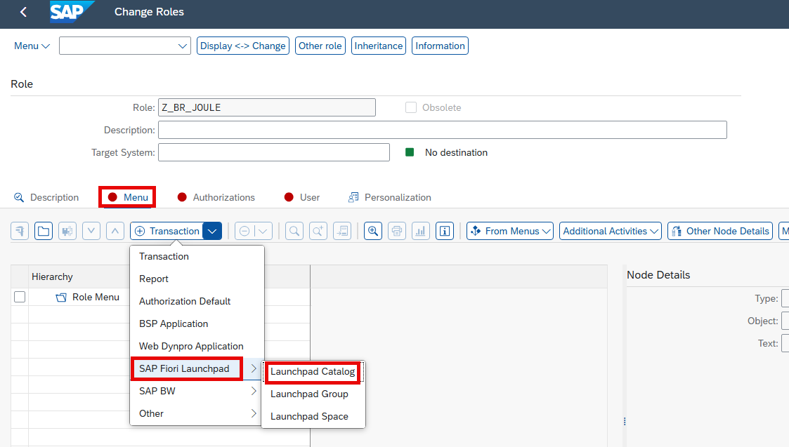
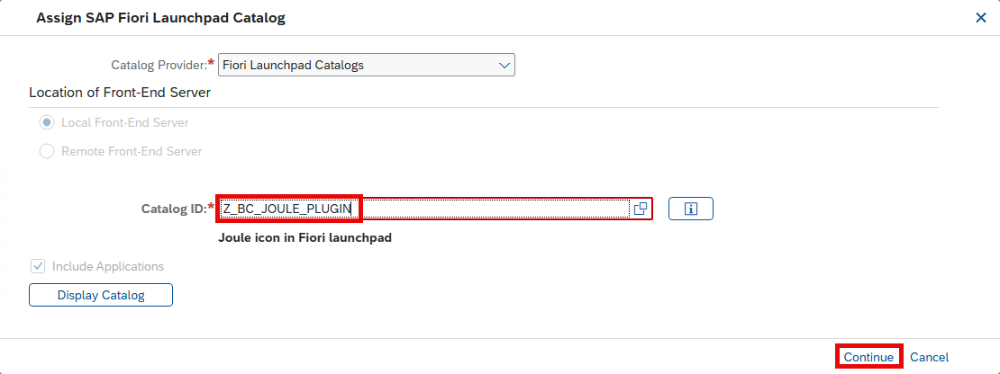
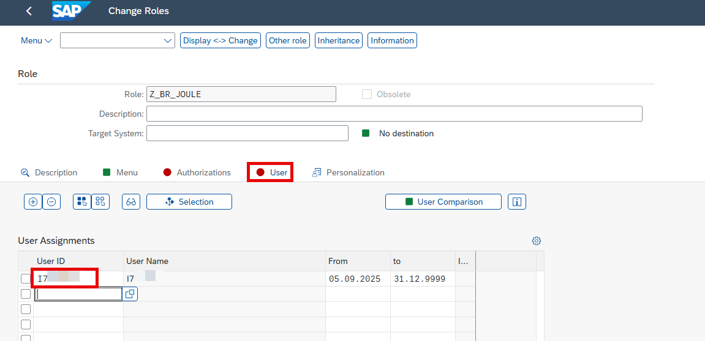

## Configure and Activate Joule Plug-In in a Target Mapping (SAP Fiori Launchpad)

### 1. Create Technical Catalog in Fiori Launchpad

You are assigned to the backend authorization role SAP_FLP_ADMIN.

1. Go to T-code: `/n/UI2/FLP` in the SAP S/4HANA Cloud Private Edition system.
2. Open the **Fiori Launchpad** tab and click on **Launchpad App Manager (Cross Client)**.

3. Click on **New Standard Catalog** to create a new Technical Catalog.

4. Fill out the required details and assign a **pre-created Workbench Transport Request**. Click **Save**.

5. Click on **ADD APP → SAPUI5 Fiori App**.

6. To configure the **Target Mapping**, obtain the **Joule Application URL**:

   - Navigate to your **BTP Subaccount**
   - Click **Instances and Subscriptions**
   - Click on **Joule → Go To Application**

7. Copy the **Joule URL** shown in the application.

---

8. Fill in the Target Mapping fields as follows:

| Field | Value |
|-------|-------|
| **Application Type** | SAP UI5 Fiori App |
| **Semantic Object** | Shell |
| **Action** | plugin |
| **SAPUI5 Component ID** | `sap.das.webclientplugin.s4` |
| **ICF Path** | `<Joule Application URL>` appended with `/resources/public/webclient/s4` |
| **Suppress Tile** | Checked |
| **Application Component ID** | `CA-FLP-ABA` |
| **Target Application Title** | Joule |
| **Information** | (Optional) Description of your plug-in |
| **Device Types** | Select supported devices (e.g., desktop, phone) |
| **Parameters** | (Optional) Name and default values for parameters |

✅ Ensure the URL is appended with `/resources/public/webclient/s4`.

---

### 2. Create Business Catalog in Fiori Launchpad

1. Go back to the **Fiori Launchpad** tab.
2. Open **Launchpad Content Manager (Client Specific)**.

3. Click on **Create** to make a new **Business Catalog**.

4. Fill in the details and assign a **Customizing Transport Request**, then click **Save**.

5. Select the new catalog and click **Add Tile/Target Mapping**.

6. Search and select the **Technical Catalog** created earlier.
7. Click on **Add TM Reference**.

---

## 9.2 Create a New Role in Role Maintenance

1. Go to T-code `/npfcg`.
2. Create a new Single Role (e.g., `z_xxxxx_joule`) following your organization's naming conventions.

3. Navigate to the **Menu** tab.
4. Click **Transaction → SAP Fiori Launchpad → Launchpad Catalog**.

5. In **Catalog Provider**, choose:
   - `Fiori Launchpad Catalogs`
   - `Local Front-End Server`
6. Assign the **Catalog ID** created earlier. Click **OK**.

7. Go to the **User** tab and add all the end user.

---

## 9.3 Validate Joule in Fiori Launchpad

1. Navigate to your **Fiori Launchpad**.
2. Look for the **Joule** icon.

3. Click on the icon to launch the **Joule window**.

✅ If everything is set up correctly, the Joule plug-in will launch successfully within the Fiori Launchpad.

---
