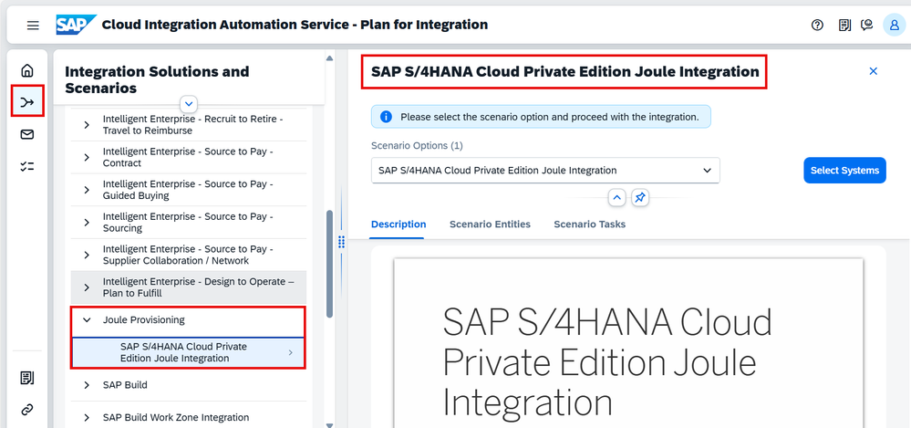

<!-- markdownlint-disable MD060 -->

# Joule provisioning for SAP S/4HANA Cloud, private edition (PCE) using Cloud Integration Automation service

JJoule integration with **SAP S/4HANA Cloud, private edition** is now available as an **integration scenario in the Cloud Integration Automation service**. This replaces a complex manual setup that could take **weeks** with a guided, role-based automated workflow that can reduce setup time to **just a few days**. Customers can use the service **within SAP BTP at no additional cost** to automate key integration steps, making the overall process **faster, simpler, and more reliable**.

## Involved components

- SAP BTP
- SAP Cloud Connector
- SAP S/4HANA Cloud Private Edition (PCE)
- SAP Cloud Identity Services

## Why Cloud Integration Automation service fits this scenario

- AI-enabled task orchestration tool
- Standardized guided workflows with role-based execution
- Integrated parameter management
- Hybrid approach (automate what can be automated, generate documentation for the rest)
- Included with SAP BTP (no additional cost)
- Can surface system landscape information for better visibility

---

## Scope of the Joule integration (high-level)

The Joule integration with SAP S/4HANA Cloud Private Edition can be broadly classified into the following areas.

### 1) SAP BTP configuration

| Task Name                                                     | Automated / Manual |
| ------------------------------------------------------------- | ------------------ |
| Create new BTP subaccount                                      | Automated          |
| Add entitlements (Joule, Cloud Identity Services, Work Zone)    | Automated          |
| Enable Cloud Foundry                                           | Automated          |
| Establish trust with Cloud Identity Services                    | Automated          |
| Activate Work Zone + Connectivity; create service keys          | Automated          |
| Activate Cloud Identity Services                                | Automated          |
| Disable IdP and trust domain                                    | Automated          |

### 2) SAP Cloud Connector configuration

| Task Name                                          | Automated / Manual |
| -------------------------------------------------- | ------------------ |
| Add subaccount in SAP Cloud Connector               | Automated          |
| Map virtual to internal system (HTTP)               | Automated          |
| Map virtual to internal system (RFC)                | Automated          |
| Add resource paths for HTTP & RFC                   | Automated          |

### 3) BTP destinations

| Task Name                                      | Automated / Manual |
| ---------------------------------------------- | ------------------ |
| Create Work Zone design-time destination        | Automated          |
| Create Work Zone runtime destination            | Automated          |
| Retrieve nomination via SAP Cloud Connector     | Automated          |
| Create Navigation service destination           | Automated          |
| Create RFC destination for identity provisioning| Automated          |
| Enable navigational and transactional access    | Automated          |

### 4) SAP S/4HANA Cloud Private Edition configurations

| Task Name                                  | Automated / Manual |
| ------------------------------------------ | ------------------ |
| Activate SICF service                       | Automated          |
| Expose roles                                | Automated          |
| Create catalog in Fiori Launchpad Designer  | Manual             |
| Create new role in role maintenance         | Manual             |

### 5) Joule activation

| Task Name                   | Automated / Manual |
| --------------------------- | ------------------ |
| Run Booster in BTP cockpit  | Manual             |

### 6) SAP Build Work Zone configuration

| Task Name                 | Automated / Manual |
| ------------------------- | ------------------ |
| Create content provider   | Manual             |

### 7) SAP Cloud Identity Services (IAS/IPS)

| Task Name               | Automated / Manual |
| ----------------------- | ------------------ |
| Trust the domain        | Automated          |
| Set up source system    | Automated          |
| Set up target system    | Automated          |
| Run / schedule the job  | Manual             |

### 8) Launching Joule

| Task Name                             | Automated / Manual |
| ------------------------------------- | ------------------ |
| Refresh content in SAP Build Work Zone| Manual             |
| Launch Joule                          | Manual             |

---

## Joule provisioning scenario in CIAS

To kickstart the integration for SAP S/4HANA Cloud Private Edition, select the **Joule provisioning** scenario in **Cloud Integration Automation service** and follow the guided workflow.

---

## Conclusion

Cloud Integration Automation service accelerates Joule adoption for SAP S/4HANA Cloud Private Edition by reducing manual steps, orchestrating activities across BTP, Cloud Connector, Identity services, and S/4HANA, and providing guided workflows and role-based execution making the integration faster, simpler, and more reliable.
