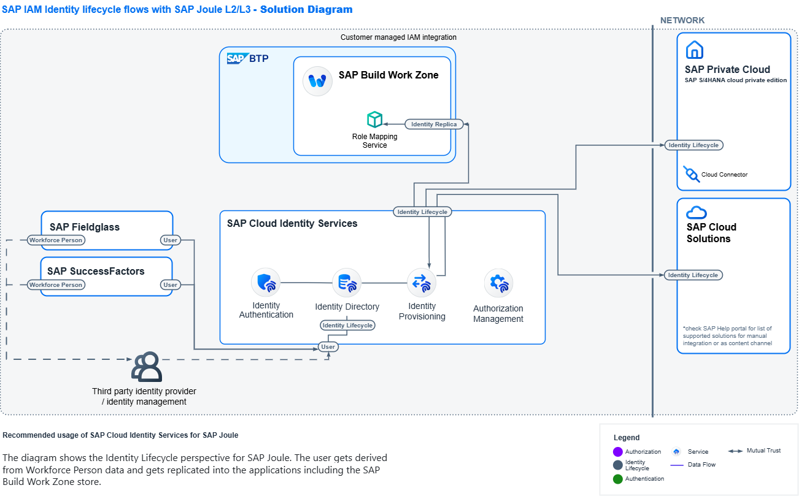

# Global User ID -- Configuration Guide

## Overview

Each user must be created in **SAP Cloud Identity Services -- Identity
Directory**.
This acts as the **central user store** for all connected SAP
applications.

Users can be created in one of the following ways:

-   Using the Web UI
-   Using the Identity Directory (IdDS) API
-   Uploading a file

------------------------------------------------------------------------

## What is the Global User ID?

When a user is created in the Identity Directory:

-   A **Global User ID** is automatically generated
-   OR a specific Global User ID can be provided manually

The **Global User ID** is essential because it:

-   Links the same user across multiple SAP applications
-   Ensures consistent identity mapping
-   Enables cross-application integration (e.g., SAP Build Work Zone,
    SAP Joule, S/4HANA, etc.)

------------------------------------------------------------------------

## Solution Architecture

The following solution diagram illustrates how:

-   User information is distributed
-   The Global User ID connects systems
-   Identity synchronization flows between services

------------------------------------------------------------------------

## User Creation in SAP Applications

In most cases:

-   The user already exists in the Identity Directory.
-   The same user must also be created in the respective SAP
    application.

While creating the user in the SAP application:

-   Ensure that the **Global User ID is maintained**.

This can happen:

-   Automatically via **Identity Provisioning Service (IPS)** using the
    **SCIM protocol**
-   OR manually, depending on the application setup

------------------------------------------------------------------------

## User and Role Synchronization

SAP business applications typically:

-   Provide user-role assignment APIs
-   Use **SCIM 2.0** standard for identity exchange

SAP Cloud Identity Services:

-   Use the **Identity Provisioning Service (IPS)**
-   Synchronize user and role data
-   Update user-role assignments in **SAP Build Work Zone**

------------------------------------------------------------------------

## Joule Integration

Ensure that:

-   **SAP Joule** is set up using the recommended **Booster**
-   Joule is properly integrated with **SAP Cloud Identity Services**

This ensures that user identity, authorization, and AI capabilities
function consistently across systems.

------------------------------------------------------------------------

## Key Takeaways

-   Identity Directory is the central user store
-   Global User ID connects identities across applications
-   IPS + SCIM enable automatic synchronization
-   Proper setup ensures seamless integration across SAP landscape
