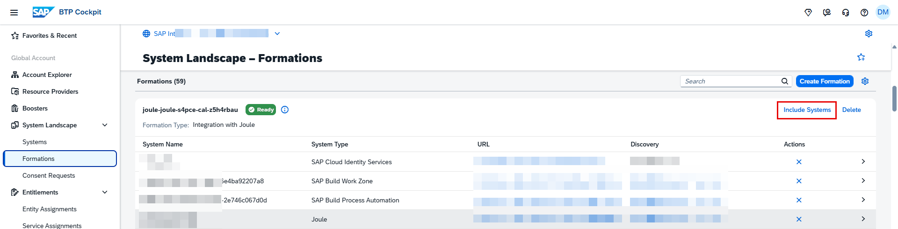
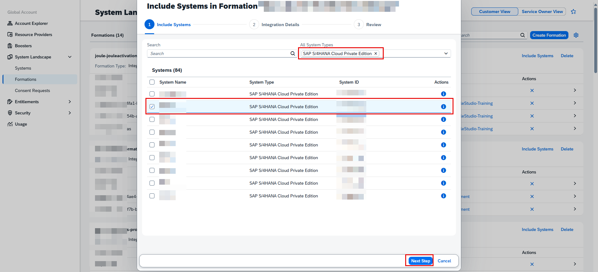
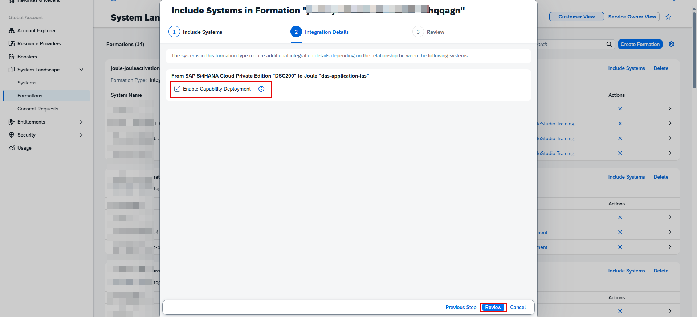
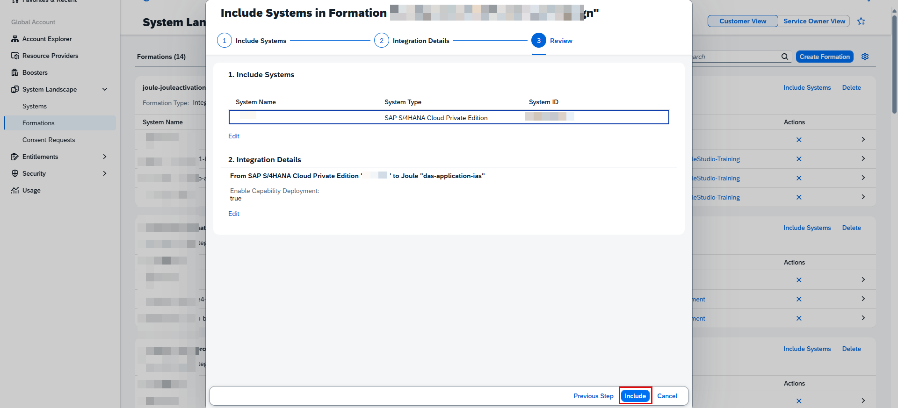
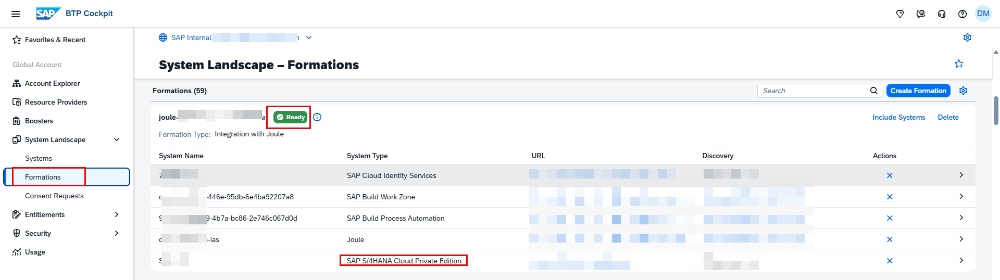
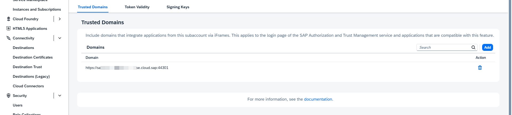
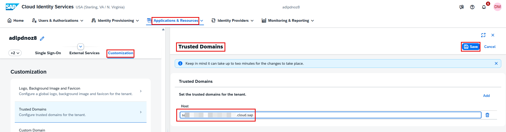

# Include S/4HANA Cloud Private Edition System in Existing Unified Joule Setup

If you already have **Unified Joule** setup and need to include an **S/4HANA Cloud Private Edition
system**, follow the steps below.
If not, skip this guide.

------------------------------------------------------------------------

## Step 1: Include S/4HANA Cloud Private Edition System in Formation

1.  Navigate to: BTP Global Account → Formations
2.  Search for the formation where **Integration with Joule** is already
    complete.
3.  Click **"Include Systems"**.

------------------------------------------------------------------------

## Step 2: Select S/4HANA Cloud Private Edition System

1.  Select the **S/4HANA Cloud Private Edition system** to be included.
2.  Click **"Next Step"**.

------------------------------------------------------------------------

## Step 3: Enable Required Capabilities

Select the following checkboxes:

-   Enable Capability Deployment

Click **Next**.

------------------------------------------------------------------------

## Step 4: Review and Include

1.  Click **"Review"**.
2.  Click **"Include"**.

This action will include the S/4HANA Cloud Private Edition system into the existing Unified Joule
setup.

------------------------------------------------------------------------

## Step 5: Verify Formation Status

After inclusion is complete:

-   The formation status will show as:

    Ready

-   The S/4HANA Cloud Private Edition system will appear inside the
    formation.

------------------------------------------------------------------------

## Step 6: Add S/4HANA Cloud Private Edition URL in Subaccount Trusted Domains

1.  Navigate to the existing Subaccount where Unified Joule is set up.
2.  Go to: Settings → Trusted Domains → Add
3.  Add the copied S/4HANA Cloud Private Edition URL.

> ⚠️ **Important:**  
> If your S/4HANA Fiori Launchpad URL contains a **port number** (for example: `https://yourdomain.com:44300`), you must include the **port number** while adding the URL in Trusted Domains.

------------------------------------------------------------------------

## Step 7: Add S/4HANA Cloud Private Edition URL in Cloud Identity Services (CIS)

1.  Login to Cloud Identity Services (CIS).
2.  Navigate to: Applications & Resources → Tenant Settings →
    Customization → Trusted Domains → Add
3.  Add the copied S/4HANA Cloud Private Edition URL

> ⚠️ **Note:**  
> In Cloud Identity Services, **do not include the port number**.  
> Only add the base domain (for example: `yourdomain.com`).

