## Create SAP Build Work Zone Instance and Subscription
1. From the Navigation Pane on the left, select **Instances and Subscriptions**.  Click **Create**.  
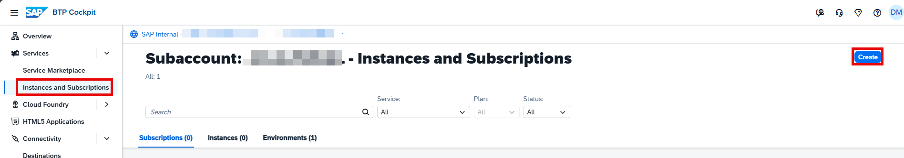

2. Select **SAP Build Work Zone, standard edition** from the Service dropdown and **Subscriptions >> foundation** from the Plan dropdown. Click **Create**. 
**Note**: Use the **standard** plan instead of **foundation** plan if setting up Joule for SAP Build Work Zone. 
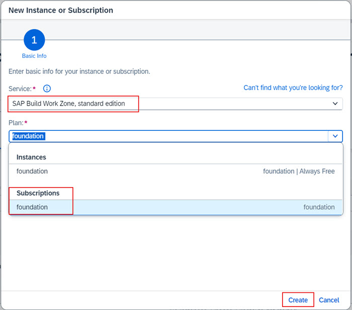   

3. Under **Instances and Subscriptions**, click the **Create** button again. 
4. Select **SAP Build Work Zone, standard edition** from Service dropdown and **instances >> foundation** from the Plan dropdown. 
**Note**: Use the **standard** plan instead of **foundation** plan if setting up Joule for SAP Build Work Zone. 
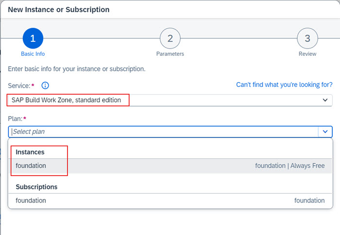  

5. Specify an **Instance Name** and click **Create**.          
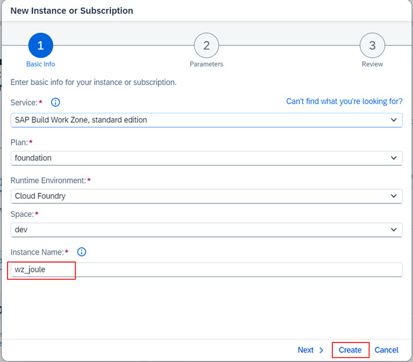

6. Confirm the subscription to the Work Zone and creation of the instance is successful.                                                         
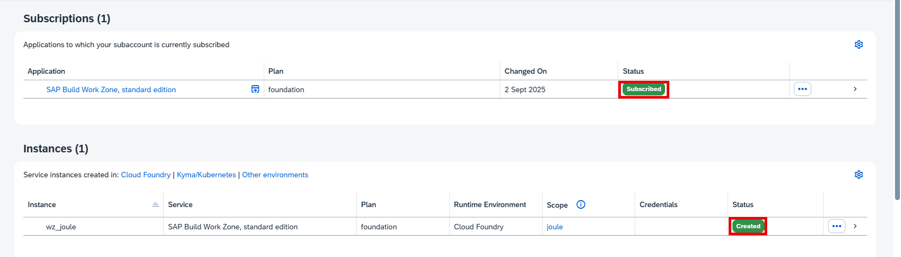

7. Click the **navigation arrow** to view the Work Zone instace details.                                      
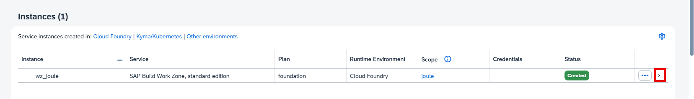

8. Under **Service Keys**, click **Create**.                                                        
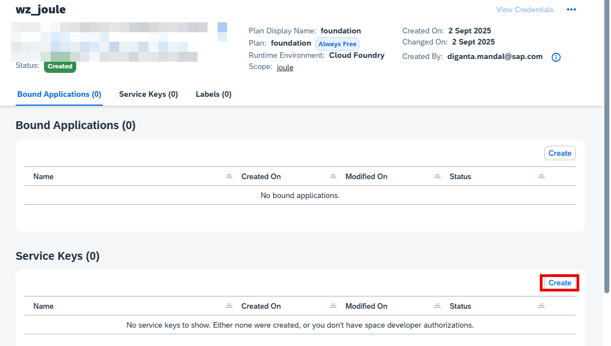

9. Specify a **Service Key Name** and click **Create**.                   
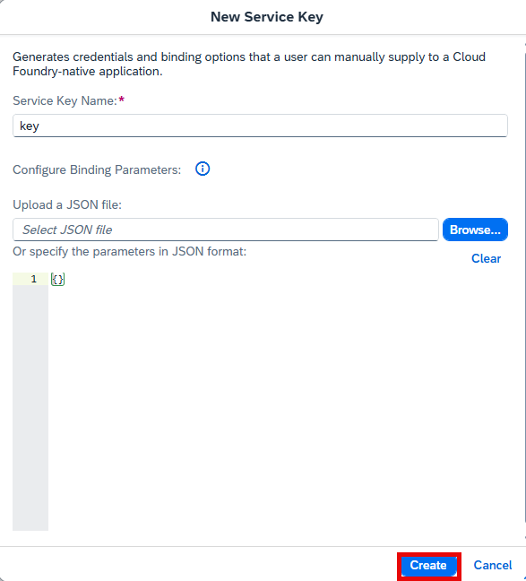

10. Click **Actions** icon next to the key and click **Download**. 
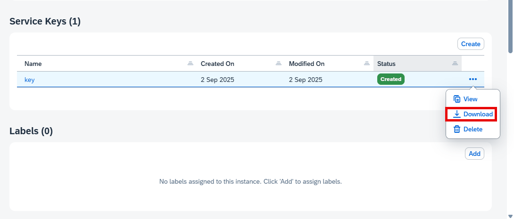

11. Confirm the **key.txt** file is successfully downloaded into your downloads folder. 
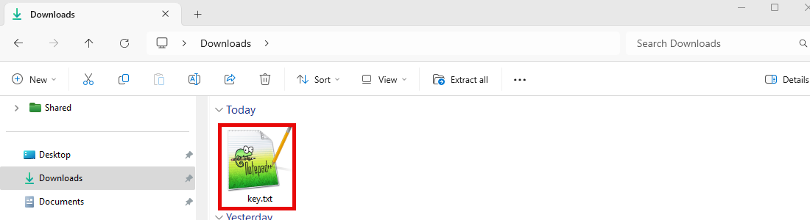

12. Open the file in a text editor to review its content.  Make note of the items in red as they will be required for further configuration. 
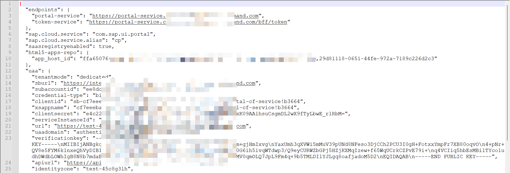

13.  In the BTP cockpit, navigate to your BTP Global Account. 
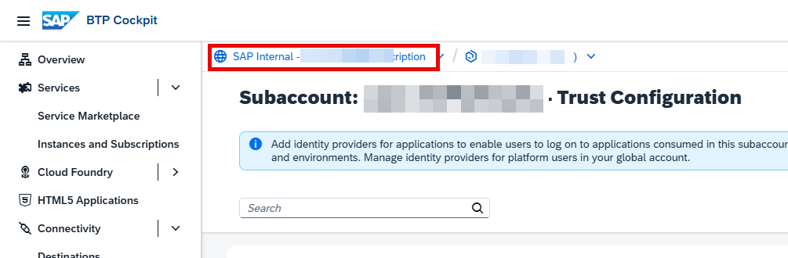
14.  Under **System Landscape** and confirm that you now also see a new system of type **SAP Build Work Zone** listed as a registered system.  This system is automatically added to the System Landscape from the SAP Build Work Zone subscription that you created earlier.  Make a note of the **System Name** for this system as it will come in handy later when executing the Joule booster. 
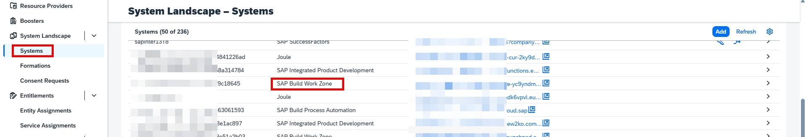