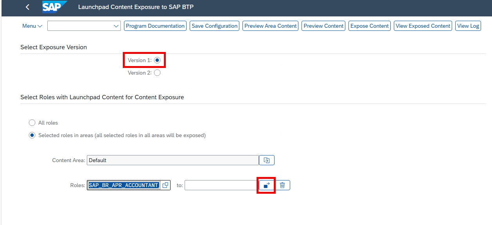
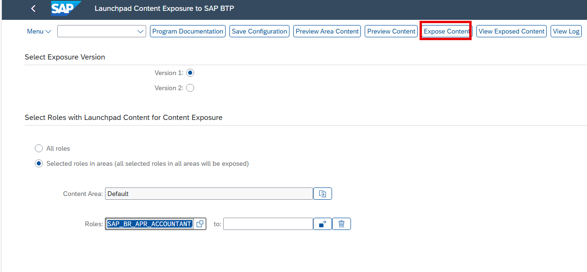

## Expose SAP Fiori Launchpad Content to SAP BTP

Administrators can expose **SAP Fiori launchpad content** to SAP BTP by selecting specific roles. The related content—such as groups, catalogs, pages, or spaces—can then be consumed in SAP BTP.

For more details, see *Manage Launchpad Content for Exposure*.

---

## Procedure

Follow the steps below to expose your SAP Fiori launchpad content to SAP BTP.

---

### 1. Launch the Exposure Transaction

- Open transaction: `/UI2/CDM3_EXP_SCOPE`

---

### 2. Choose Exposure Version

- Select the exposure version to use.

> ℹ️ **Note**: Each version uses a **dedicated repository**, allowing both version 1 and version 2 to be used simultaneously.

> ℹ️ **Note (SAP S/4HANA backend release level):**  
>- **Exposure Version 2** – use for **SAP S/4HANA 2023 FPS01 and higher**  
>- **Exposure Version 1** – use for **SAP S/4HANA releases below 2023 FPS01**

---

### 3. Select Roles to Expose

You can choose from the following options:

| Option | Description |
|--------|-------------|
| **All roles with launchpad content** | Default option. All roles are exposed. |
| **Selected roles in areas** | Select specific roles or group roles by areas. See *Select Roles for Content Exposure*. |

> ℹ️ **Note**:  
> - All roles from all selected areas are used in the exposure.  
> - To **add roles**, include them in the role selection and execute the exposure again.  
> - To **remove roles**, exclude them from the role selection and re-execute the exposure.

> ⚠️ **Important**:  
> **Derived roles** are not supported directly.  
> To expose a derived role, select the **leading role** (the one that contains the launchpad content). The derived role will be exposed indirectly via its relation to the leading role.

---

### 4. (Optional) Preview Content

- Use **Preview Content** or **Preview Area Content** to verify selected content.
- Review for completeness and check for any **errors or warnings**.

---

### 5. Save Role Selection

- Click **Save Selected Roles**.
  
> ❗ You must save the role selection before exposing.  
> Otherwise, the system will use the last saved configuration.

---

### 6. Check for Errors

- Click **View Log** or **Preview Content > Display Log** to view any issues.
- Only **error-free content** can be exposed.

---

### 7. Expose the Content

You have two options:

| Method | Description |
|--------|-------------|
| **Manual Exposure** | Click **Expose Content** to trigger the exposure immediately. |
| **Scheduled Job** | Set up a scheduled job to expose the content regularly using the saved configuration. See *[Schedule Content Exposure](https://help.sap.com/docs/ABAP_PLATFORM_NEW/a7b390faab1140c087b8926571e942b7/bc4da46ed81648598d30dcd39f5fcf2a.html?version=202310.001)*. |

