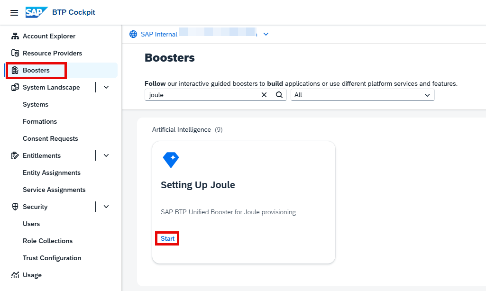
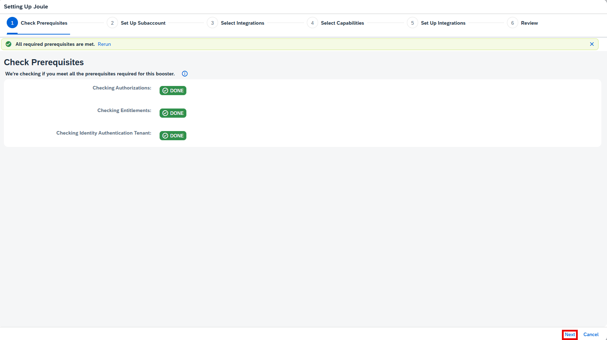
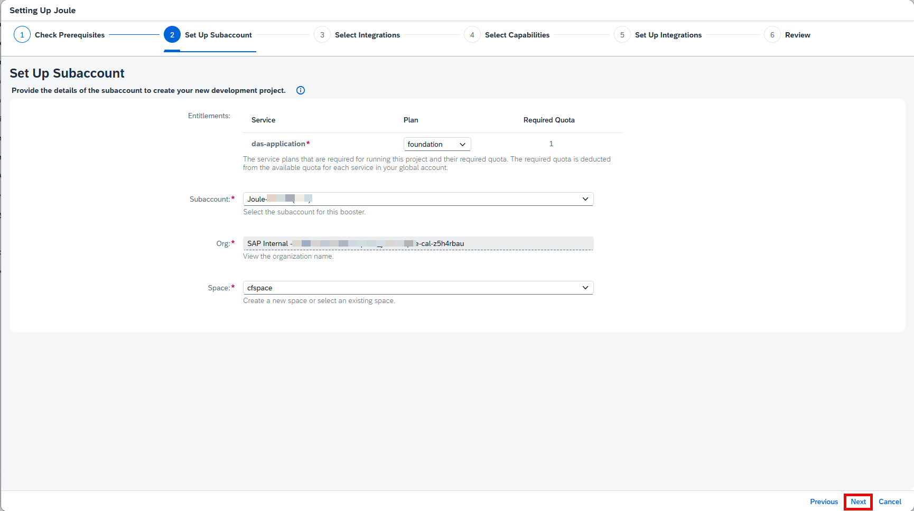
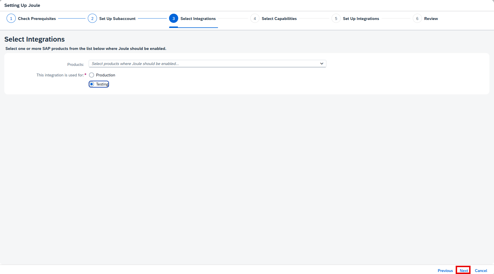
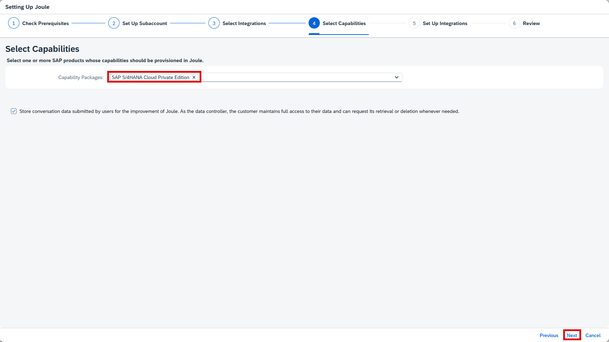
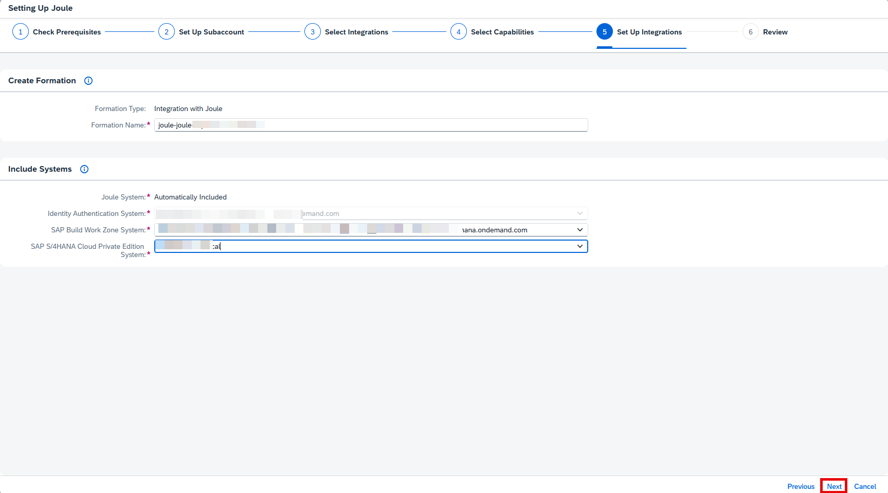
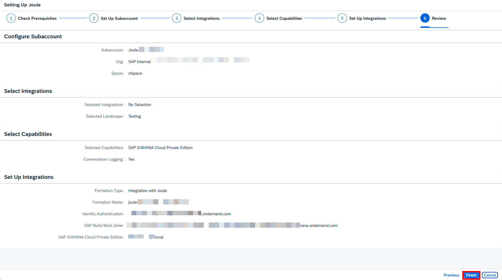
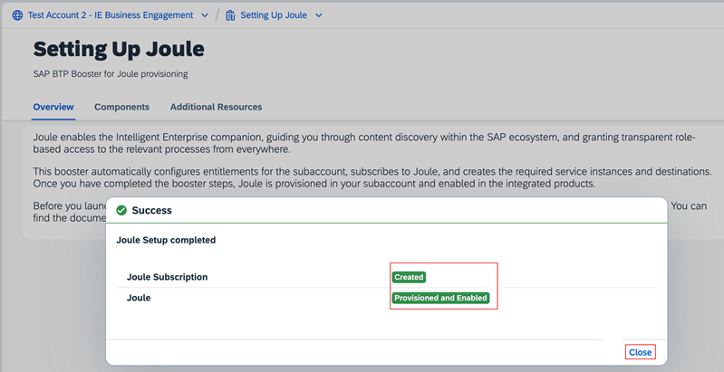

1. If necessary, navigate to your BTP Global Account. 

2. From the Navigation Pane on the left, click **Boosters** >> search for **Joule** >> click **Start** on Setting up Joule tile. 

3. Confirm the pre-requisites check is successful and click **Next**. 

4. From the Subaccount dropdown select the **Joule** subaccount created earlier and click **Next**. 

5. From the Products dropdown for SAP **S/4HANA Cloud, private edition**, you do not need to select anything. However, you can add **SAP Build Work Zone, standard edition** if you are planning to integrate Joule with **SAP Build Work Zone, standard edition (Plan – Standard)** 
 Choose whether the integration is for **Testing or Production** and click **Next**. 

6. From the Capability Pacakages dropdown select **S/4HANA Cloud Private Edition**. Click **Next**. 

7. Leave the default **Formation Name**.  Under the Include System area choose the following and click **Next**.  
  SAP Build WorkZone System: **Choose the SAP Build Work Zone created earlier** 
  SAP Cloud Identity Services System: **Choose the Cloud Identity Services Tenant** 
  S/4HANA Cloud Private Edition System: **Choose the S/4HANA Cloud Private Edition** 

10. Review the configuration settings and click **Finish**. 
  

11. Confirm the booster execution is successful and click **Close**. 
