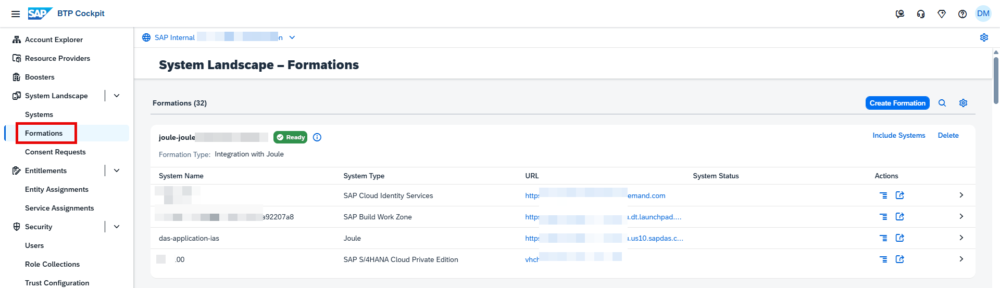
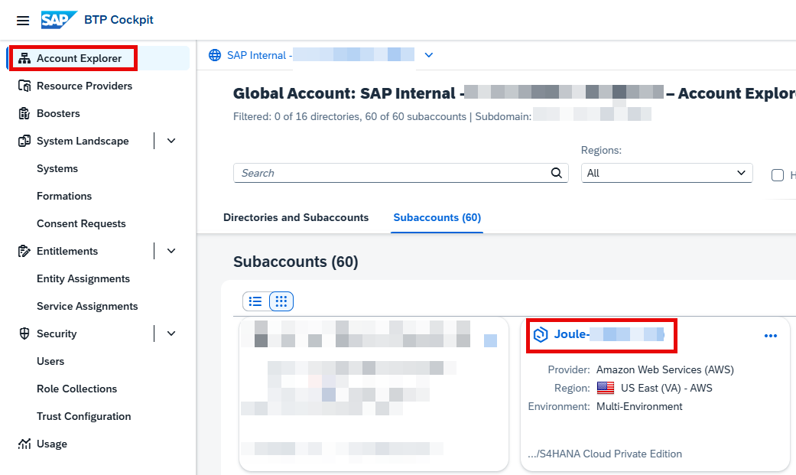
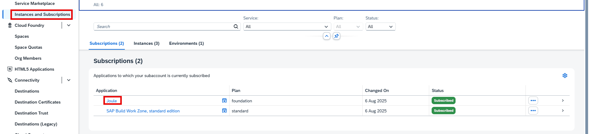
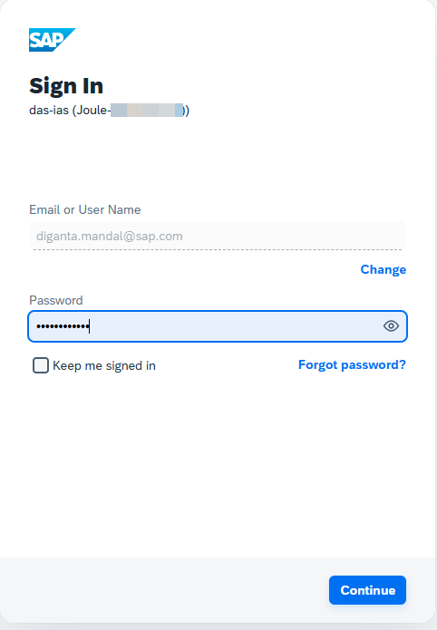
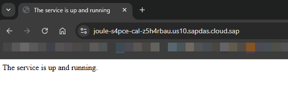
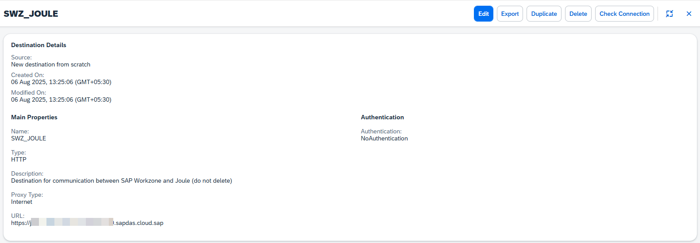

## Check Formations in BTP Global Account
1. If necessary, navigate to your BTP Global Account.
2. Under **System Landscape** click **Formations** and ensure the formation is created successfully.  The formations should have all the systems that were selected during the booster execution.  

## Check Joule Subscription and Destinations setup in BTP Subaccount
1. Click **Account Explorer** and select the Subaccount used for Joule setup. 
 
2. Click **Services -> Instances and Subscriptions** and confirm **Joule** application is subscribed successfully. 
  
3. Click on the **Joule** application, specify credentials of user in SAP Cloud Identity Services and click **Continue**. 
   
4. Confirm the Joule application is running and make a note of the URL of the application.  This URL is required later to complete Joule setup for S/4HANA Cloud Private Edition. 
    
5. Click **Connectivity -> Destinations** and confirm that the destination SWZ_JOULE has been successfully created if you selected integration with SAP Build Work Zone, standard edition during the booster execution. 
  