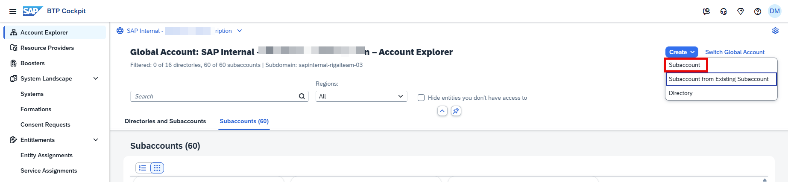
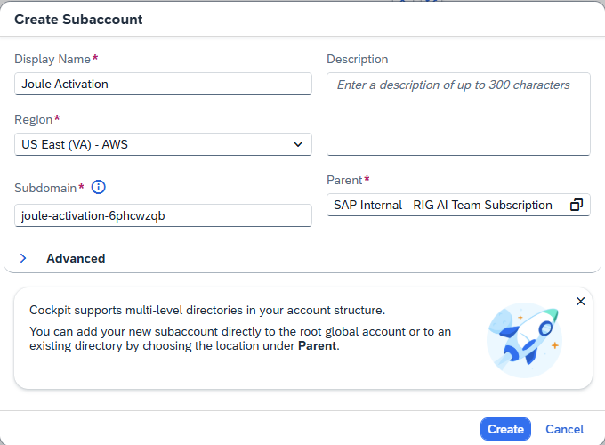
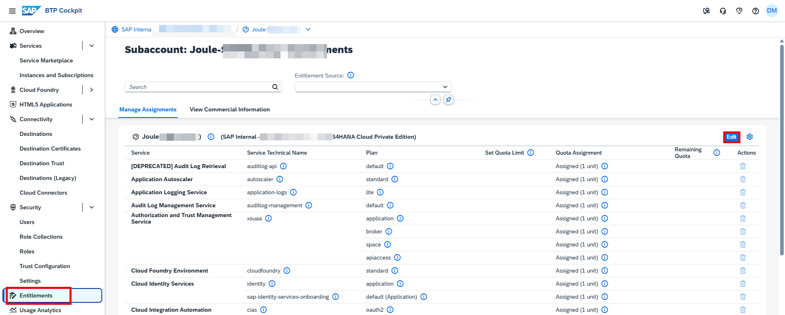
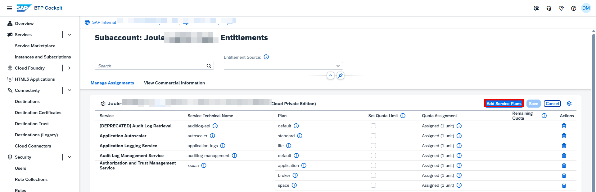
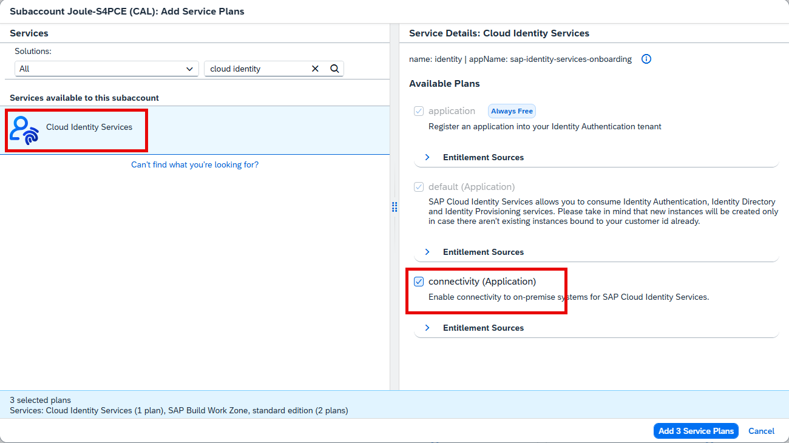
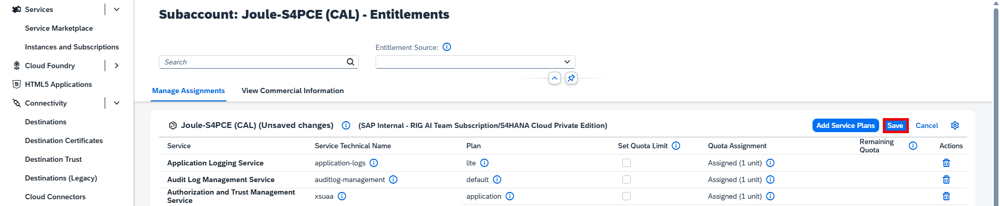

# Why Cloud Identity Service Connectivity Plan & Destinations Must Be Created in a Separate Subaccount

In SAP Business Technology Platform (SAP BTP), connectivity services and destinations are scoped at the **subaccount level**.

A key limitation is:

> **One SAP Cloud Identity Services tenant can be connected to only one Connectivity plan.**

---

## What This Means

- The Connectivity plan is assigned to **a single subaccount**.
- Identity Provisioning can access only the connectivity configuration of that specific subaccount.
- Connectivity plans **cannot be shared across multiple subaccounts**.
- If a destination is created in a different subaccount, Identity Provisioning will **not** be able to see or use it.

---

## Why Use a Separate Subaccount?

Creating a dedicated subaccount for:

- Connectivity service  
- Cloud Connector  
- Destinations (e.g., for Identity Provisioning integration)  

ensures:

1. Compliance with the **one connectivity plan per tenant** restriction  
2. Proper visibility of destinations  
3. Better security isolation  
4. Clear separation between connectivity and application environments (Dev/Test/Prod)

---

## Summary

Because a Cloud Identity Services tenant supports only **one Connectivity plan**, and connectivity is scoped at the subaccount level, the Connectivity service and related destinations must be created in the **designated subaccount** linked to the Identity Services tenant.

## **Create Subaccount and Cloud Foundry Space**

1. Access [BTP Cockpit URL](https://cockpit.btp.cloud.sap).
2. Select the BTP Global Account that has the Joule entitlements and click **Continue**. 
                  

3. From the Navigation Pane on the left, select **Account Explorer**.  Click **Create** >> **Subaccount**. 

4. Specify **Display Name** and **Region** and click **Create**. 

   
**Note**: The **Region** must be from one of the supported data centers for Joule.  See [Data Centers Supported by Joule](https://help.sap.com/docs/JOULE/3fdd7b321eb24d1b9d40605dce822e84/8b4d8708f6d646a995fdc50f8c508f1f.html?version=CLOUD)

## **Add Entitlements**

1. From the Navigation Pane, select **Entitlements** and click **Edit**. 

2. Click **Add Service Plans**. 

3. Search for "Cloud Identity Service".  Click **Joule** and choose **Connectivity (Application)** from the list of available plans. 

4. Click **Save**.                 

 