## Add Subaccount in your SAP Cloud Connector
If you have your S/4HANA Cloud Private Edition instance managed by SAP, you would need to contact your support team to make the changes. You should be sharing the details, to add context we are sharing the configuration process below.

Note: You should have Principal Propagation, which should be available to communicate with SAP BTP. If necessary, you may refer to Expose Intranet Systems for details. 

1. First, in your BTP Subaccont, navigate to the Overview section and look for the **Subaccount ID**. Please make a note of it.
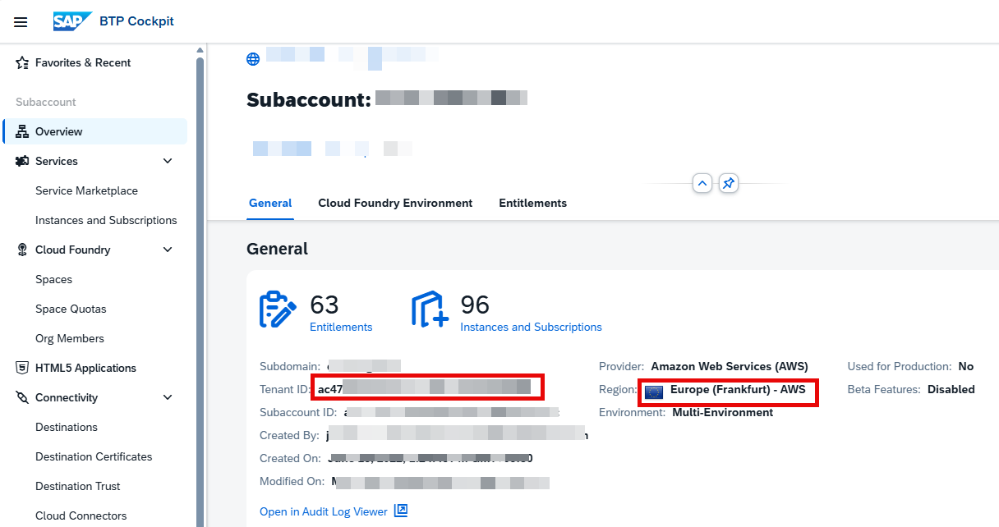

2. Log in to your **SAP Cloud Connector** -> Click on **Add Subaccount** -> Enter the following details. 
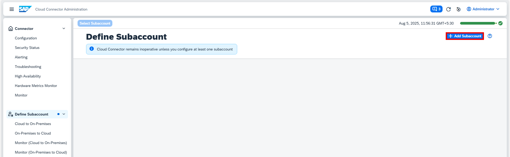

3. Enter the details such as the **Region** of your BTP Subaccount, **Subaccount ID**, Display name of your choice, **Login Email** Address (subaccount admin), and **Password**, and click on Save.  

## Create a New System Mapping for the HTTPS Protocol
1. Now navigate to your Subaccount -> click on **Cloud To On-Prem** and click on the **“+”** sign to Add System Mapping -> Select **ABAP System** and click on Next -> Select **HTTPs** and click on Next.  
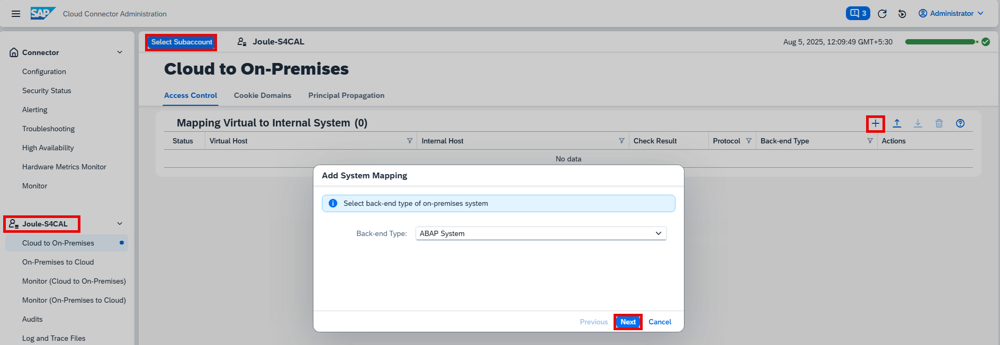
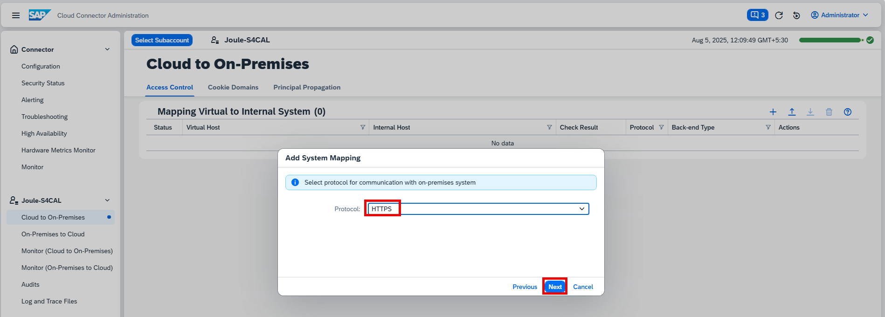

2. Enter the **Internal Host** and **Port Number**, then click Next.  
Note: Please use the **Web Dispatcher URL** if it is configured.  
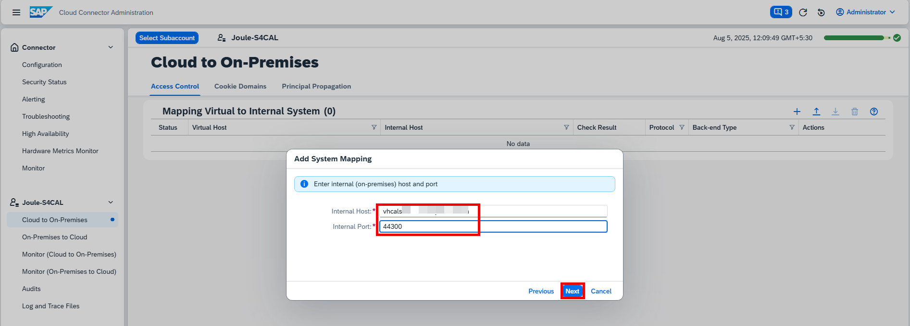

3. Now enter a meaningful name for the **Virtual Host** and **Virtual Port**, and click on Next. 
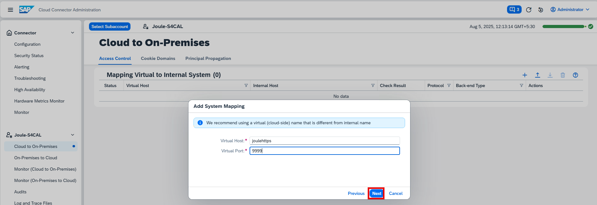

4. Select the Pricipal Type **X.509 Certificate**, and click on Next. 
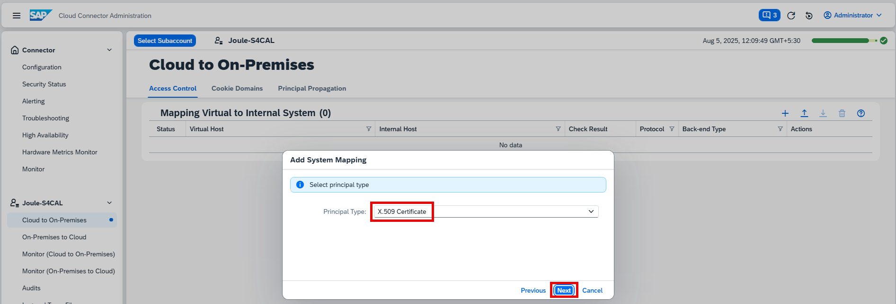

5. Make sure **System Certificate for Logon** is **Unchecked**, and click on Next. 
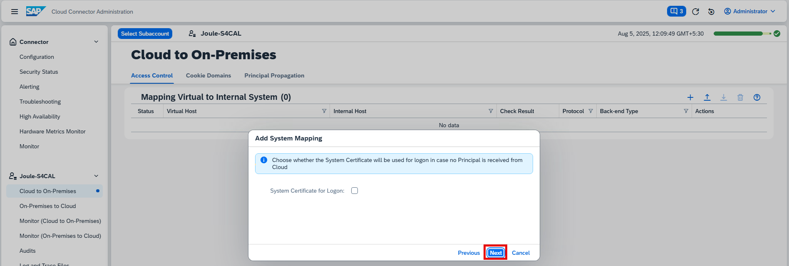

6. Enter your **S/4HANA Cloud Private Edition SID**, and click on Next. 
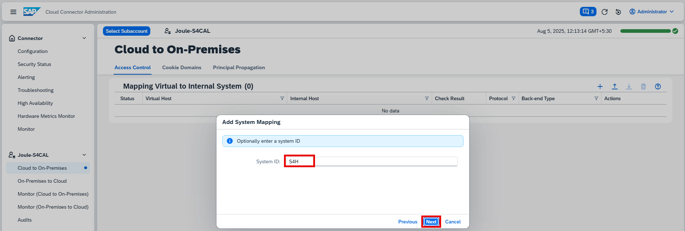

7. Verify the details and click on Finish. 
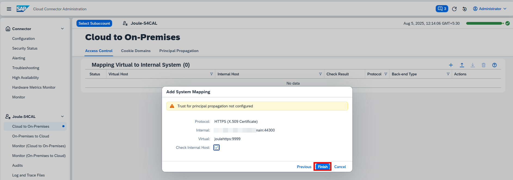

## Adding the Resource Path to HTTPS Protocal System Mapping
Here, you may want to add the resource path required for communication. In my case, I have given access to the full path for demo purposes; however, if you would like to permit a specific communication path, I recommend you add the list below.

| Path to fetch                     | Value                                                                                                                                        |
|----------------------------------|----------------------------------------------------------------------------------------------------------------------------------------------|
| Card manifests and i18n files     | /sap/bc/lrep/                                                                                                                               |
| The UI5 App Index                 | /sap/bc/ui2/app_index/                                                                                                                      |
| CDM3 content                     | /sap/bc/ui2/cdm3/ (This is the path for V1 CDM content exposure)   /sap/bc/http/ui2/flp_content_exposure/entities (This is the recommended path for V2 CDM exposure, available from 2023 FPS1 and the same should be used in the Design time destination) |
| Data from OData services          | /sap/opu/odata/                                                                                                                             |
| Data from OData V4 services       | /sap/opu/odata4/                                                                                                                            |

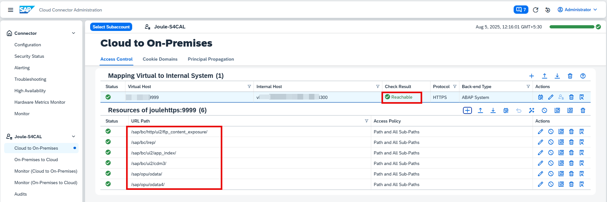

## Create a new system mapping for the RFC protocol
1. Now navigate to your Subaccount -> click on **Cloud To On-Prem** and click on the **“+”** sign to Add System Mapping -> Select **ABAP System** and click on Next -> Select **RFC** and click on Next.  
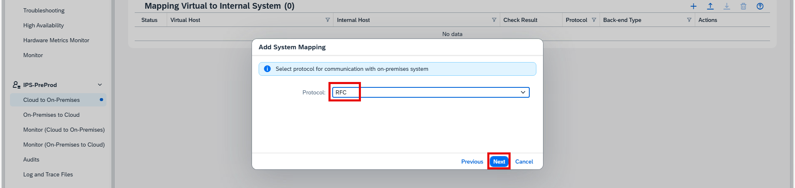

2. Select the Connection Type **Without load balancing**.  
Note: You can choose the Connection Type **With load balancing** then you need to use **Message Server** and **System ID**.  
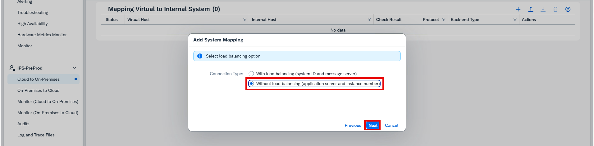

3. Enter the **Application Server** and **Instance Number**, then click Next.  
Note: Please use the **Web Dispatcher URL** if it is configured.  
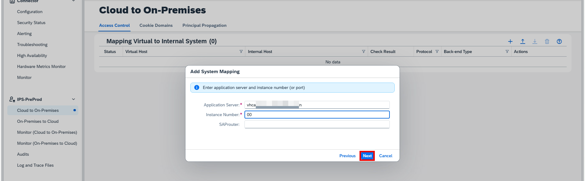

3. Now enter a meaningful name for the **Virtual Host** and **Virtual Port**, and click on Next. 
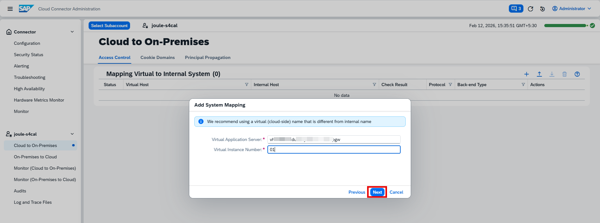

4. Enter your **S/4HANA Cloud Private Edition SID**, and click on Next. 
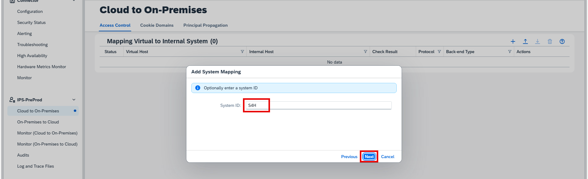

7. Verify the details and click on Finish. 
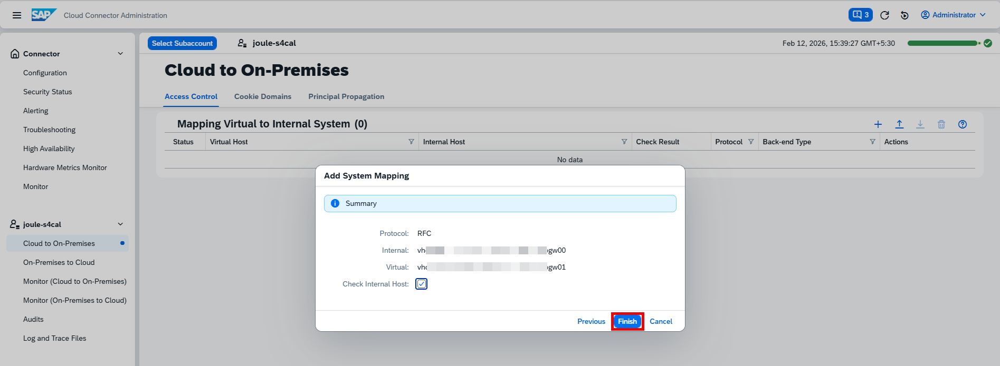

## Adding the Resource Path to RFC Protocal System Mapping
Select the RFC Protocol that we created now, and click on “+” icon. With the Naming Policy set to Exact Name in the Identity Provisioning service, allow access to the following resources:

- BAPI_USER_GETLIST
- BAPI_USER_GET_DETAIL
- PRGN_ACTIVITY_GROUPS_LOAD_RFC
- PRGN_ROLE_GETLIST

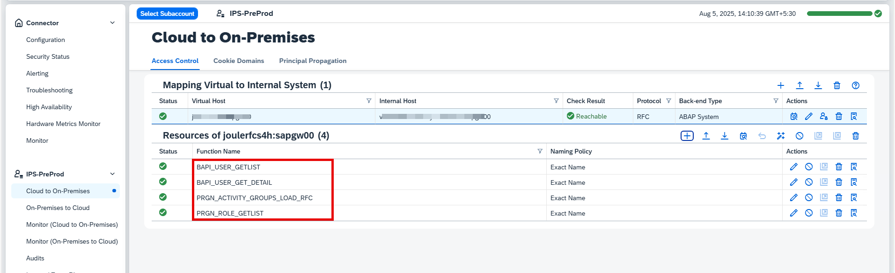