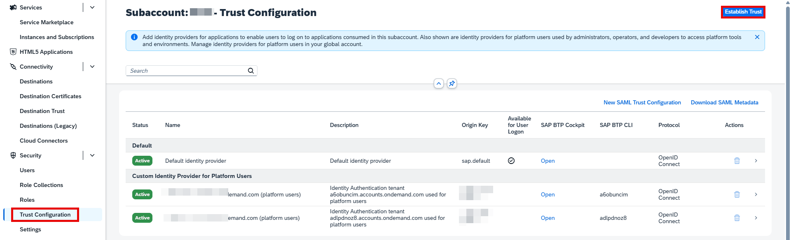
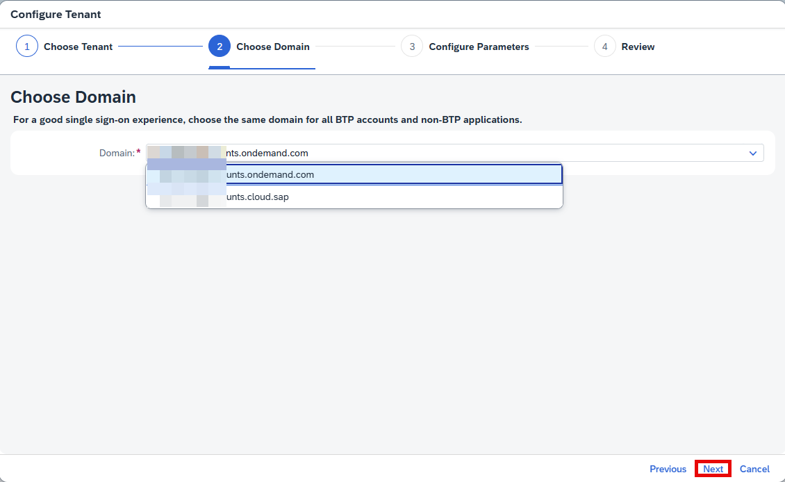
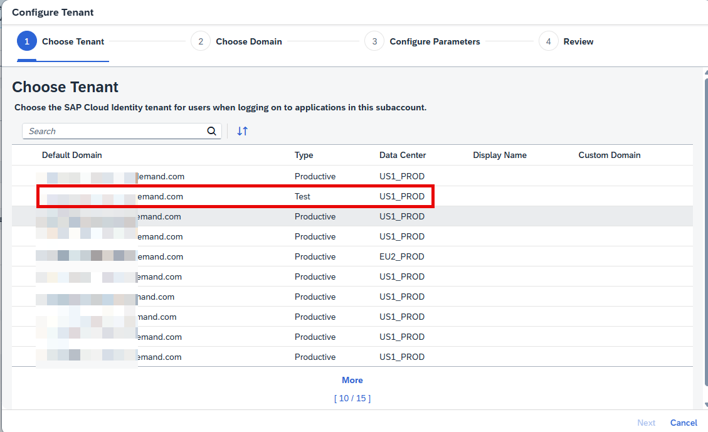
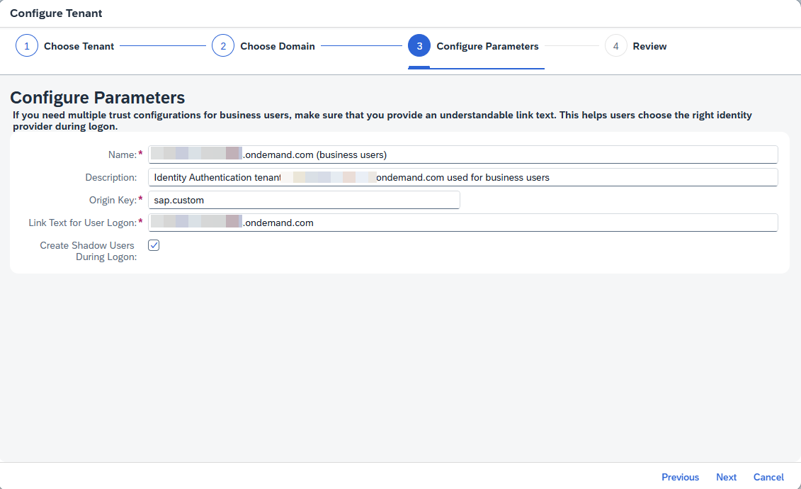
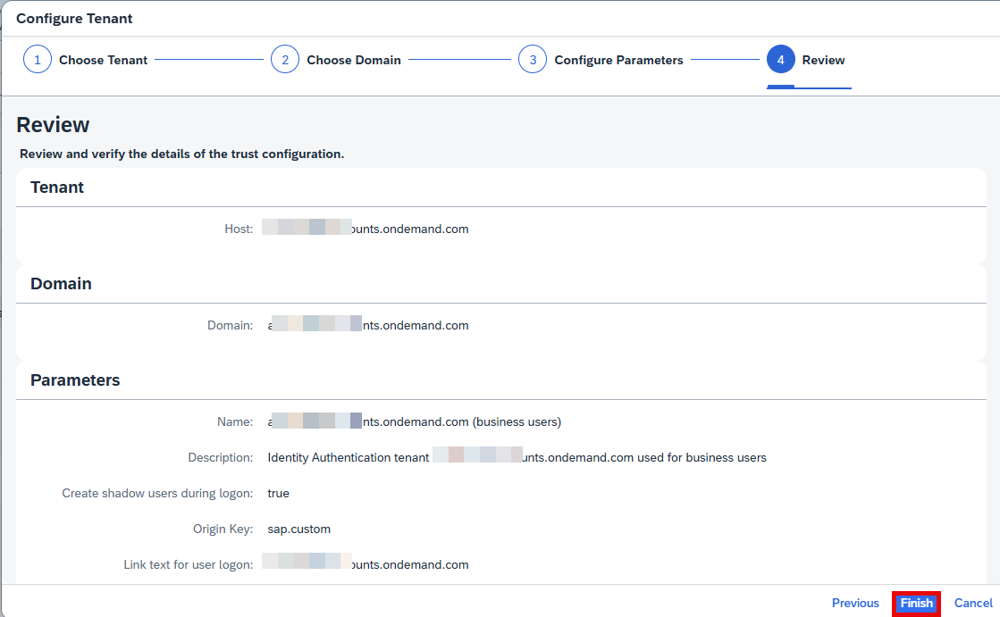
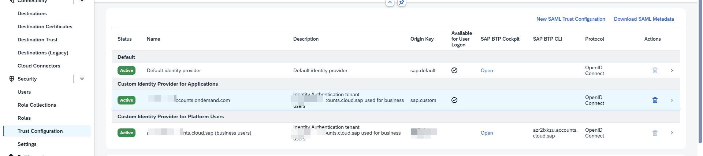

1. From the Navigation Pane on the left, select **Trust Configuration**.  Click **Establish Trust**. 

2. It is important to select the correct SAP Cloud Identity Services tenant. The tenant selected here must be the same tenant that is used when accessing the S/4HANA Fiori Launchpad. Ensure that the tenant matches the one configured for the applications for which Joule is being set up., choose the one that is also used by your applications and click **Next**.      
**Note**: Select the SAP Cloud Identity Services tenant that is used to authenticate users when opening the **SAP S/4HANA Fiori launchpad**. This must be the same tenant used by the applications for which Joule is being configured. Refer to the preparation section of the mission for more information.       
   

3. Choose the appropriate domain for your SAP Cloud Identity Services tenant.  Select either **ias.accounts.ondemand.com** or **ias.accounts.cloud.sap** and click **Next**.            
**Note**: Refer to the preparation section of the mission for more information.  All apps that will be configured for Joule setup should be integrated with IAS using the same domain.  In most cases, set up the BTP subacccount trust using **cloud.sap** domain.            
       

4. Leave the default settings and click **Next**.         

5. Review the information is correct and click **Finish**.                                                        

6. Confirm the new trust with SAP Cloud Identity Services is visible under **Custom Identity Provider for Applications**.                                      
