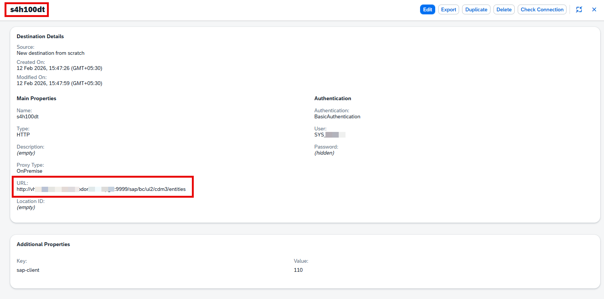
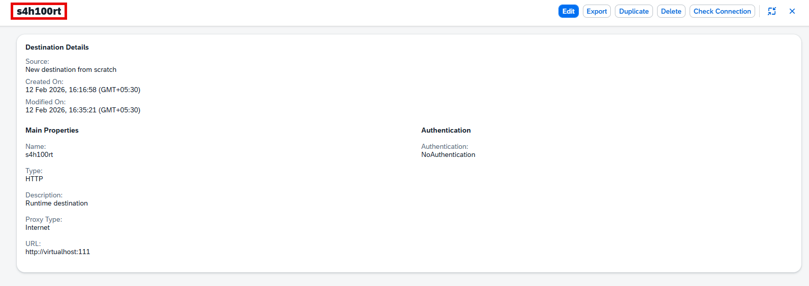
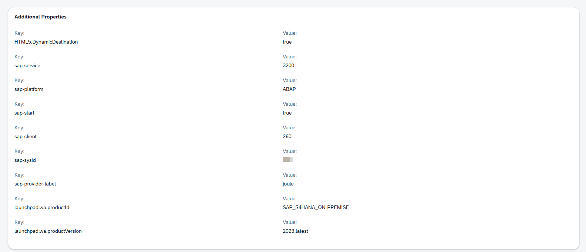
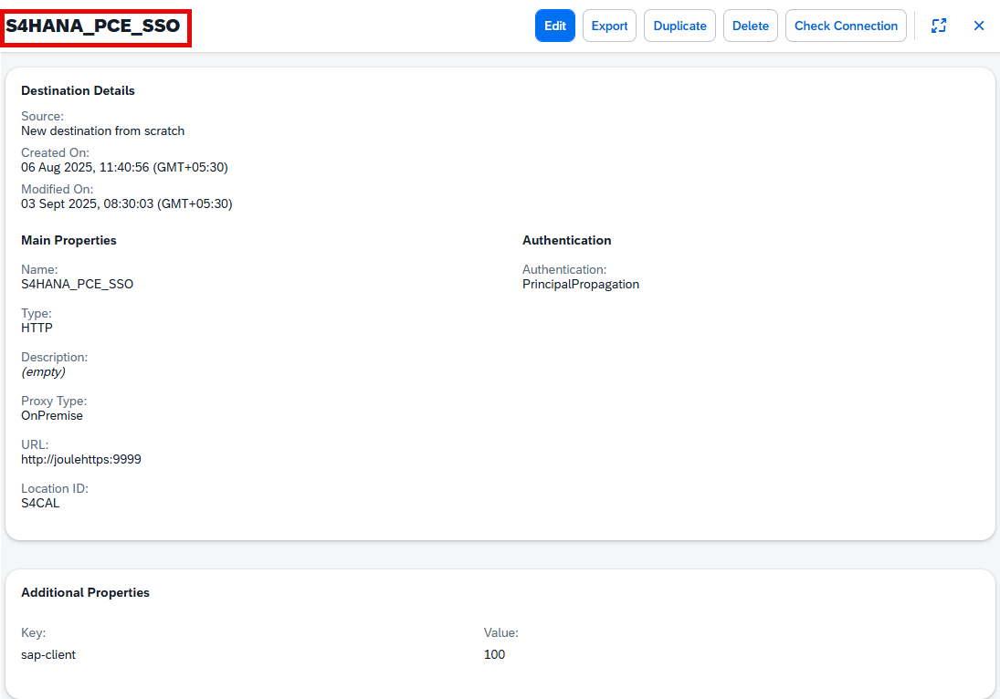
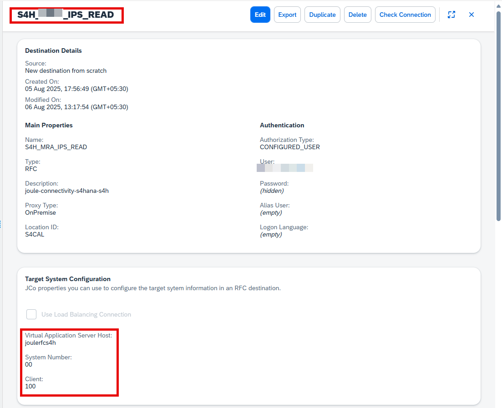

## Configure Design-Time Destination in SAP BTP Cockpit

In the SAP BTP cockpit, within your subaccount, navigate to:  
**Connectivity > Destinations**

Use the following properties to define the **design-time destination**:

| Property         | Value / Description |
|------------------|---------------------|
| **Name**         | Recommended: add the suffix `dt` to the name. |
| **Type**         | `HTTP` |
| **Description**  | Enter a relevant description. |
| **URL**          | The URL of the Virtual Host of your Cloud Connector:  • Version 1: `https://<host>:<port>/sap/bc/ui2/cdm3/entities`  • Version 2: `https://<host>:<port>/sap/bc/http/ui2/flp_content_exposure/entities` |
| **Proxy Type**   | `OnPremise` |
| **Authentication Method** | Supported method: `Basic Authentication`  ⚠️ The selected method must also be supported by the content provider.  Use a technical user with permission to read the CDM.  ❌ Principal Propagation is *not supported*. |
| **sap-client** (additional property) | The client number of the ABAP system.  For example: `120` |

---

✅ Once all fields are configured, save the destination to complete the setup.

## Configure Runtime Destination in SAP BTP Cockpit

The runtime destination defines the location from which to obtain the resources needed to run the federated apps in runtime.

In the SAP BTP cockpit, within your subaccount, navigate to:  
**Connectivity > Destinations**

Use the following properties to define the **runtime destination**:

| Property                | Value / Description |
|-------------------------|---------------------|
| **Name**                | We recommend adding the suffix `rt` to the name. |
| **Type**                | `HTTP` |
| **Description**         | Enter a description. For example: `SAP Start Run time Destination` |
| **URL**                 | The URL of the Virtual Host set up in your Cloud Connector.  Find this value in the Cloud Connector Administration tool under **Cloud to On-Premise > Access Control** in the Virtual Host column.  Example: `https://sxw-90.devsys.net.sap`  ⚠️ For Web Dynpro ABAP apps with SAP Business Client (`CompatibilityMode=TRUE`), ensure the virtual host matches the full path (see WDA Apps Integration Mode). |
| **Proxy Type**          | `Internet` |
| **Authentication Method** | `NoAuthentication` |

---

** Additional Properties **

| Property                      | Value / Description |
|-------------------------------|---------------------|
| **HTML5.DynamicDestination**  | Set to `true` when creating a destination for a dynamic tile.  ⚠️ To enable CSRF protection via the approuter, set `CEP.EnableCsrfProtection=true` unless the backend handles CSRF protection already. |
| **sap-platform**              | `ABAP` |
| **sap-client**                | The client number of the ABAP system. For example: `920` |
| **sap-sysid**                 | System ID (SID) of the SAP system. For example: `SXW` |
| **launchpad.wa.productId, launchpad.wa.productVersion** | Configure these to enable SAP Companion content (on-screen help) for SAP S/4HANA apps. See **Activating SAP Companion Content**. |
| **sap-provider-label**        | A user-friendly display name for the system. Used in tiles, search results, user default values, and app finder. |
| **sap-service**               | A 4-character string: `32` + instance number of the ABAP server or SAP system number. Example: `3200` |
| **sap-start**                 | Set to `true` |

---

** Runtime Destination for Dynamic Data **

- A dynamic tile displays data updated during runtime.
- To retrieve dynamic data, define an additional runtime destination for dynamic data.
- In the Channel Manager, the default dynamic data destination is the same as the runtime destination but can be changed if required.

## Create Destination for Single Sign-On

In the SAP BTP cockpit, log on to your subaccount for **Joule** as administrator.

In the navigation area, choose:  
**Connectivity > Destinations**

To create the destination, choose **New Destination** and enter the following information:

| Property                | Description / Value |
|-------------------------|---------------------|
| **Name**                | `S4HANA_PCE_SSO` |
| **Type**                | `HTTP` |
| **Description**         | Enter a description. |
| **URL**                 | The URL of the Virtual Host of your Cloud Connector:   `https://<host>:<port>` |
| **Proxy Type**          | `OnPremise` |
| **Authentication**      | Principal Propagation is supported. |
| **sap-client** (additional property) | The client number of the ABAP system. |

---

✅ Save the destination after entering the above properties.

## Create Destination for Identity Provisioning Integration

Navigate to:  
**Connectivity > Destinations**

Create a new destination with the following example values for a connection with load balancing:

| Field                | Value / Description |
|----------------------|---------------------|
| **Name**             | Name of the destination |
| **Type**             | `RFC` |
| **Description**      | Enter a description |
| **ProxyType**        | `OnPremise` |
| **User**             | `<Username of your SAP S/4HANA Cloud Private Edition technical service user>` |
| **Password**         | `<Password of your SAP S/4HANA Cloud Private Edition technical service user>` |
| **Authorization Type** | `CONFIGURED_USER` |
| **Location ID**      | `<ID of the SAP Cloud Connector, if configured>`, example: `DLM_MAIL` |

---

### Additional Properties (case sensitive)

| Property              | Value / Description |
|-----------------------|---------------------|
| **jco.client.client**  | `<Client of your SAP S/4HANA Cloud Private Edition system>`, example: `950` |
| **jco.client.ashost**  | `<Virtual host of your SAP Cloud Connector configuration for Identity Provisioning service integration>`, example: `joulerfcS4H` (value up to colon) |
| **jco.client.sysnr**   | `<Virtual System Number of your SAP Cloud Connector configuration>`, example: `00` |

---

✅ Save the destination after entering all details.

