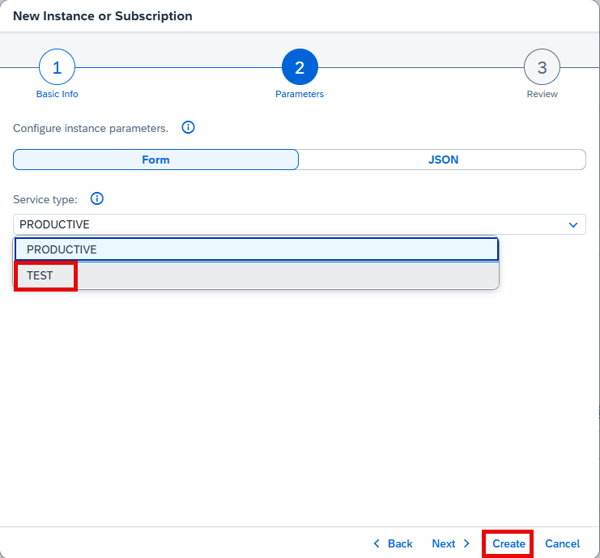
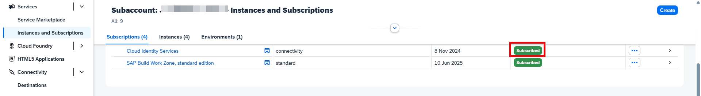

## Create Cloud Identity Service Connectivity Plan Subscription
1. From the Navigation Pane on the left, select **Instances and Subscriptions**.  Click **Create**.  

2. Select **Cloud Identity Service** from the Service dropdown and **Subscriptions >> Connectivity** from the Plan dropdown. 

3. Specify the IAS **Tenant Type** and click **Create**.          

4. Confirm the subscription to the Work Zone and creation of the instance is successful.</r>                                                        
