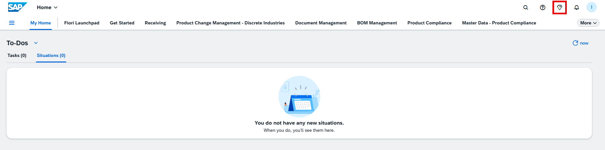
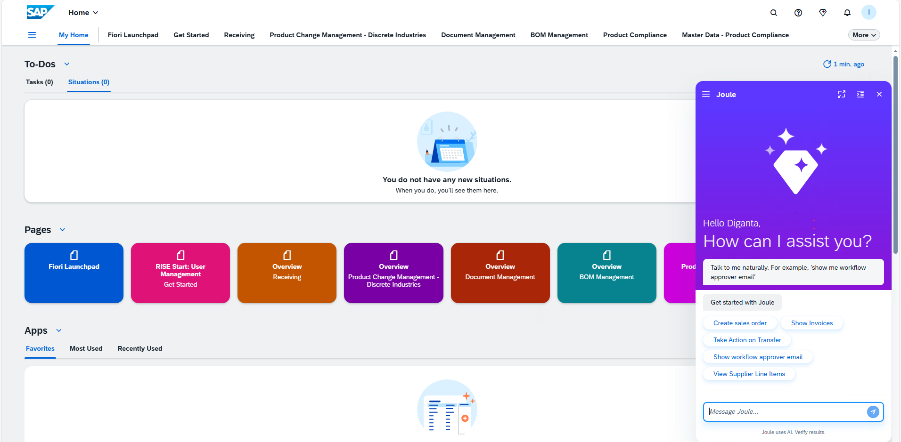
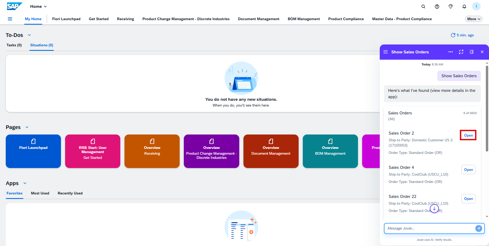
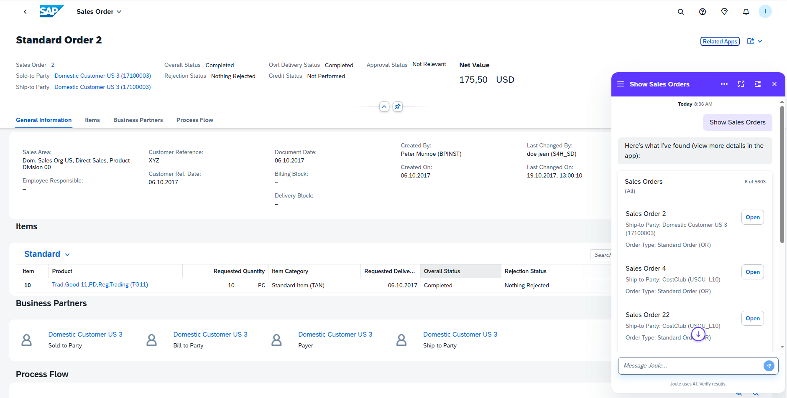

## S/4HANA Private Cloud – Joule Testing Guide

This guide will help you validate and test **Joule integration** in the **Fiori Launchpad** for S/4HANA Private Cloud.

---

### Validate Joule in Fiori Launchpad

1. Navigate to your **Fiori Launchpad**.
2. Look for the **Joule** icon.

   

3. Click on the icon to launch the **Joule assistant window**.

   

✅ **Expected Result**: The Joule plugin should open within the Fiori Launchpad without errors.

---

## 🔸 Test Use Case: Show Sales Orders

1. In the Joule input field, type: **Show Sales Orders**

2. Joule should respond with a **list of recent sales orders**.

   

3. Click on one of the sales orders in the list.

4. Joule should **navigate you to the corresponding Fiori app** or detail page for the selected sales order.

   

---

## 📎 Reference

- 🔗 [Joule Supported Use Cases – SAP Help Portal](https://help.sap.com/docs/joule/capabilities-guide/joule-in-sap-s-4hana-cloud-private-edition)

