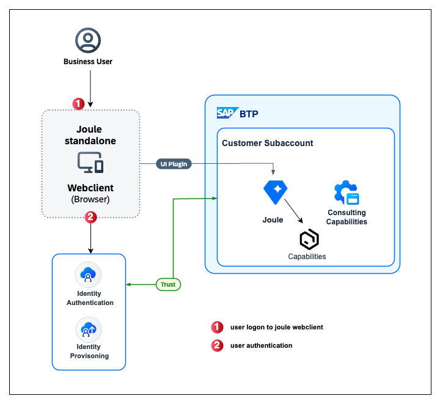

### SAP Joule for Consultants Architecture Diagram

 

 
 

 <b>Solution Diagram</b> 

 

#### Solution Diagram Description

In this mission, we will discuss who can access it and how to authenticate it using SAP Cloud Identity Services. We recommend using an existing SAP Cloud Identity Services, and if you are new to SAP Cloud Identity Services, or are not aware of existing services, please refer to our SAP Discovery Center Mission - 

<li><a href="https://discovery-center.cloud.sap/missiondetail/4538/4826/"</href>Establish a Unified Joule Instance Mission.</a></li> 

If you would like to validate your existing SAP Cloud Identity Services in your organisation, you can visit:

<li>View Assigned Tenants and Admins, how to get access <a href="https://discovery-center.cloud.sap/missiondetail/4538/4826/"</href> IAM Tenants</a></li> 

<li>SAP IAM Tenants - <a href= https://iamtenants.accounts.cloud.sap/>https://iamtenants.accounts.cloud.sap/</a> </li>
 

**Note:**
For **SAP IAM Tenants**, authoriztion is required. Follow the steps in this <a href="https://help.sap.com/docs/cloud-identity-services/cloud-identity-services/viewing-assigned-tenants-and-administrators">page</a> to get access or as an alternative, you can view the tenant administrators of the tenants that are assigned to you and add new administrators in SAP Cloud Identity Services via the <a href="https://help.sap.com/docs/link-disclaimer?site=https%3A%2F%2Fme.sap.com%2Fhome">SAP for Me</a> portal. For more information see <a href="https://help.sap.com/docs/link-disclaimer?site=https%3A%2F%2Fsupport.sap.com%2Fcontent%2Fs4m%2Fhelp%2Fsystems%2Fsystems%2Fdetails%2Fias.html"> Cloud Identity Services Administrators Card. </a>
