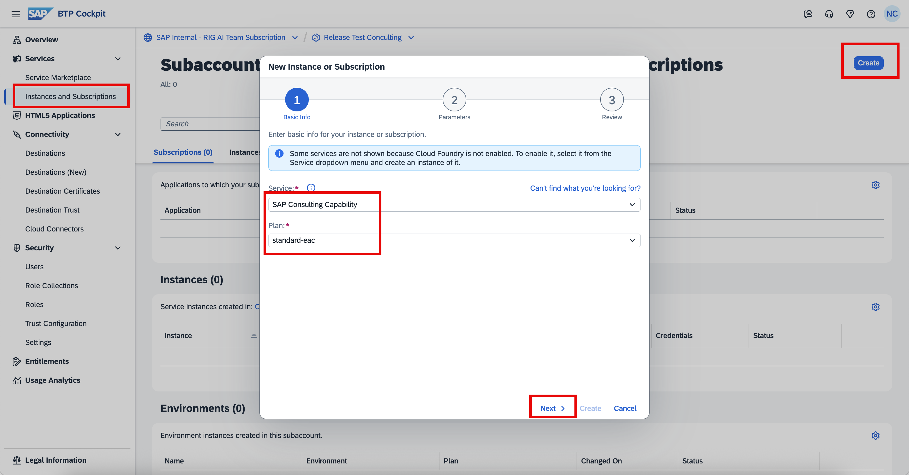
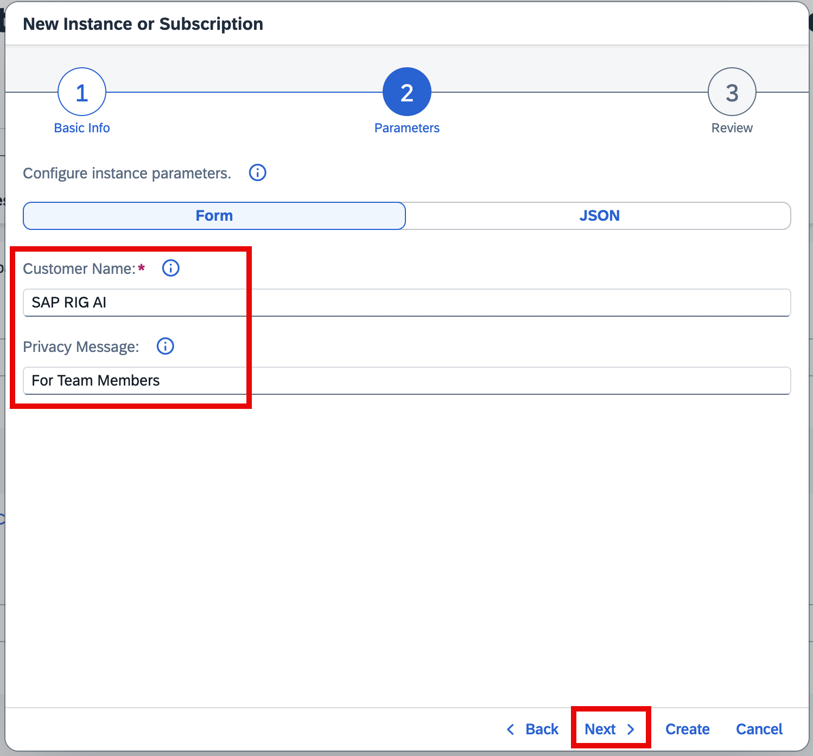
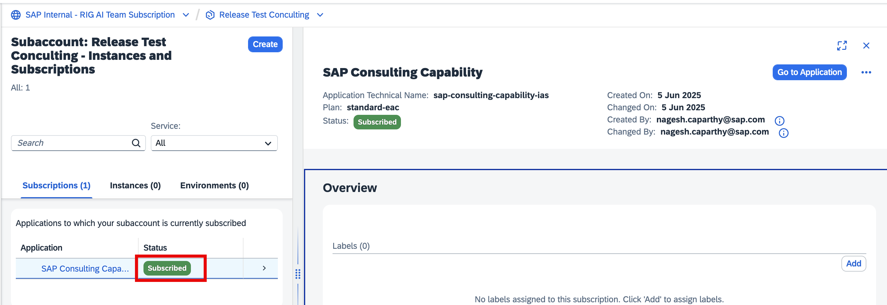
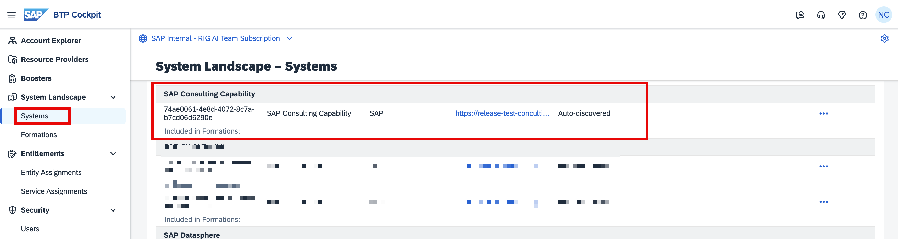

## Create a Service Instance

We will now be activating the **SAP Joule Consulting Capability** services in your SAP BTP Subaccount. 

<li>Navigate to Instances and Subscriptions</li>
<li><b>“Create”</b> and choose <b>SAP Joule Consulting</b> Capability as the service </li>
 

 
 

 <b>Image 1</b> 

 
<li>Follow the <b>on-screen instructions</b>, no changes are required, and click on <b>Create</b></li>
 

 
 

 <b>Image 2</b> 

 
<li>Wait for the instance to be successfully created </li>
 

 
 

 <b>Image 3</b> 

 

## Verify Instance Creation and Confirm System Landscape 

<li>Go to System Landscape  </li>
<li>Ensure that SAP Consulting Capability is now displayed.  </li>
 

 
 

 <b>Image 4</b> 

 
This completes the pre-requisites setup process, and we are now good to execute the <b>Joule Booster</b>. 
