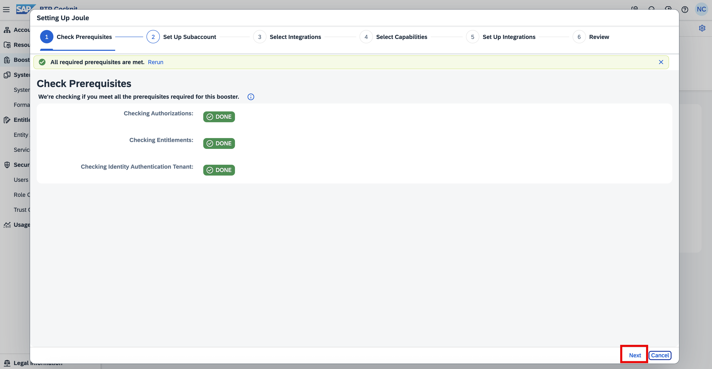
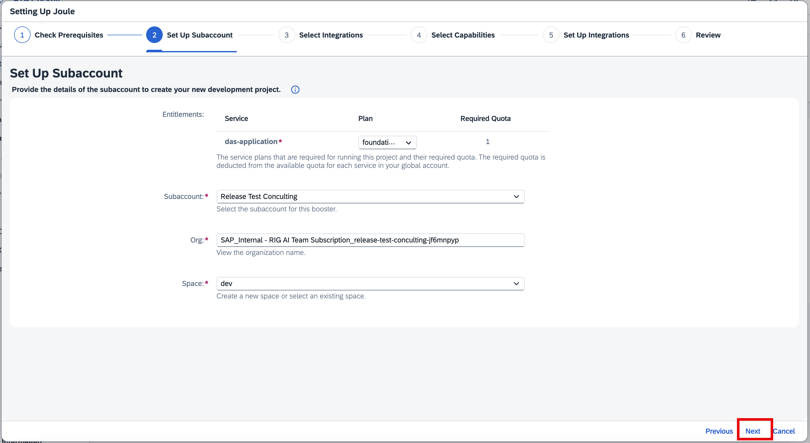
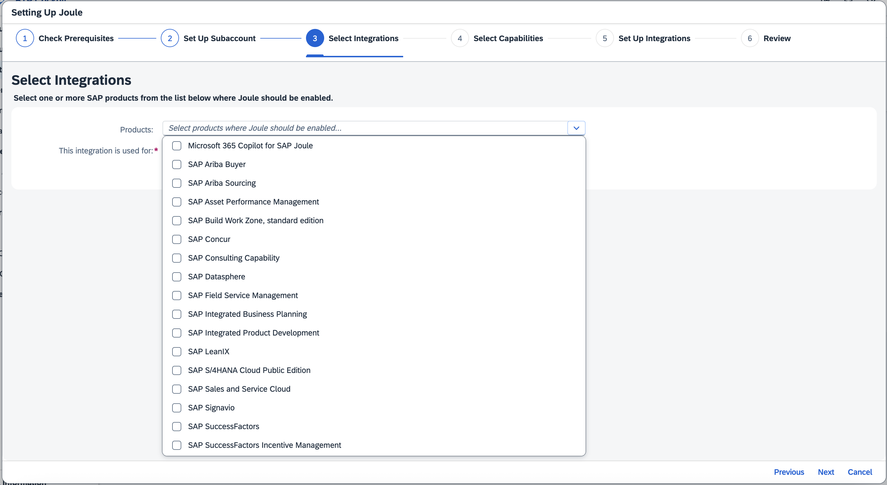
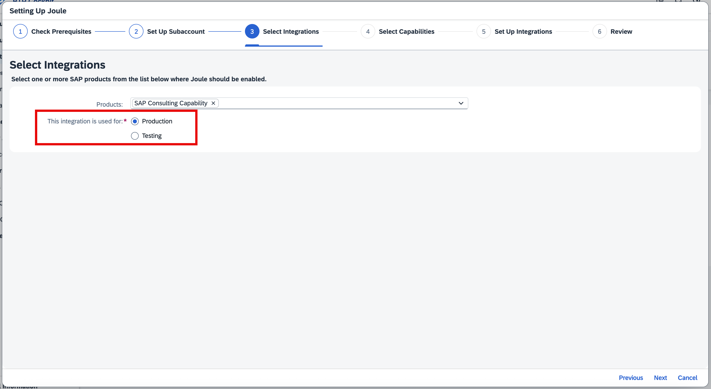
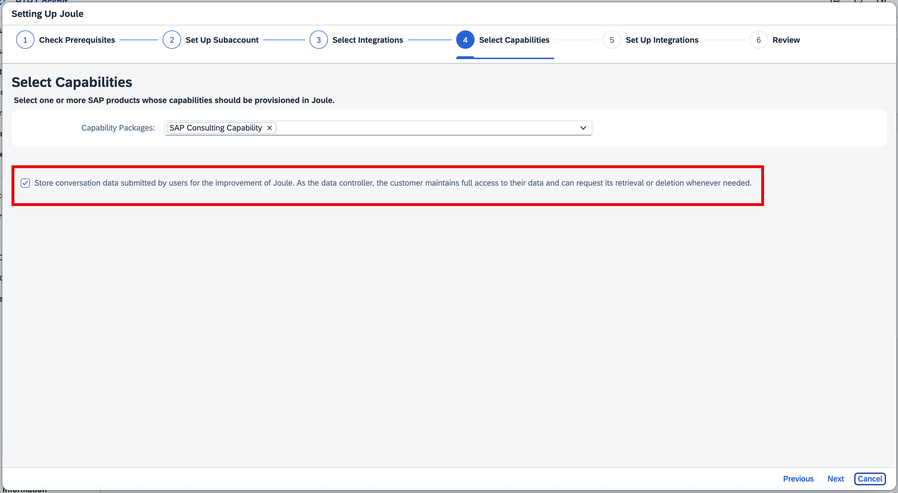
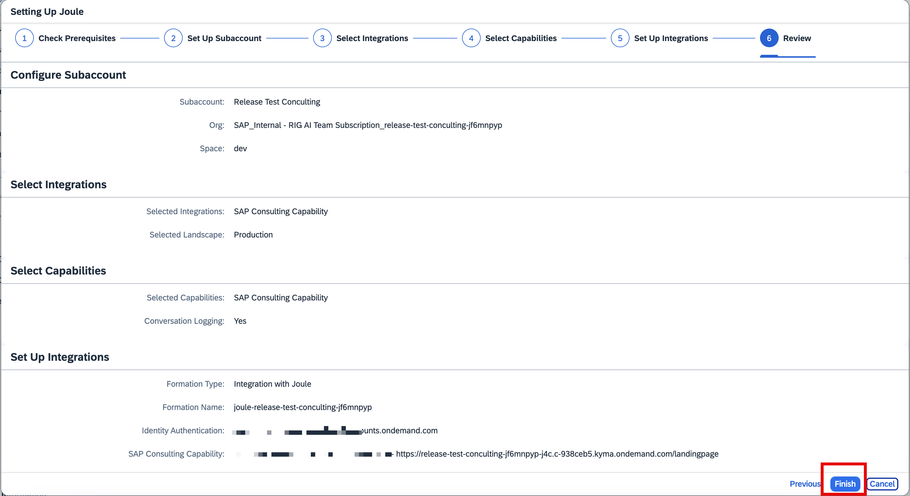
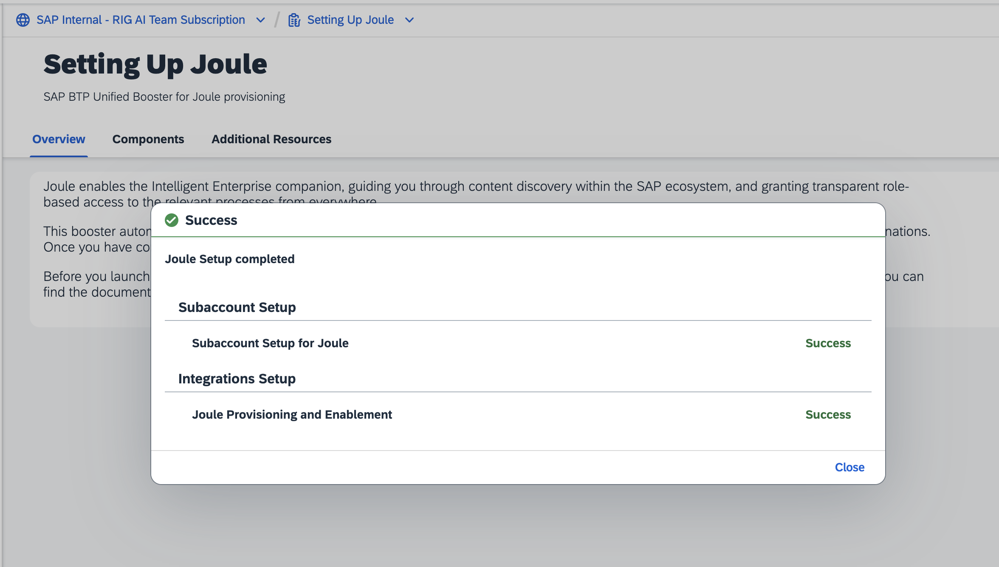
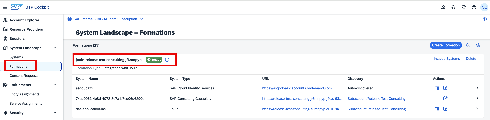

## Launch Joule Booster

We shall now execute the Joule Booster to activate the services required to enable the Joule for Consulting services. FYI, the booster is an automated process that enables the required services. 

<li>In your global account, click on <b>Boosters,</b> search for <b>Joule</b> and then click on <b>Start</b> to launch the Joule Booster</li>
 

 
 

 <b>Image 1</b> 

 
<li>Select the SAP BTP Subaccount that you have created. In our case, it is <b>Release Test Consulting</b> and click on <b>Next</b>.</li>
 

 
 

 <b>Image 2</b> 

 
<li>From the drop down list, select the service <b>SAP Consulting Capablity</b> and click on <b>Next</b></li>
 

 
 

 <b>Image 3</b> 

 
<li>In this screen you will have an option to select <b>Production</b> or <b>test.</b> We recommend selecting <b>Production</b> as you will need only one setup for your organization, and J4C does not offer any customization in the current release. Please select <b>Production</b> and click on <b>Next.</b></li>

 
 
 

 <b>Image 4</b> 

 
<li>To support the improvement of Joule, the customer, as the data controller, retains full access to their data and may request its retrieval or deletion at any time. Please tick the box to confirm and click on <b>Next.</b> </li>
 

 
 

 <b>Image 5</b> 

 
<li>Validate your selections and click on <b>Finish.</b>   </li>
 

 
 

 <b>Image 6</b> 

 
<li>The Joule booster will start the automation, and you can see the progress here. The process may take around 5-8 minutes at time.</li>
 

 
 

 <b>Image 7</b> 

 
<li>Once the process is completed, you should be able to see a <b>success message</b> as shown below.</li>
 

 
 

 <b>Image 8</b> 

 
<li>This completes the Booster setup process.</li>

## Post Joule Booster Checks

Once the Joule booster has been executed successfully, you should be able to see a new Formation created in your BTP Global Account. To check this, please click on **System Landscape** -> click on **Formations** and look for the formation with a "joule"-subaccountname listed. You should be able to see a similar formation as shown below. 

 

 
 

 <b>Image 9</b> 

 

The above formation represents the Joule, SAP Cloud Identity Services, and SAP Consulting Capability grouped together to support the setup and user access.
 
