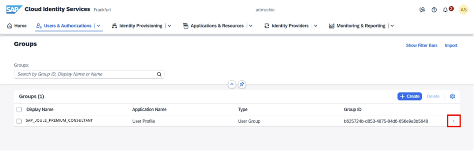
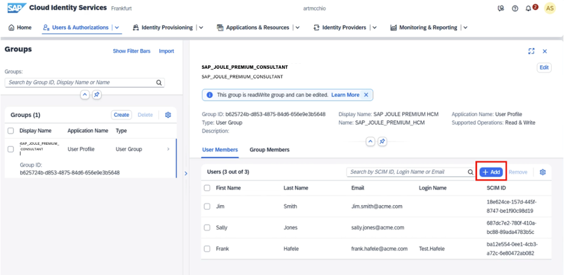
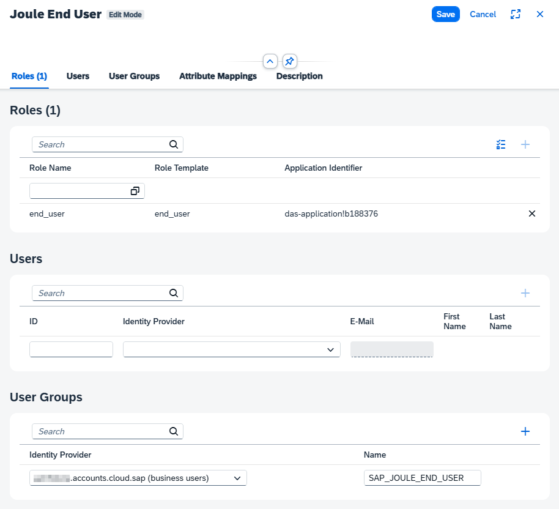
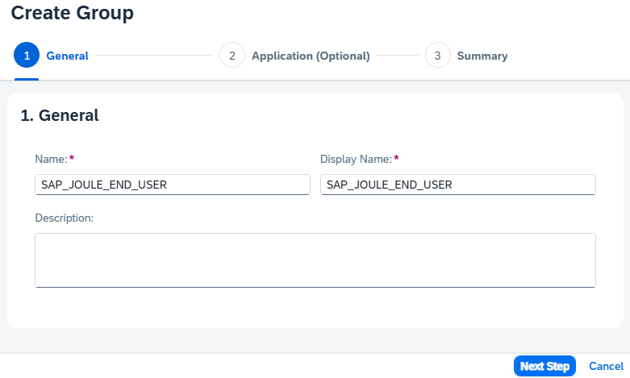

## Access SAP for Me and Request Activation
 
As part of the Joule for Consultants activation process, you will need to create an SAP Incident to create the License Group in the SAP Cloud Identity Services. This process will be automated soon by SAP to avoid the ticketing process; however, at this release, this step must be completed manually.
 
To log in to SAP for Me, you will need your SAP S-User ID with Cloud Administrator authorization.
 
To activate the package, please [create a ticket](https://me.sap.com/createIssue/0) using the support component CBC-AIX and include the following information:
<li>URL of the SAP Cloud Identity tenant
<li>PUPM package: SAP Joule for Consultants
 
**Note:**
Admins should anticipate some processing time while the CBC team completes the request.
 
## Assign users to access Joule for Consultants

**Note:**
Ensure the ticket has been processed from the previous step before completing this step.
 
<li>Once the ticket is processed, the <b>SAP_JOULE_PREMIUM_CONSULTANT</b> License Group will be created in your SAP Cloud Identity Services. You can log in to SAP Cloud Identity Services and navigate to <b>Users & Authorization</b> -> click on <b>Groups</b> to see the group shown below.</li>
 

  
 

 <b>Image 2</b> 

 
<li>Add the users who should have access to SAP Joule for Consultants
  <b>Note: </b>
You can add the users manually or use the <a href="https://help.sap.com/docs/cloud-identity-services/cloud-identity-services/import-csv-file-with-full-user-profile">Import CSV File</a> functionality.
  

 
 

 <b>Image 3</b> 

## Create a BTP role collection and add the required role

<li>Navigate to the SAP BTP subaccount you created earlier
<li>Expand <b>Security</b> → click on <b>Role Collections</b></li>
<li>Create a role collection for the end users with a name of your choice, e.g. Joule End User
<li>Add the role end_user from the application das-application!b188376 
<li>Add a user group with a name of your choice, e.g. SAP_JOULE_END_USER
<li>Click on <b>Save</b></li>
 

 
 

## Assign users to enable Joule
<li>Navigate to the SAP Cloud Identity Services
<li>Expand <b>Users & Authorizations</b> → click on <b>Groups</b></li>
<li>Click on <b>Create</b></li>
<li>Add Name and Display Name, here: SAP_JOULE_END_USER
<li>Follow the rest of the steps and click on <b>Finish</b></li>
<li>Add the same users you assigned earlier</li>
 <b>Note: </b>
Alternatively, you can add the users to the BTP role collection you created in the previous step.
  

 
 

