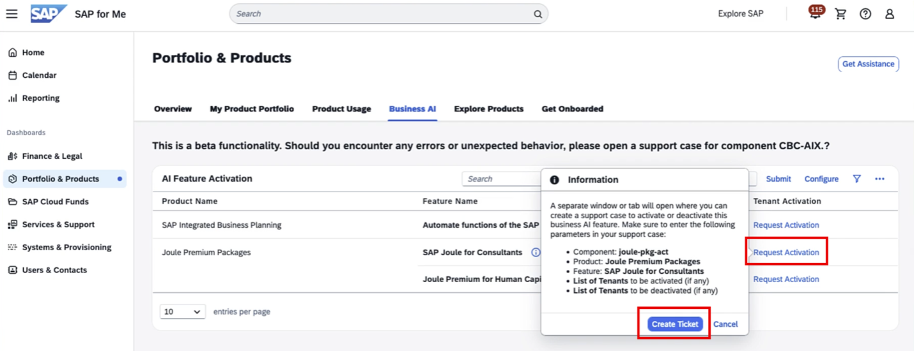

## Access SAP for Me and Request Activation
 
As part of the Joule for Consultants activation process, you will need to create an SAP Incident to create the User Groups in the SAP Cloud Identity Services. This process will be automated soon by SAP to avoid the ticketing process; however, at this release, you may have to do this manually.
 
While creating the SAP Incident, ensure you provide the SAP Cloud Identity service details along with the request.

**Note:**
Contact your designated SAP technical representative to support the activation of SAP Joule for Consultants, as this step must currently be completed manually.
 
To log in to SAP for Me, you will need your SAP S-User ID with Cloud Administrator authorization.
 
<li>Go to SAP for Me(https://me.sap.com/home) → Portfolio & Products → Business AI 
<li>Create a support ticket requesting activation of SAP Joule for Consultants  
 
**Note:**
Admins should anticipate some processing time while the CBC team completes the request.

 

 
 

 <b>Image 1</b> 

 
 
## Assigning users to access Joule for Consulting
 
<li>Once the ticket is processed, the <b>SAP_JOULE_PREMIUM_CONSULTANT</b> group will be created in your SAP Cloud Identity Services as shown below. You can log in to SAP Cloud Identity Services and navigate to <b>Users & Authorization</b> -> click on <b>Groups</b> to see the Group shown below. 
 

 
 

 <b>Image 2</b> 

 
<li>Add the users who should have access to SAP Joule for Consultants 
 

 
 

 <b>Image 3</b> 

 
