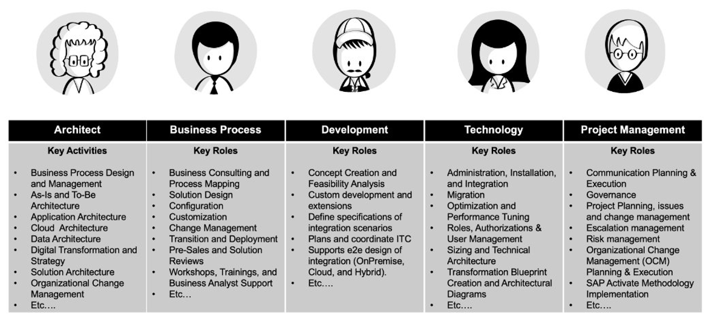

## Key Consultant Roles 

Following are some of the important personas in consulting roles. The image details the multiple activities/roles specific to each persona.

### Key Personas:

<li><b>Architect</li>

<li>Business Process</li>

<li>Development</li>

<li>Technology</li>

<li>Project Managaemnet</b>
 

 
 

 <b>Image 1</b> 

 

### Example for Business Process Persona

<li><b>Prompting for Business Process Consultants: </b>

Create prompts that help accelerate the analysis of a client’s business processes and generate recommendations based on relevant context. ​The key is to specify the exact business processes and clarify if you need standard or industry-specific variants. ​ 
 
<li><b>Sample Prompt 1:​ </b>

A manufacturing business has this business requirement: "A goods receipt for a Production Order should not occur if no goods have been issued against that Production Order, or the Production Order has not been fully or partially confirmed." Please conduct a fit-gap analysis on this requirement.​ 
 

<li><b>Sample Prompt 2:​ </b>

In the prepare phase of SAP Activate for RISE with SAP S/4HANA Cloud Private Edition, how do I conduct New Implementation Clean Core Quality Gate 1? 
