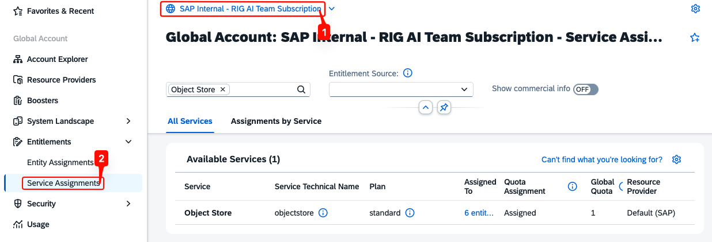
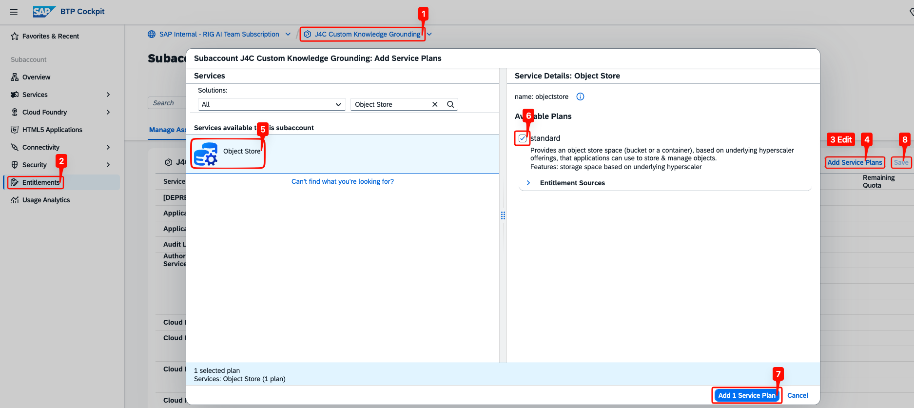
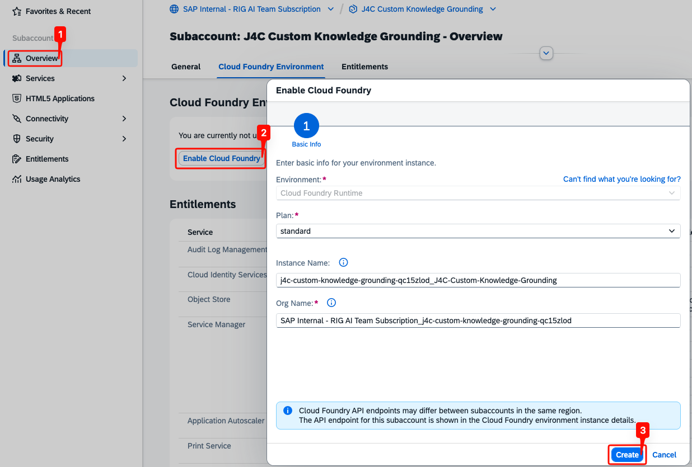
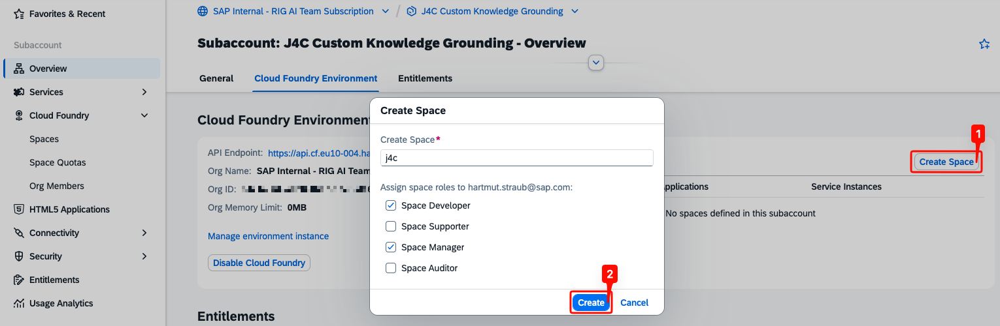
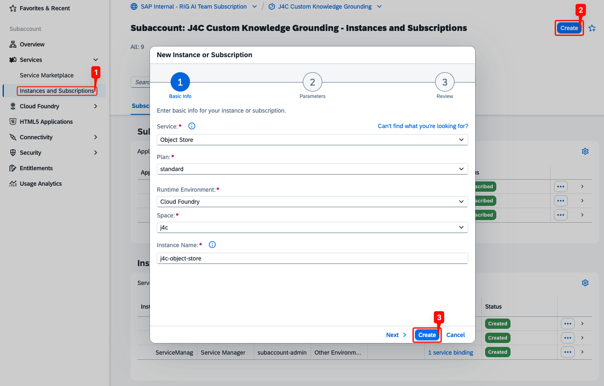
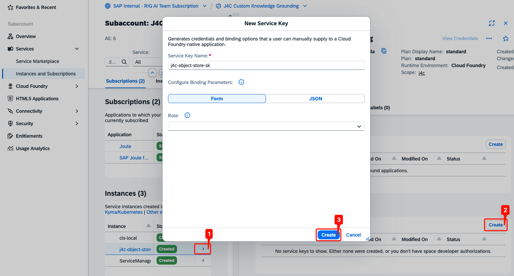
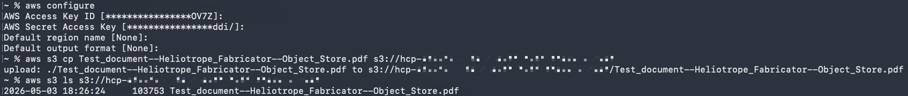

## Provision the Object Store Service

The Object Store provides S3-compatible storage where documents are uploaded for AI Core Document Grounding to index. Begin by verifying the entitlement at the global account and adding the service plan to your subaccount.

> **Note:** Create the Object Store in an AWS-based subaccount; the steps below assume an AWS backend.

- At the global account level, open **Entitlements** → **Service Assignments**.
- Search for `Object Store` and confirm the `standard` plan is assigned.

<p align="center">
  
</p>

- In your subaccount, open **Entitlements** and click **Edit**.
- Click **Add Service Plans**, select **Object Store**, check the `standard` plan, and click **Add 1 Service Plan**.
- Click **Save** to apply the changes.

<p align="center">
  
</p>

## Set Up the Cloud Foundry Environment

The Object Store instance runs in the Cloud Foundry runtime, so the subaccount must have Cloud Foundry enabled and a space available to host the instance.

- In your subaccount, open **Overview** and click **Enable Cloud Foundry**.
- Keep the **Cloud Foundry Runtime** environment and `standard` plan, adjust the **Instance Name** and **Org Name** if needed, then click **Create**.

<p align="center">
  
</p>

- Once Cloud Foundry is enabled, click **Create Space** on the **Cloud Foundry Environment** tab.
- Enter a space name (for example, `j4c`), assign yourself the **Space Developer** and **Space Manager** roles, and click **Create**.

<p align="center">
  
</p>

## Create the Object Store Instance

- In your subaccount, open **Instances and Subscriptions** and click **Create**.
- Fill in the required fields:
  - **Service:** `Object Store`
  - **Plan:** `standard`
  - **Runtime Environment:** `Cloud Foundry`
  - **Space:** the space you created (e.g., `j4c`)
  - **Instance Name:** e.g., `j4c-object-store`
- Click **Create** to provision the instance.

<p align="center">
  
</p>

- Click on the instance row to open its details panel on the right.
- Under **Service Keys**, click **Create**.
- Enter a name (e.g., `j4c-object-store-sk`) and click **Create**.

<p align="center">
  
</p>

> **Note:** The service key contains the `access_key_id`, `secret_access_key`, `region`, and `bucket` values needed to upload documents — you'll use them in the next step.

## Upload Documents with the AWS CLI

With the service key credentials, you can use the AWS CLI to upload documents to the Object Store bucket. AI Core Document Grounding will then index these documents for retrieval.

- Install the [AWS CLI](https://docs.aws.amazon.com/cli/latest/userguide/getting-started-install.html) if it isn't already on your machine.

> **Note:** If you prefer a graphical client, [Cyberduck](https://cyberduck.io/download/) supports S3 with the same service key credentials.

- Download the sample file [Test_document--Heliotrope_Fabricator.pdf](../assets/Test_document--Heliotrope_Fabricator.pdf?raw=true). You can append `--Object-Store` to the filename (e.g., `Test_document--Heliotrope_Fabricator--Object-Store.pdf`) to mark which storage backend the copy belongs to.
- Run `aws configure` and paste in the credentials when prompted — the default output format can be left blank.
- Upload the document to the bucket and list its contents to verify:

  ```
  aws s3 cp <file> s3://<bucket>
  aws s3 ls s3://<bucket>
  ```

<p align="center">
  
</p>

> **Note:** The bucket name in the service key is prefixed with `hcp-` followed by a unique identifier.