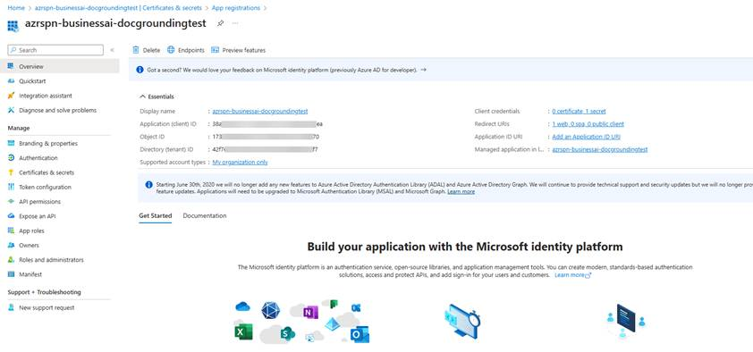
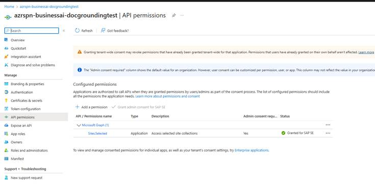
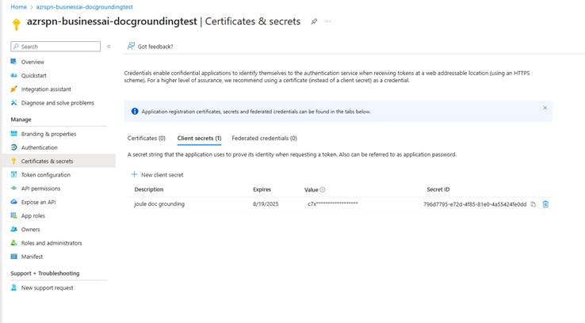

> **Disclaimer:** The steps below are a reference. Coordinate with your SharePoint administrator and validate against the documentation below.
>
> - [Set Up Data Repository Integration | SAP Help Portal](https://help.sap.com/docs/joule/integrating-joule-with-sap/prepare-sharepoint-integration#microsoft-sharepoint) — the official SAP guidance for this setup. It is written for SAP Joule for Business, but the data repository setup steps apply here as well.
> - [Understanding Resource Specific Consent for Microsoft Graph and SharePoint Online | Microsoft Learn](https://learn.microsoft.com/en-us/sharepoint/dev/sp-add-ins-modernize/understanding-rsc-for-msgraph-and-sharepoint-online) — Microsoft's reference on the Resource Specific Consent permission model that the steps below rely on.

## Register the Microsoft Entra Application

AI Core Document Grounding connects to a SharePoint site through a Microsoft Entra application using the OAuth2ClientCredentials flow. Start by registering the application in Microsoft Entra.

- Sign in to [entra.microsoft.com](https://entra.microsoft.com/) with an account that can register applications.
- Open **App registrations** and click **New registration**.
- Enter a name (e.g., `j4c-sharepoint-grounding`), keep the default settings, and click **Register**.
- From the **Overview** tab, copy the **Application (client) ID** and the **Directory (tenant) ID** — you'll need both for the next phase.

<p align="center">
  
</p>

## Grant the Sites.Selected Permission

The application needs the `Sites.Selected` Microsoft Graph permission. On its own, this permission grants access to **zero** SharePoint sites — it only makes the application eligible to be granted access to specific sites in a later step. This is intentional and enforces least-privilege.

- In the registered application, open **API permissions** and click **Add a permission**.
- Select **Microsoft Graph** → **Application permissions**.
- Search for `Sites.Selected`, check it, and click **Add permissions**.

> **Note:** Use the `Sites.Selected` permission listed under **Microsoft Graph** — not the one with the same name listed under **SharePoint**. They are different resources, and AI Core Document Grounding consumes Microsoft Graph.

- Click **Grant admin consent for [Your Org]**. A tenant Global Administrator or Privileged Role Administrator must perform this step.
- Verify that the **Status** column for `Sites.Selected` shows a green check mark.

<p align="center">
  
</p>

## Create a Client Secret

The OAuth2ClientCredentials flow authenticates with a client secret instead of a user sign-in.

- In the registered application, open **Certificates & secrets** and click **New client secret**.
- Enter a description, pick an expiry, and click **Add**.
- Copy the secret **Value** immediately — it is only displayed once. Store it together with the tenant ID and application ID.

<p align="center">
  
</p>

## Link the Application to the SharePoint Site

After admin consent, the application still cannot read any site. You now have to bind it explicitly to the SharePoint site that hosts your grounding documents. The easiest path is the [PnP.PowerShell](https://pnp.github.io/powershell/) module.

> **Note:** The account running the grant command must have the **Site Collection Administrator** role on the target SharePoint site (a tenant Global Administrator works as well). Owners of the Microsoft 365 Group or Teams team that backs a SharePoint site automatically have this role. If you don't have it, ask a SharePoint administrator to grant it temporarily. `Sites.Selected` on its own is not enough to perform the grant.

- Install **PowerShell 7.2 or later** — see [Install PowerShell on Windows, Linux, and macOS | Microsoft Learn](https://learn.microsoft.com/en-us/powershell/scripting/install/installing-powershell).
- Install the PnP.PowerShell module — see [Installing PnP PowerShell | PnP PowerShell](https://pnp.github.io/powershell/articles/installation.html).
- On first use in the tenant, register PnP's own Entra application by running `Register-PnPEntraIDApp` and following the prompts. The resulting **Client ID** is the helper-app ID used to sign in with `Connect-PnPOnline` — it is **not** the ID of the application you registered in the previous sections.

> **Note:** `Register-PnPEntraIDApp` is a one-time setup per tenant. Skip it if PnP.PowerShell has already been initialized.

- Sign in to the target SharePoint site and grant the Sites.Selected application read access:

  ```
  Connect-PnPOnline -Url "<site-url>" -Interactive -ClientId "<pnp-helper-app-client-id>"
  Grant-PnPAzureADAppSitePermission `
      -AppId "<sites-selected-app-client-id>" `
      -DisplayName "<display-name>" `
      -Site "<site-url>" `
      -Permissions Read
  ```

  Replace `<site-url>` with the full SharePoint site URL (e.g., `https://contoso.sharepoint.com/sites/KnowledgeBase`), `<pnp-helper-app-client-id>` with the helper-app client ID from `Register-PnPEntraIDApp`, and `<sites-selected-app-client-id>` with the **Application (client) ID** of the application you registered for AI Core Document Grounding.

- A successful response prints the permission ID, the granted role (`read`), and the application identity.

> **Note:** `Read` is sufficient for AI Core Document Grounding. The same grant can also be issued through a Microsoft Graph `POST /sites/{site-id}/permissions` call — see [Understanding Resource Specific Consent for Microsoft Graph and SharePoint Online | Microsoft Learn](https://learn.microsoft.com/en-us/sharepoint/dev/sp-add-ins-modernize/understanding-rsc-for-msgraph-and-sharepoint-online) for the REST equivalent.

## Upload Documents to the SharePoint Site

- Open the SharePoint site in a browser and upload your documents to a document library.
- Download the sample file [Test_document--Heliotrope_Fabricator.pdf](../assets/Test_document--Heliotrope_Fabricator.pdf?raw=true). You can append `--SharePoint` to the filename (e.g., `Test_document--Heliotrope_Fabricator--SharePoint.pdf`) to mark which storage backend the copy belongs to.

The Bruno and AI Launchpad cards in the next phase consume the following SharePoint credentials, which you have now collected:

- `MS_Entra_Tenant_ID` — **Directory (tenant) ID** from the Overview tab.
- `MS_Entra_Application_ID` — **Application (client) ID** from the Overview tab.
- `MS_Entra_Application_Client_Secret` — the secret value copied from **Certificates & secrets**.
- `SharePoint_URL` — the full URL of the SharePoint site you granted permission on.