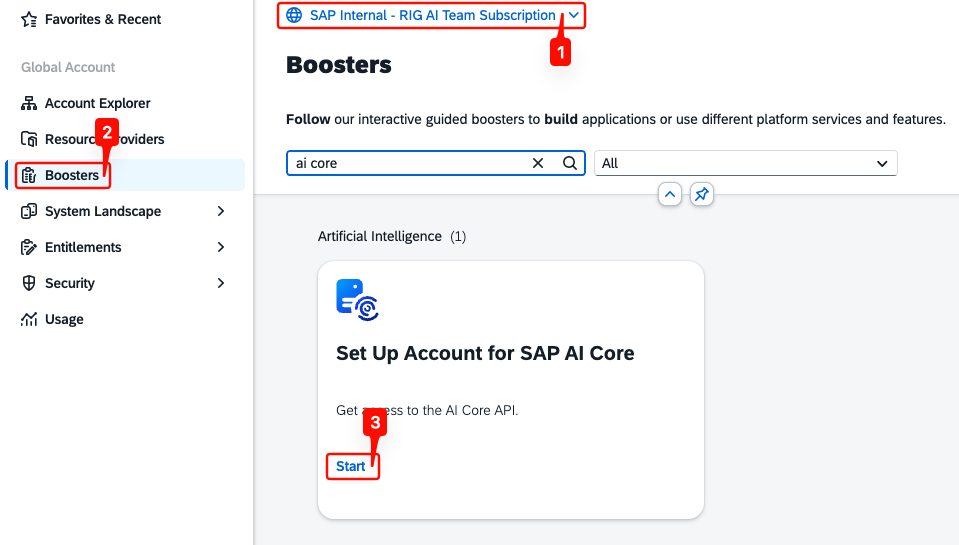
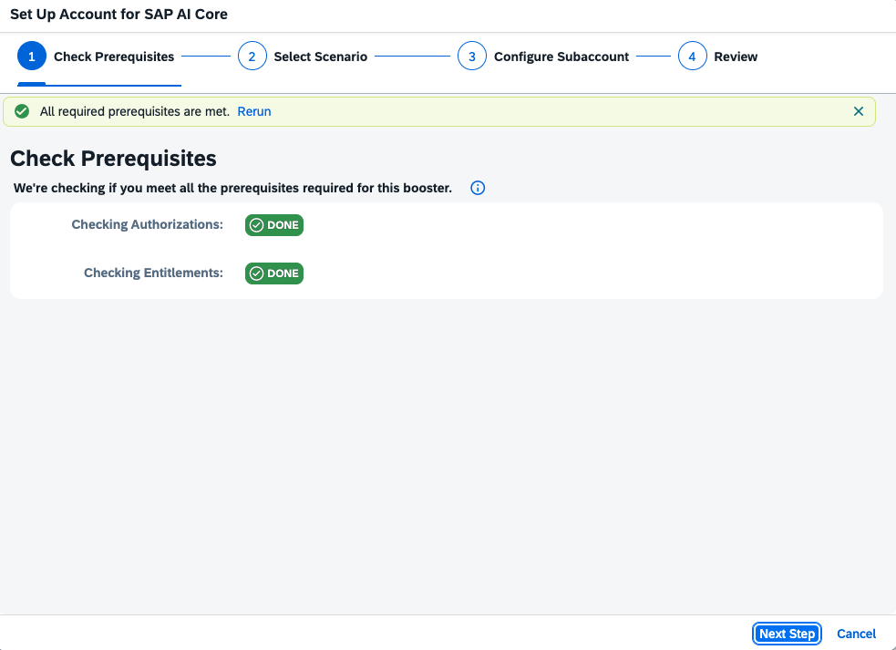
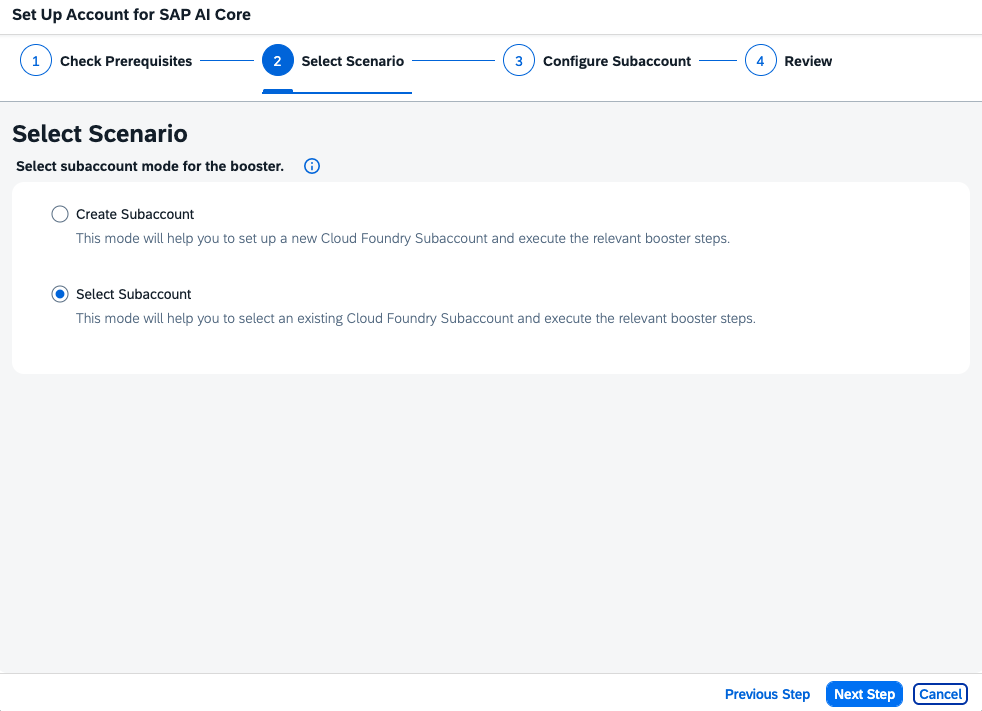
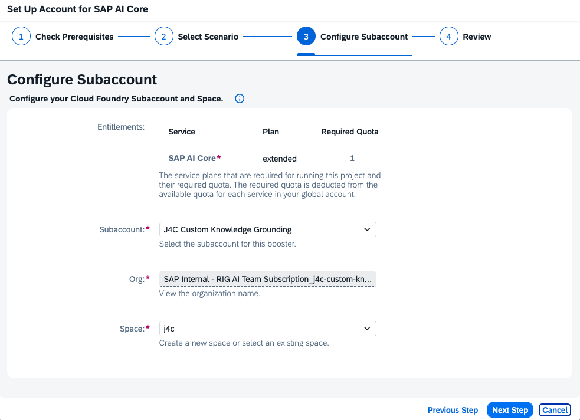
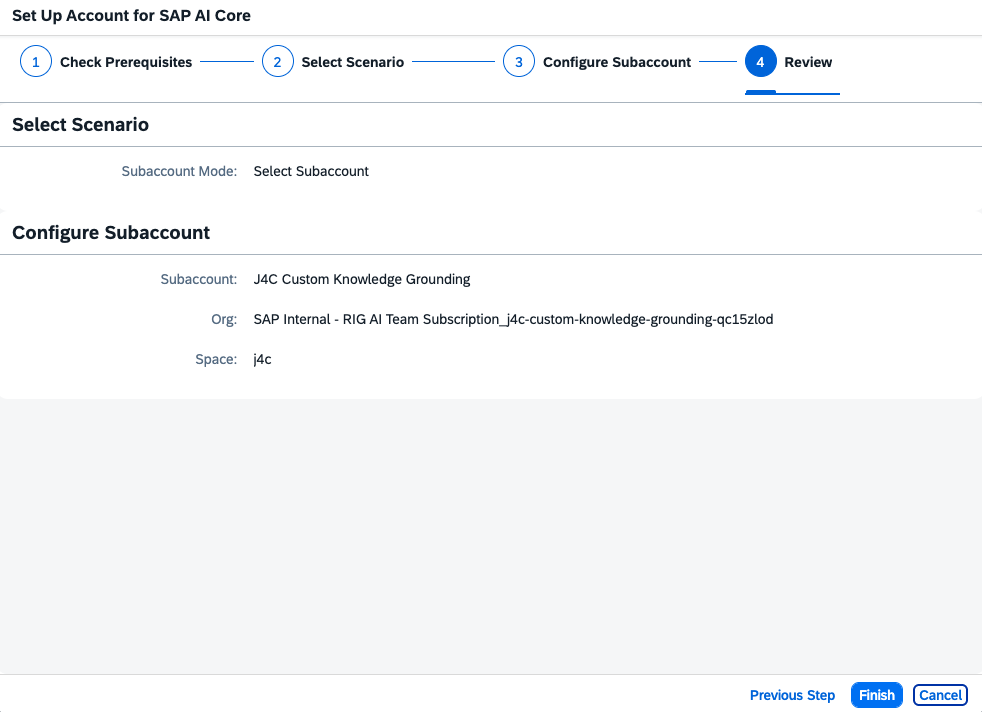
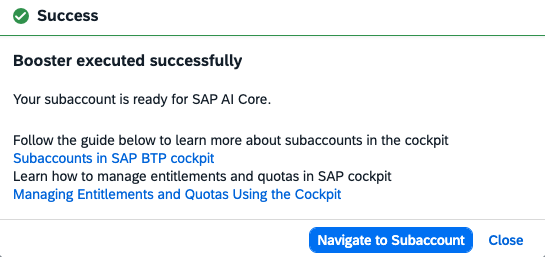
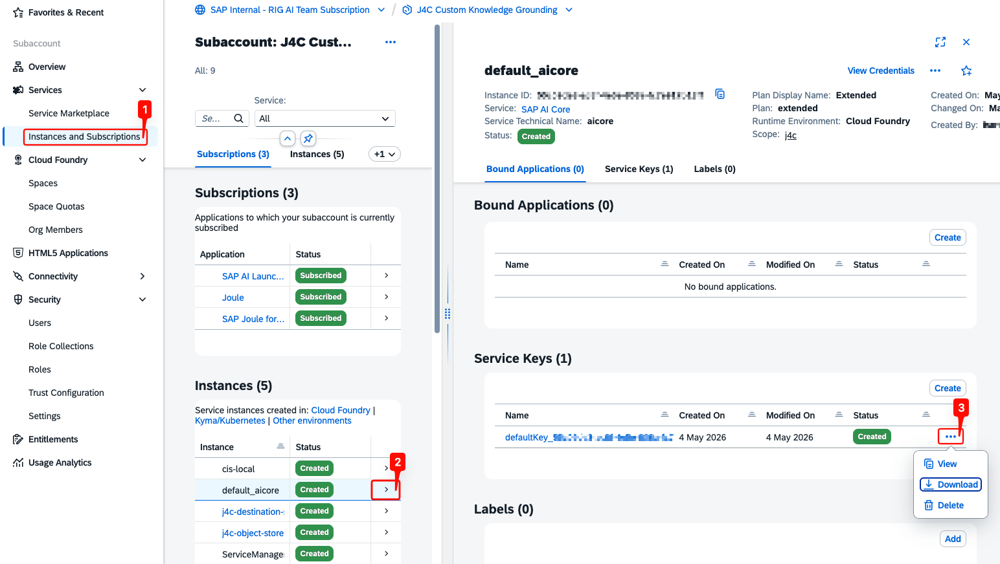

## Launch the AI Core Booster

We shall now execute the AI Core Booster to provision SAP AI Core in your subaccount. The booster automates the entitlement assignment, instance creation, and service key generation for the `extended` plan required by AI Core Document Grounding.

- In your global account, click on **Boosters**, look for **Set Up Account for SAP AI Core**, and then click on **Start** to launch the booster.

  

- The booster checks that your user has the required authorizations and that the global account holds the necessary entitlements. Wait for both checks to show **DONE**, then click on **Next Step**.

  

- Select **Select Subaccount** to reuse an existing Cloud Foundry subaccount and click on **Next Step**.

> **Note:** Choose **Create Subaccount** instead if you do not already have a target subaccount.

  

- Select your target **Subaccount** and **Space**. The **Org** is filled in automatically. Click on **Next Step**.

  

- Validate your selections and click on **Finish**.

  

- The booster assigns the `extended` plan, creates the `default_aicore` instance, and generates a default service key. Once completed, a **Success** message appears. Click on **Navigate to Subaccount**.

  

## Download the AI Core Service Key

The booster creates the SAP AI Core instance and a service key automatically. Download the service key — you'll need its credentials when configuring the Destination Service later.

- In the subaccount, open **Instances and Subscriptions** and click the `default_aicore` row to open its details panel on the right.
- Under **Service Keys**, click the **...** menu next to the default key and select **Download**.

  

