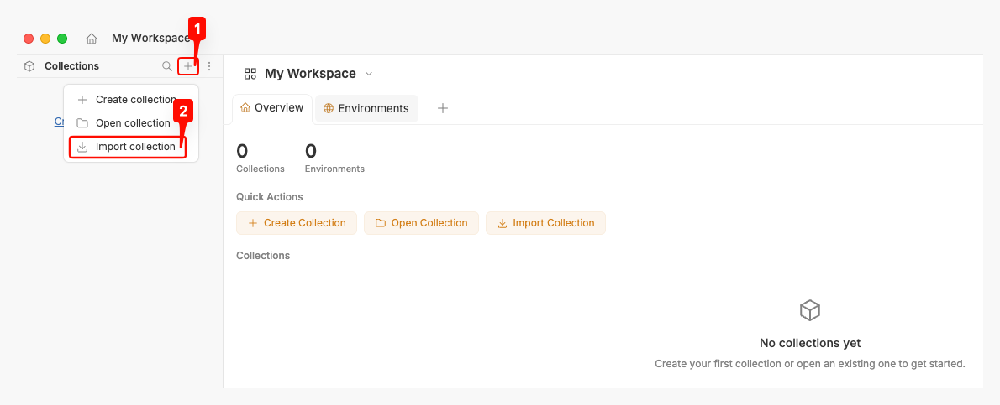
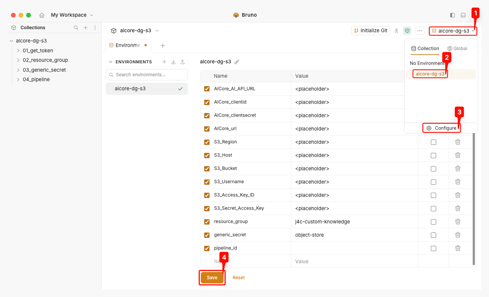
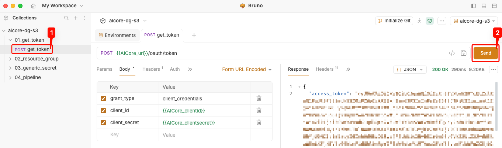
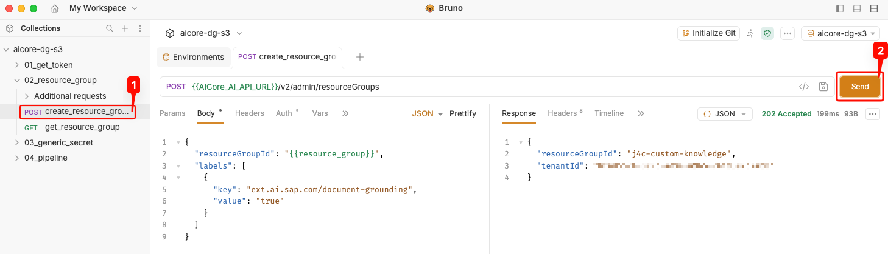
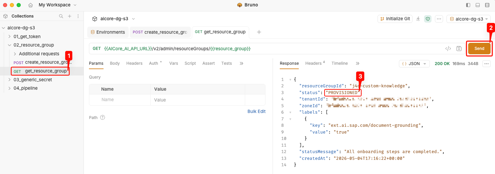
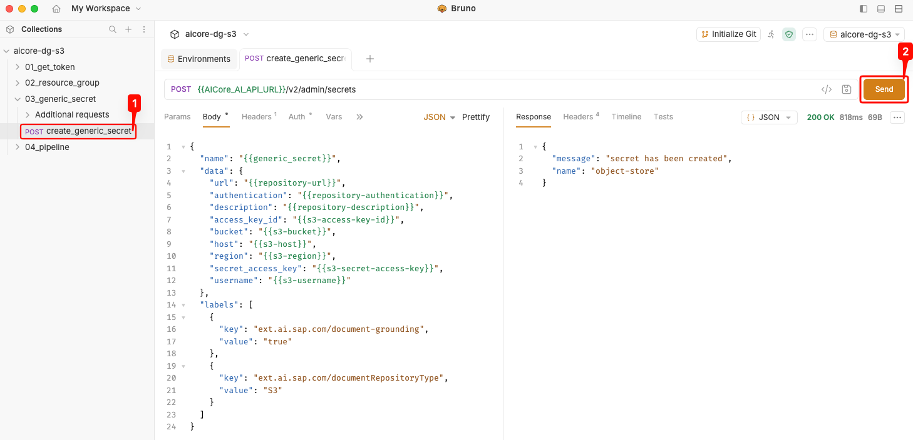
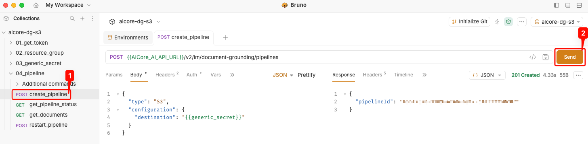
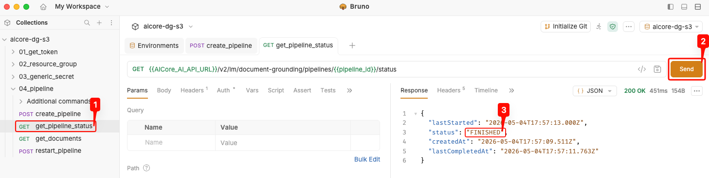
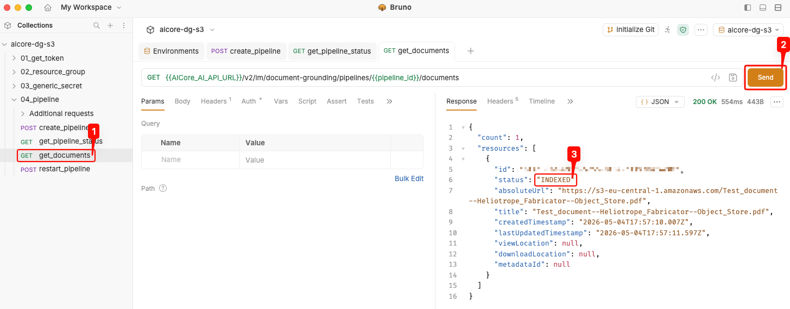

## Install Bruno and Import the Collection

Bruno is an open-source API client for exploring and testing APIs. Use it to create the resource group, register the Object Store credentials as a generic secret, and provision the document grounding pipeline with the AI Core Document Grounding REST API.

- Download and install the latest version of [Bruno](https://www.usebruno.com/downloads).

> **Note:** The templates collections are stored as `.yml` files. Older Bruno versions do not support the YAML import format, so make sure to install the latest release.

- Open Bruno and click the **+** icon next to **Collections** in the left navigation, then select **Import collection**.
- Pick the `aicore-dg-s3.yml` collection file when prompted.

<p align="center">
  
</p>

## Configure the Environment

The collection ships with an `aicore-dg-s3` environment containing placeholders for the AI Core and Object Store credentials. Fill them in before running any request.

- With the `aicore-dg-s3` collection open, click the environment selector in the top-right corner and select `aicore-dg-s3`, then click **Configure**.
- Replace each `<placeholder>` with the corresponding value:
  - `AICore_AI_API_URL`, `AICore_clientid`, `AICore_clientsecret`, `AICore_url` — from the AI Core service key.
  - `S3_Region`, `S3_Host`, `S3_Bucket`, `S3_Username`, `S3_Access_Key_ID`, `S3_Secret_Access_Key` — from the Object Store service key.
- Leave `resource_group` and `generic_secret` at their defaults (or adjust to your naming convention). For the Object Store setup, you can use `object-store` as the name for the generic secret. Leave `pipeline_id` empty for now.
- Click **Save**.

<p align="center">
  
</p>

## Fetch an Access Token

Every request to the AI Core API requires an OAuth2 bearer token. The collection retrieves it once and reuses it across the other requests via a collection-level script.

- Open the `01_get_token` folder and select the `get_token` request.
- Click **Send**. A `200 OK` response with an `access_token` confirms the credentials are correct.

<p align="center">
  
</p>

> **Note:** Occasionally, the token expires. Resend the request above to retrieve a new token.

## Create the Resource Group

The resource group isolates document grounding artifacts inside the AI Core tenant. It must carry the `ext.ai.sap.com/document-grounding: true` label so that AI Core enables the grounding capability for it.

- Open the `02_resource_group` folder and select `create_resource_group`.
- Click **Send**. A `202 Accepted` response with the `resourceGroupId` confirms the request was queued.

<p align="center">
  
</p>

- Select `get_resource_group` and click **Send** to poll the provisioning status. Initially the `status` field reads `PROVISIONING`.
- Wait a few minutes and resend the request until `status` reads `PROVISIONED`.

<p align="center">
  
</p>

> **Note:** Do not continue to the next step until the resource group is fully `PROVISIONED` — the generic secret cannot be created against a resource group that is still onboarding.

## Create the Generic Secret

The generic secret stores the S3 credentials inside AI Core so that the document grounding pipeline can read from the Object Store bucket. The `ext.ai.sap.com/documentRepositoryType: S3` label tells AI Core how to interpret the credentials.

- Open the `03_generic_secret` folder and select `create_generic_secret`.
- Click **Send**. A `200 OK` response with `"message": "secret has been created"` confirms the secret is registered.

<p align="center">
  
</p>

## Create the Pipeline

The pipeline binds the generic secret to a document grounding job. Once created, AI Core ingests, chunks, embeds, and indexes every document in the bucket.

> **Note:** The full pipeline API is documented in [Create a Document Grounding Pipeline Using the Pipelines API | SAP Help Portal](https://help.sap.com/docs/sap-ai-core/generative-ai/create-document-grounding-pipeline-using-pipelines-api-d32b1465461149749b00129c02e05142). There you can find information on how to restrict processing to specific folders, include metadata, and configure the update schedule.

A request body that limits indexing to a folder inside the bucket looks like this (S3 only — for the other data repositories, see the SAP Help link above):

```json
{
  "type": "S3",
  "configuration": {
    "destination": "{{generic_secret}}",
    "s3": {
      "includePaths": [
        "/j4c-custom-knowledge"
      ]
    }
  }
}
```

To run the example above, replace the body in the `create_pipeline` request with the snippet.

- Open the `04_pipeline` folder and select `create_pipeline`.
- Click **Send**. A `201 Created` response returns the `pipelineId`.

<p align="center">
  
</p>

- Note down the returned `pipelineId` for later use.
- Select `get_pipeline_status` and click **Send** to monitor progress. The pipeline takes a few minutes to finish — longer if more documents are in the bucket. Resend until `status` reads `FINISHED`.

<p align="center">
  
</p>

- Select `get_documents` and click **Send** to list the documents picked up by the pipeline. Each document should report `"status": "INDEXED"`.

<p align="center">
  
</p>

> **Note:** If you upload new documents to the Object Store bucket after the pipeline has finished, run the `restart_pipeline` request to trigger a fresh sync. The pipeline picks up additions and changes, then transitions back to `FINISHED` once the new documents are indexed.