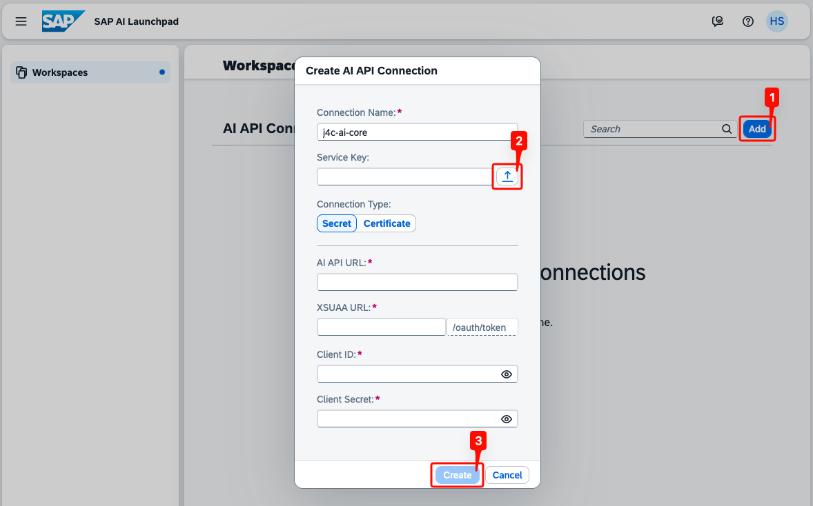
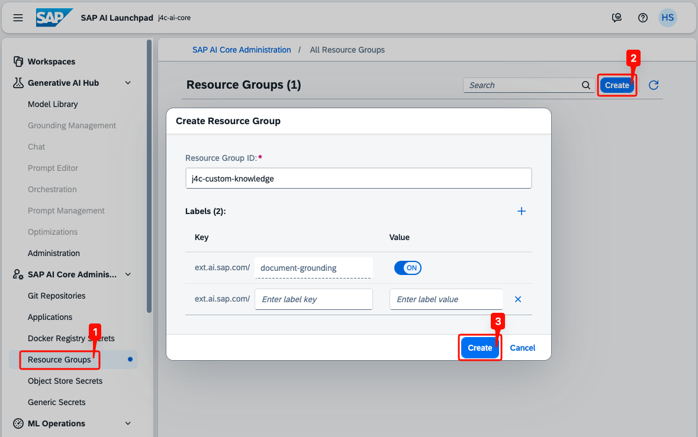
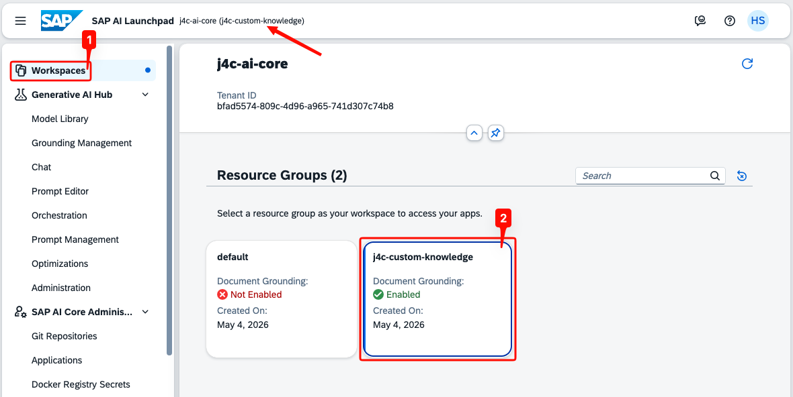
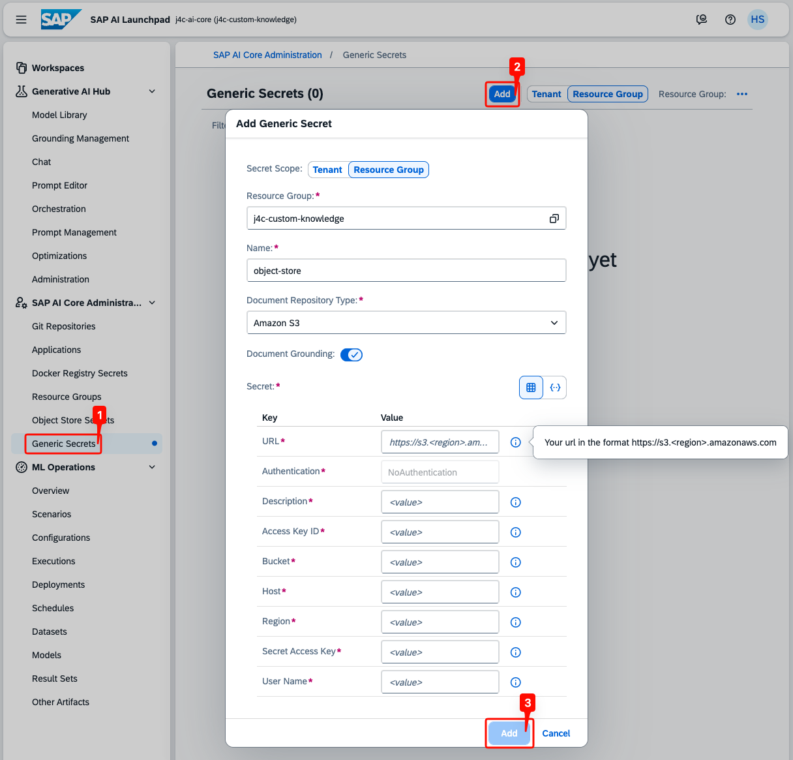
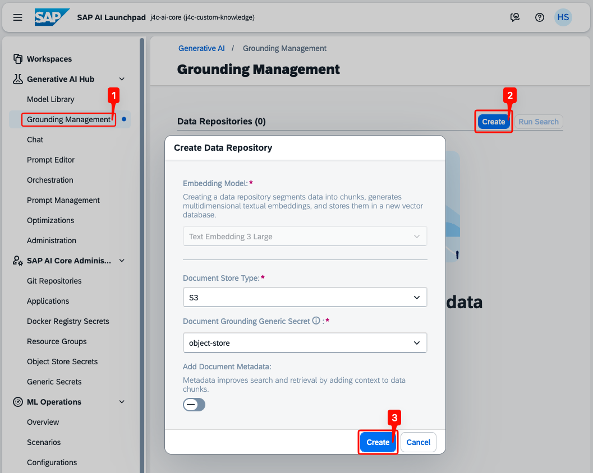
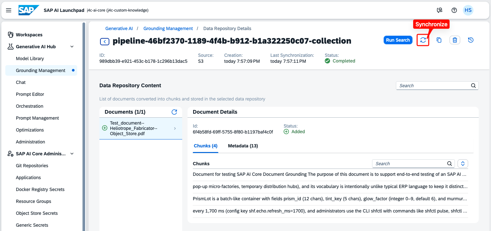

## Provision SAP AI Launchpad

SAP AI Launchpad is a web-based UI that lets you set up AI Core Document Grounding through a graphical interface — without writing API requests. Using it is **optional**: the same setup can be completed with Bruno (see the previous card). Choose AI Launchpad if you prefer a UI-driven workflow.

SAP AI Launchpad is a paid subscription service. The `standard` plan is required. Review the pricing on [SAP Discovery Center Service - SAP AI Launchpad](https://discovery-center.cloud.sap/serviceCatalog/sap-ai-launchpad?region=all&tab=service_plan) before subscribing.

SAP AI Launchpad can be set up using the **Set Up Account for SAP AI Launchpad** booster. Follow steps similar to the AI Core booster execution described in one of the previous cards.

Access to SAP AI Launchpad and its administrative features requires specific role collections to be assigned to your user. For more information, see [SAP AI Launchpad > Roles and Authorizations | SAP Help Portal](https://help.sap.com/docs/ai-launchpad/sap-ai-launchpad/security#loio4ef8499d7a4945ec854e3b4590830bcc).

## Create the AI API Connection

Before SAP AI Launchpad can manage the AI Core tenant, register the AI Core service key as an AI API connection.

- In SAP AI Launchpad, open **Workspaces** in the left navigation and click **Add** in the top-right corner.
- Enter a **Connection Name** (e.g., `j4c-ai-core`).
- Next to **Service Key**, click the upload icon and select the AI Core service key file you downloaded earlier. The **AI API URL**, **XSUAA URL**, **Client ID**, and **Client Secret** fields are populated automatically.
- Click **Create**.

  

## Create the Resource Group

The resource group isolates document grounding artifacts inside the AI Core tenant.

- Go to **SAP AI Core Administration** > **Resource Groups** and click **Create** in the top-right corner.
- Enter a **Resource Group ID** (e.g., `j4c-custom-knowledge`).
- Ensure that the `ext.ai.sap.com/document-grounding` label is enabled.
- Click **Create**.

  

> **Note:** The resource group takes a few minutes to transition from `PROVISIONING` to `PROVISIONED`. Do not continue to the next step until the resource group is fully provisioned — the generic secret cannot be created against a resource group that is still onboarding.

- In the left navigation, click **Workspaces**.
- Under **Resource Groups**, click the card for the resource group you created (e.g., `j4c-custom-knowledge`). The card should show **Document Grounding: Enabled**.
- The header at the top of the launchpad now displays the active workspace as `<connection> (<resource-group>)` — for example, `j4c-ai-core (j4c-custom-knowledge)`.

  

## Create the Generic Secret

The generic secret stores the S3 credentials inside AI Core so that the document grounding pipeline can read from the Object Store bucket.

- Go to **SAP AI Core Administration** > **Generic Secrets** and click **Add**.
- Select **Amazon S3** as the **Document Repository Type** and ensure that **Document Grounding** is toggled on.
- Fill in the **Secret** key/value pairs using the Object Store service key.
- Click **Add**.

  

## Create the Document Grounding Pipeline

Create a pipeline so AI Core ingests, chunks, embeds, and indexes every document in the data repository.

- Go to **Generative AI Hub** > **Grounding Management** and click **Create** in the top-right corner.
- Choose `S3` as the **Document Store Type**.
- Choose the generic secret you created in the previous step (e.g., `object-store`)
- Click **Create**.

  

The pipeline will now start ingesting the documents from the data repository. This process will take a few minutes. Open the pipeline to confirm that it finished successfully and that the test document was indexed.

- On the **Grounding Management** page, click the new pipeline (named `pipeline-<id>-collection`) to open its details.
- Wait until the **Status** in the header switches to **Completed**.
- Under **Data Repository Content**, the **Documents** list shows every indexed file.

  

> **Note:** If you upload new documents to the Object Store bucket after the pipeline has finished, you can click the **Synchronize** icon in the top-right corner of the pipeline page to trigger a resync.