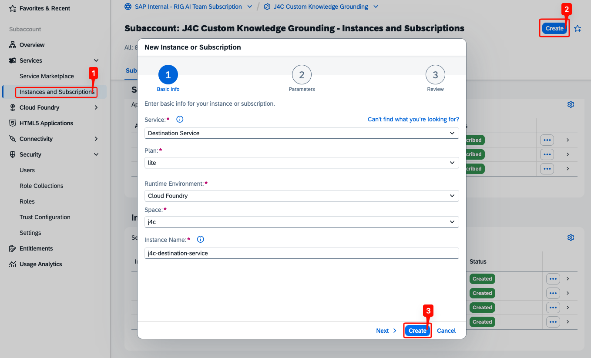
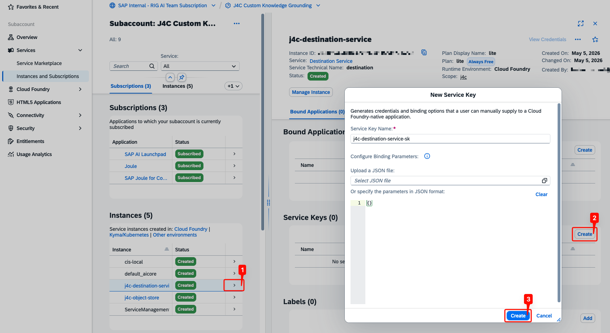
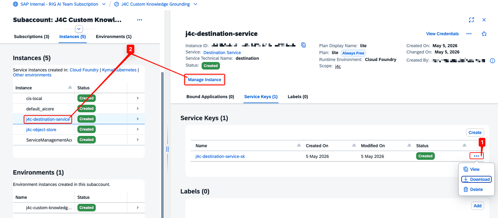
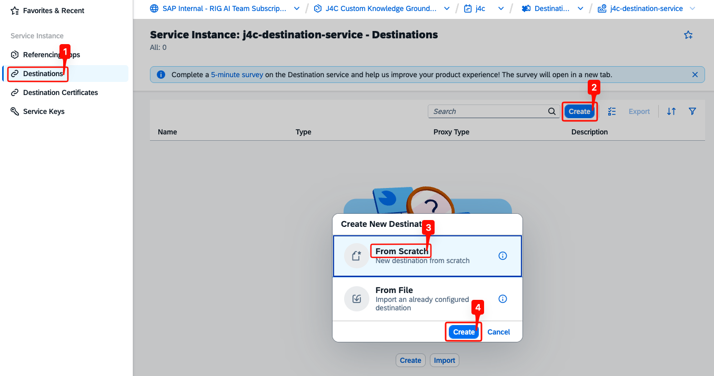
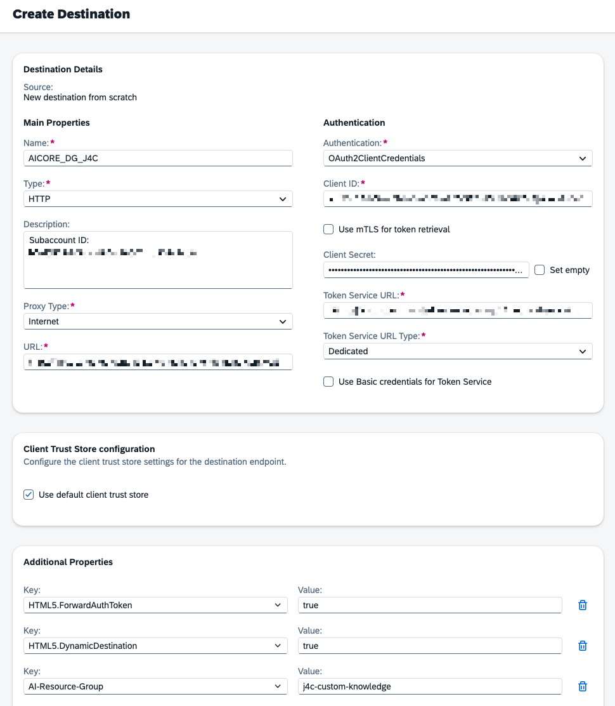
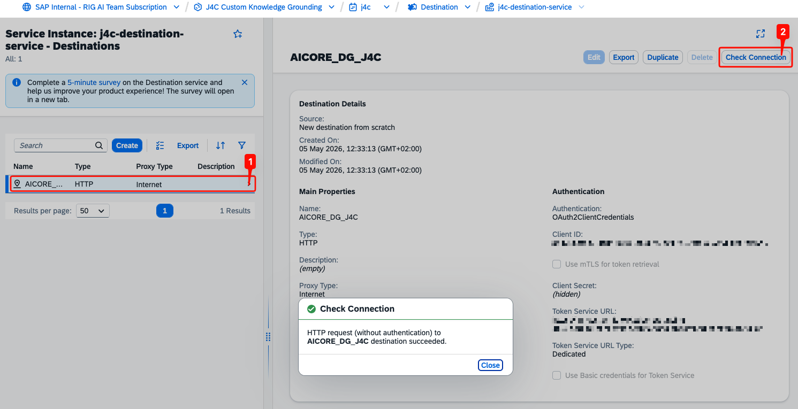

## Configure the Destination Service

A Destination Service connects AI Core Document Grounding to SAP Joule for Consultants. Configure it as follows.

> **Note:** The Destination Service instance runs in the Cloud Foundry runtime, so the subaccount needs Cloud Foundry enabled with a space available — see **Set Up the Cloud Foundry Environment** in the **Object Store** card. If you set up Object Store earlier, this is already in place.

- In your subaccount, open **Instances and Subscriptions** and click **Create**.
- Select **Destination Service** with the `lite` plan, fill in the required fields, and click **Create** to provision the instance.

  

- Click the instance row (not the blue instance name) to open its details panel on the right.
- Under **Service Keys**, click **Create**.
- Enter a name and click **Create**.

  

- Download the service key — you'll need it later to connect SAP Joule for Consultants.
- Then open the instance to configure its destinations — either click the blue instance name in the **Instances** list, or click **Manage Instance** at the top of the details panel on the right. Both navigate to the same instance page.

> **Note:** Destinations can be configured either at the instance level or at the subaccount level. This setup uses the instance level. Do not configure the destination at the subaccount level.

> **Note:** Editing or deleting destinations requires the BTP role collection `Destination Administrator`.

  

## Create the Destination

- In the Destination Service instance, open the **Destinations** section and click **Create**.
- Select **From Scratch** and click **Create**.

  

- Open the service key of the AI Core instance — you'll copy several values from it.
- Set **Authentication** to **OAuth2ClientCredentials**, then paste in the **Client ID** and **Client Secret** from the AI Core service key.
- Fill in the following fields, replacing the placeholders with the values from the service key:
  - **Token Service URL:** `<url>/oauth/token`
  - **URL:** `<AI_API_URL>/v2/lm/document-grounding`
- Add the following **Additional Properties**:
  - `HTML5.ForwardAuthToken`: `true`
  - `HTML5.DynamicDestination`: `true`
  - `AI-Resource-Group`: name of your resource group

> **Note:** `AI-Resource-Group` is not available as a predefined value in the value help — enter the key name manually.

> **Note:** Optionally, add the subaccount ID to the destination **Description**. This makes it easier to identify the source later, for example when several sources are listed in the SAP Joule for Consultants Console.

  

- Check the connection to verify the destination is configured correctly.

  

