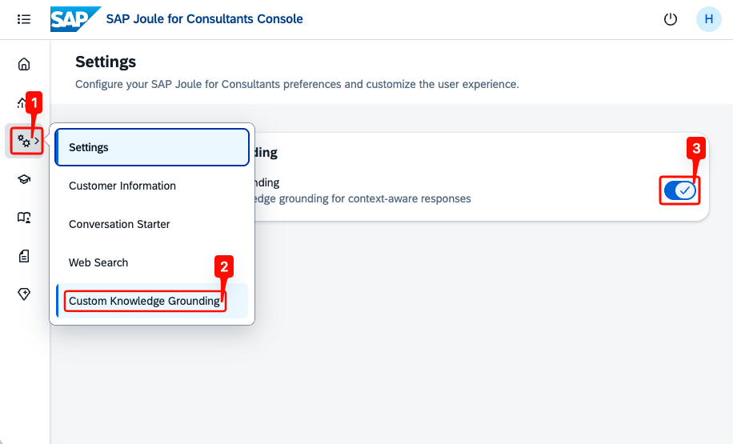
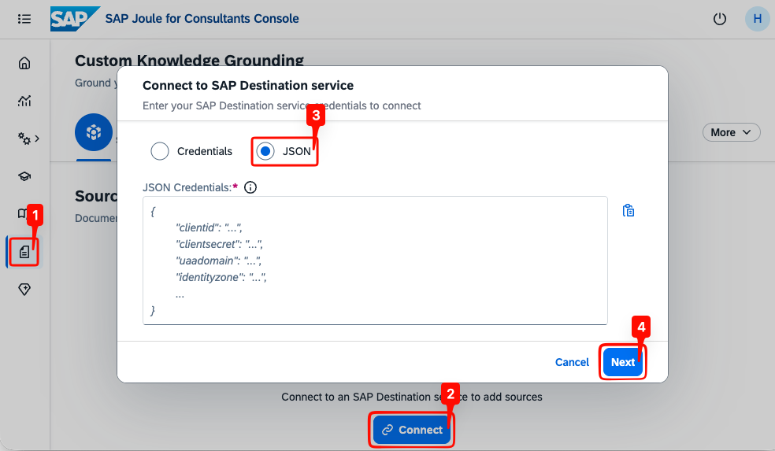
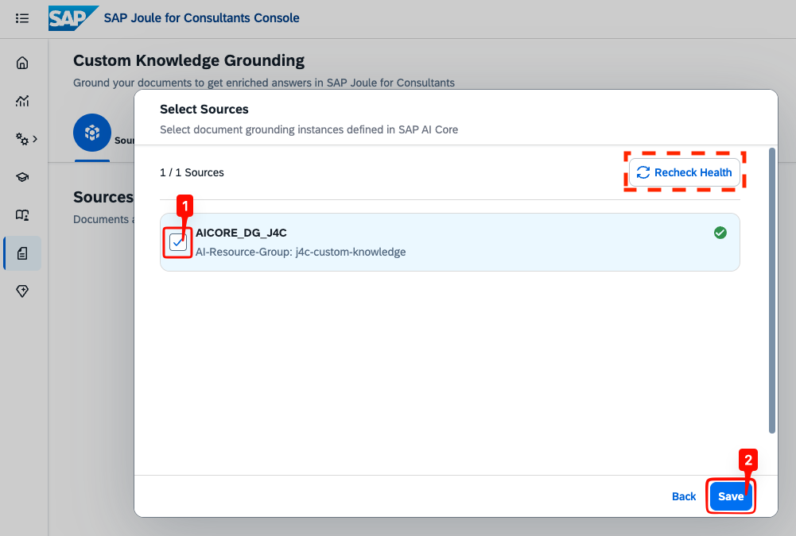
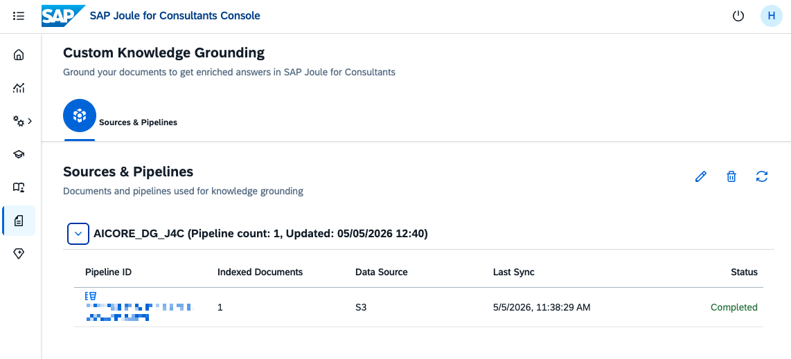

## Enable Custom Knowledge Grounding
With the Destination Service configured, enable Custom Knowledge Grounding in the SAP Joule for Consultants Console and connect to AI Core Document Grounding through the destination.

> **Note:** You need to have admin access to the SAP Joule for Consultants Console, see [SAP Joule for Consultants Console](https://help.sap.com/docs/joule/joule-tools-12ace5a963e147ffa6f5aab8a4cf15f4/sap-joule-for-consultants-console).

- In the SAP Joule for Consultants Console, open the **Settings** menu from the left navigation and select **Custom Knowledge Grounding**.
- Toggle the switch to enable the feature.

  

## Connect to the SAP Destination Service

- In the left navigation, open the **Custom Knowledge Grounding** page.
- Click **Connect** to open the connection dialog.
- Select **JSON** as the credentials type. Alternatively, choose **Credentials** to enter each field individually.
- Paste the contents of the Destination Service service key downloaded earlier into the **JSON Credentials** field.
- Click **Next**.

> **Note:** Use the service key from the Destination Service instance — not the AI Core service key.

  

Once connected, the console retrieves the document grounding instances available through the destination.

- In the **Select Sources** dialog, check the instance(s) you want to use. Only sources with a green checkmark can be selected.
- Use **Recheck Health** if you recently updated a source and want to refresh its validation status.
- Click **Save**.

  

## Manage Sources & Pipelines

The selected sources appear under **Sources & Pipelines**. Expand a source to inspect its pipelines.

  

The pipeline table shows the following columns:

| **Column** | **Description** |
| --- | --- |
| Pipeline ID | Unique identifier — click the link to open detailed processing logs |
| Indexed Documents | Total number of documents submitted for processing |
| Data Source | Type of connected data source (e.g., S3) |
| Last Sync | Timestamp of the most recent sync run |
| Status | `Completed`, `Completed With Errors`, or `Processing` |

The three action icons in the top-right corner of the page are:

- **Pencil** — configure document grounding instances (connect or disconnect sources).
- **Bin** — delete the selected source.
- **Refresh** — re-read the pipeline metadata from AI Core Document Grounding and update what the console shows (status, last sync timestamp, document count).

> **Note:** Once the pipeline **Status** shows **Completed**, SAP Joule for Consultants references the grounded knowledge starting with the next new conversation.

> **Note:** If the status shows **Completed With Errors**, some documents were not ingested successfully by the document grounding pipeline. Only successfully processed documents are used in answers. For details, check the documents in Bruno or in the SAP AI Launchpad. For support, please open a ticket under component `CA-ML-RAGE` — troubleshooting the AI Core Document Grounding pipeline is out of scope for SAP Joule for Consultants.

> **Note:** The **Refresh** icon in the console only refreshes the **view** — it does **not** re-index your data repository. Whether newly uploaded documents become available to SAP Joule for Consultants is decided by re-running the AI Core Document Grounding pipeline itself: the `restart_pipeline` request in the Bruno card, or the **Synchronize** icon on the pipeline page in SAP AI Launchpad. Until that pipeline run reaches `FINISHED` / `Completed`, the new documents are not indexed.

## Troubleshooting

**Destination shows "not a valid DGS destination":** The destination is missing one or more of the required additional properties (`HTML5.DynamicDestination`, `HTML5.ForwardAuthToken`, `AI-Resource-Group`), or its URL does not point to a valid document grounding endpoint. Edit the destination in the BTP Cockpit, add the missing properties, save it, then click **Recheck Health** in the console.

**Source not appearing in the Select Sources dialog:** Verify that the Destination Service instance whose service key you connected is the same instance where you created the destination. The console only discovers destinations from its own bound Destination Service instance.

**No pipelines appear after saving:** Allow a few minutes for the pipeline to initialize and the first sync to complete. Use the **Refresh** icon on the **Sources & Pipelines** page to update the view.