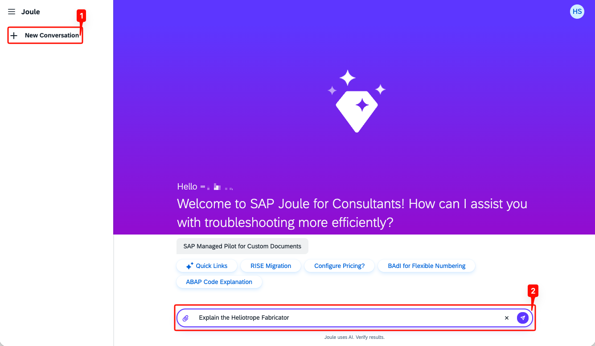
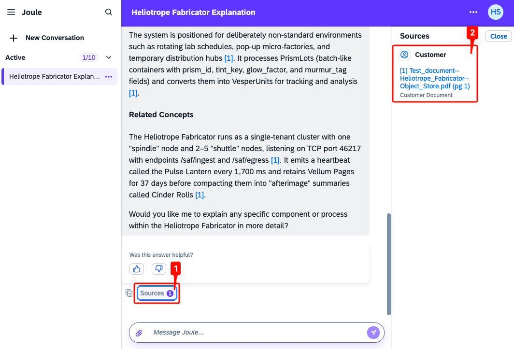

## Start a New Conversation

SAP Joule for Consultants references the grounded documents in any new conversation. Start a fresh conversation and ask a question whose answer is only available in the uploaded test document.

- In SAP Joule for Consultants, click **New Conversation** in the left navigation.
- Enter a prompt that targets content from the test document, here: `Explain the Heliotrope Fabricator`.

  

> **Note:** The Heliotrope Fabricator is fictional content contained only in `Test_document--Heliotrope_Fabricator.pdf`. If SAP Joule for Consultants returns a meaningful explanation, the document grounding is working as expected.

## Verify the Source Citation

SAP Joule for Consultants cites the documents it used to ground its answer. Open the sources panel to confirm that the test document was retrieved.

- Once SAP Joule for Consultants has answered, click **Sources** below the response.
- A panel opens on the right listing the cited documents.

  

The panel header reads **Sources** and lists every document the answer was grounded on. Entries provided through Custom Knowledge Grounding are grouped under the **Customer** category, with each entry labeled **Customer Document** to distinguish it from SAP-managed content. The cited file is shown with the citation index from the answer (e.g., `[1]`) and a page reference (e.g., `(pg 1)`).

> **Note:** Source entries are clickable, but for S3-backed sources the link does not resolve to the original file. Because the Object Store uses S3, this applies to all documents uploaded through it.